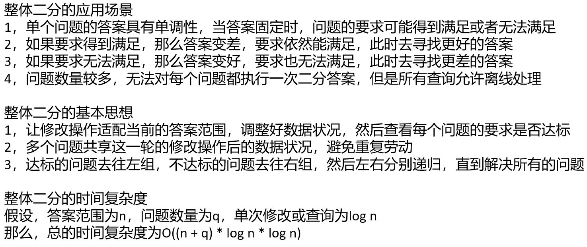
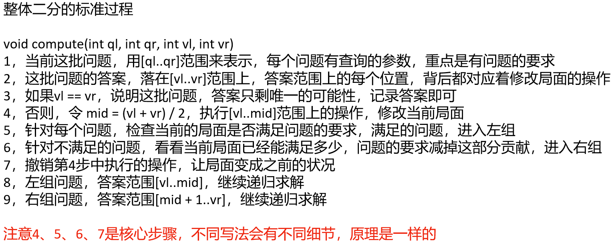

# 整体二分





## [P3834 【模板】可持久化线段树 2](https://www.luogu.com.cn/problem/P3834)

> - **Question**
>   - 给定一个长度为 `n` 的数组 `arr` ，下标 `1 ~ n` ，一共有 `m` 条查询，每条查询 `l r k` 打印 `arr[l ~ r]` 中第 `k` 小的数字。
>   - **Tips**
>     - `1 <= n、m <= 2 * 10^5`
>     - `0 <= arr[i] <= 10^9`

## Java

> - **方法一**

```java
// For Most Online Judge systems

import java.io.*;
import java.util.*;

public class Main {

    public static int MAXN = 200001;
    public static int n, m;

    // 位置i，数值v
    public static int[][] arr = new int[MAXN][2];

    // 查询
    public static int[] qid = new int[MAXN];
    public static int[] l = new int[MAXN];
    public static int[] r = new int[MAXN];
    public static int[] k = new int[MAXN];

    // 树状数组
    public static int[] tree = new int[MAXN];

    // 整体二分
    public static int[] lset = new int[MAXN];
    public static int[] rset = new int[MAXN];

    // 查询的答案
    public static int[] ans = new int[MAXN];

    // 树状数组中的lowbit
    public static int lowbit(int i) {
        return i & -i;
    }

    // 树状数组中增加i位置的词频
    public static void add(int i, int v) {
        while (i <= n) {
            tree[i] += v;
            i += lowbit(i);
        }
    }

    // 树状数组中查询[1~i]范围的词频累加和
    public static int sum(int i) {
        int ret = 0;
        while (i > 0) {
            ret += tree[i];
            i -= lowbit(i);
        }
        return ret;
    }

    // 树状数组中查询[l~r]范围的词频累加和
    public static int query(int l, int r) {
        return sum(r) - sum(l - 1);
    }

    // 整体二分的第一种写法
    // 问题范围[ql..qr]，答案范围[vl..vr]，答案范围的每个下标都是数字的排名
    public static void compute(int ql, int qr, int vl, int vr) {
        if (ql > qr) {
            return;
        }
        if (vl == vr) {
            for (int i = ql; i <= qr; i++) {
                ans[qid[i]] = arr[vl][1];
            }
        } else {
            // 修改数据状况
            int mid = (vl + vr) / 2;
            for (int i = vl; i <= mid; i++) {
                add(arr[i][0], 1);
            }
            // 检查每个问题并划分左右
            int lsiz = 0, rsiz = 0;
            for (int i = ql; i <= qr; i++) {
                int id = qid[i];
                int satisfy = query(l[id], r[id]);
                if (satisfy >= k[id]) {
                    lset[++lsiz] = id;
                } else {
                    k[id] -= satisfy;
                    rset[++rsiz] = id;
                }
            }
            for (int i = 1; i <= lsiz; i++) {
                qid[ql + i - 1] = lset[i];
            }
            for (int i = 1; i <= rsiz; i++) {
                qid[ql + lsiz + i - 1] = rset[i];
            }
            // 撤回数据状况
            for (int i = vl; i <= mid; i++) {
                add(arr[i][0], -1);
            }
            // 左右两侧各自递归
            compute(ql, ql + lsiz - 1, vl, mid);
            compute(ql + lsiz, qr, mid + 1, vr);
        }
    }

    public static void main(String[] args) throws Exception {
        FastReader in = new FastReader(System.in);
        PrintWriter out = new PrintWriter(new OutputStreamWriter(System.out));
        n = in.nextInt();
        m = in.nextInt();
        for (int i = 1; i <= n; i++) {
            arr[i][0] = i;
            arr[i][1] = in.nextInt();
        }
        for (int i = 1; i <= m; i++) {
            qid[i] = i;
            l[i] = in.nextInt();
            r[i] = in.nextInt();
            k[i] = in.nextInt();
        }
        Arrays.sort(arr, 1, n + 1, (a, b) -> a[1] - b[1]);
        compute(1, m, 1, n);
        for (int i = 1; i <= m; i++) {
            out.println(ans[i]);
        }
        out.flush();
        out.close();
    }

    // 读写工具类
    static class FastReader {
        private final byte[] buffer = new byte[1 << 16];
        private int ptr = 0, len = 0;
        private final InputStream in;

        FastReader(InputStream in) {
            this.in = in;
        }

        private int readByte() throws IOException {
            if (ptr >= len) {
                len = in.read(buffer);
                ptr = 0;
                if (len <= 0)
                    return -1;
            }
            return buffer[ptr++];
        }

        int nextInt() throws IOException {
            int c;
            do {
                c = readByte();
            } while (c <= ' ' && c != -1);
            boolean neg = false;
            if (c == '-') {
                neg = true;
                c = readByte();
            }
            int val = 0;
            while (c > ' ' && c != -1) {
                val = val * 10 + (c - '0');
                c = readByte();
            }
            return neg ? -val : val;
        }
    }

}
```

> - **方法二**

```java
// For Most Online Judge systems

import java.io.*;
import java.util.*;

public class Main {

    public static int MAXN = 200001;
    public static int n, m;

    public static int[][] arr = new int[MAXN][2];

    public static int[] qid = new int[MAXN];
    public static int[] l = new int[MAXN];
    public static int[] r = new int[MAXN];
    public static int[] k = new int[MAXN];

    public static int[] tree = new int[MAXN];
    // 数据的使用数量
    public static int used = 0;

    public static int[] lset = new int[MAXN];
    public static int[] rset = new int[MAXN];

    public static int[] ans = new int[MAXN];

    public static int lowbit(int i) {
        return i & -i;
    }

    public static void add(int i, int v) {
        while (i <= n) {
            tree[i] += v;
            i += lowbit(i);
        }
    }

    public static int sum(int i) {
        int ret = 0;
        while (i > 0) {
            ret += tree[i];
            i -= lowbit(i);
        }
        return ret;
    }

    public static int query(int l, int r) {
        return sum(r) - sum(l - 1);
    }

    // 整体二分的第二种写法
    public static void compute(int ql, int qr, int vl, int vr) {
        if (ql > qr) {
            return;
        }
        if (vl == vr) {
            for (int i = ql; i <= qr; i++) {
                ans[qid[i]] = arr[vl][1];
            }
        } else {
            int mid = (vl + vr) / 2;
            // 数据不够就叠加
            while (used < mid) {
                used++;
                add(arr[used][0], 1);
            }
            // 数据超了就撤销
            while (used > mid) {
                add(arr[used][0], -1);
                used--;
            }
            int lsiz = 0, rsiz = 0;
            for (int i = ql; i <= qr; i++) {
                int id = qid[i];
                int satisfy = query(l[id], r[id]);
                if (satisfy >= k[id]) {
                    lset[++lsiz] = id;
                } else {
                    rset[++rsiz] = id;
                }
            }
            for (int i = 1; i <= lsiz; i++) {
                qid[ql + i - 1] = lset[i];
            }
            for (int i = 1; i <= rsiz; i++) {
                qid[ql + lsiz + i - 1] = rset[i];
            }
            compute(ql, ql + lsiz - 1, vl, mid);
            compute(ql + lsiz, qr, mid + 1, vr);
        }
    }

    public static void main(String[] args) throws Exception {
        FastReader in = new FastReader(System.in);
        PrintWriter out = new PrintWriter(new OutputStreamWriter(System.out));
        n = in.nextInt();
        m = in.nextInt();
        for (int i = 1; i <= n; i++) {
            arr[i][0] = i;
            arr[i][1] = in.nextInt();
        }
        for (int i = 1; i <= m; i++) {
            qid[i] = i;
            l[i] = in.nextInt();
            r[i] = in.nextInt();
            k[i] = in.nextInt();
        }
        Arrays.sort(arr, 1, n + 1, (a, b) -> a[1] - b[1]);
        compute(1, m, 1, n);
        for (int i = 1; i <= m; i++) {
            out.println(ans[i]);
        }
        out.flush();
        out.close();
    }

    // 读写工具类
    static class FastReader {
        private final byte[] buffer = new byte[1 << 16];
        private int ptr = 0, len = 0;
        private final InputStream in;

        FastReader(InputStream in) {
            this.in = in;
        }

        private int readByte() throws IOException {
            if (ptr >= len) {
                len = in.read(buffer);
                ptr = 0;
                if (len <= 0)
                    return -1;
            }
            return buffer[ptr++];
        }

        int nextInt() throws IOException {
            int c;
            do {
                c = readByte();
            } while (c <= ' ' && c != -1);
            boolean neg = false;
            if (c == '-') {
                neg = true;
                c = readByte();
            }
            int val = 0;
            while (c > ' ' && c != -1) {
                val = val * 10 + (c - '0');
                c = readByte();
            }
            return neg ? -val : val;
        }
    }

}
```
