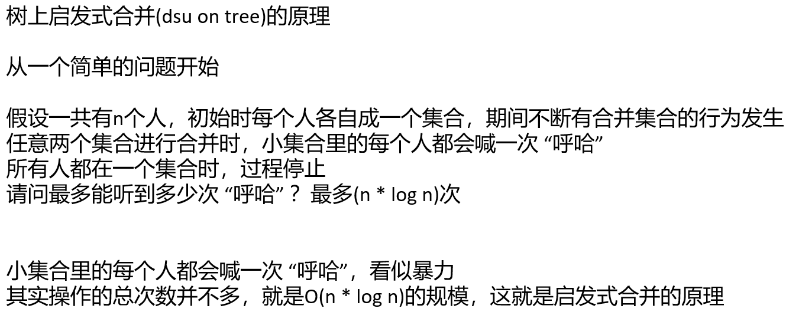
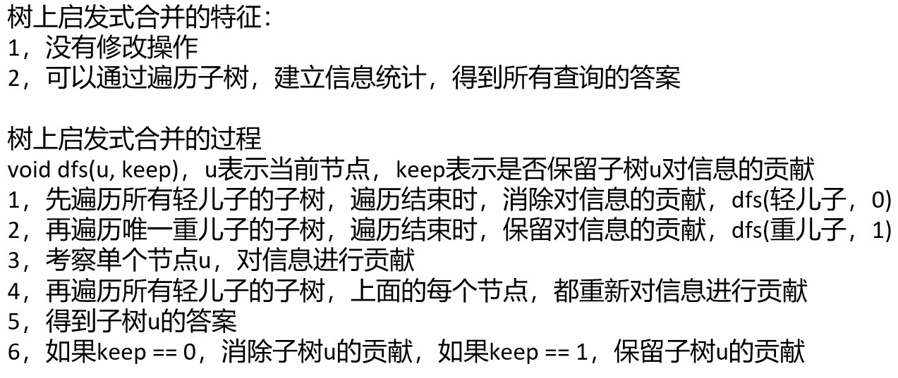
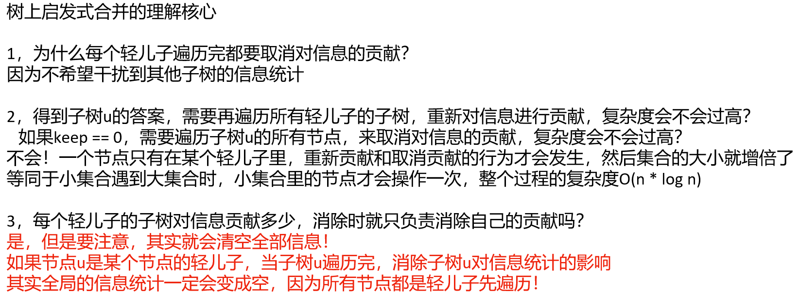

# 树上启发式合并







## [U41492 树上数颜色](https://www.luogu.com.cn/problem/U41492)

> - **Question**
>   - 一共有 `n` 个节点，编号 `1 ~ n` ，给定 `n - 1` 条边，所有节点连成一棵树， `1` 号节点为树头，每个节点给定一种颜色值，一共有 `m` 条查询，每条查询给定参数 `x` ，每条查询打印x为头的子树上，一共有多少种不同的颜色。
>   - **Tips**
>     - `1 <= n、m、颜色值 <= 10^5`

## Java

> - **Question**

```java
// For Most Online Judge systems

import java.io.*;
import java.util.*;

public class Main {

    public static int MAXN = 100001;

    public static int n, m;

    // 每个节点的颜色
    public static int[] arr = new int[MAXN];

    // 链式前向星
    public static int[] head = new int[MAXN];
    public static int[] next = new int[MAXN << 1];
    public static int[] to = new int[MAXN << 1];
    public static int cnt = 0;

    // 树链剖分
    public static int[] fa = new int[MAXN];
    public static int[] siz = new int[MAXN];
    public static int[] son = new int[MAXN];

    // 树上启发式合并
    // colorCnt[i] = j，表示i这种颜色出现了j次
    public static int[] colorCnt = new int[MAXN];
    public static int[] ans = new int[MAXN];
    public static int diffColors = 0;

    public static void addEdge(int u, int v) {
        next[++cnt] = head[u];
        to[cnt] = v;
        head[u] = cnt;
    }

    // 重链剖分
    public static void dfs1(int u, int f) {
        fa[u] = f;
        siz[u] = 1;
        for (int e = head[u], v; e > 0; e = next[e]) {
            v = to[e];
            if (v != f) {
                dfs1(v, u);
            }
        }
        for (int e = head[u], v; e > 0; e = next[e]) {
            v = to[e];
            if (v != f) {
                siz[u] += siz[v];
                if (son[u] == 0 || siz[son[u]] < siz[v]) {
                    son[u] = v;
                }
            }
        }
    }

    // 子树u每个节点贡献信息
    public static void effect(int u) {
        if (++colorCnt[arr[u]] == 1) {
            diffColors++;
        }
        for (int e = head[u], v; e > 0; e = next[e]) {
            v = to[e];
            if (v != fa[u]) {
                effect(v);
            }
        }
    }

    // 子树u每个节点取消贡献
    public static void cancel(int u) {
        if (--colorCnt[arr[u]] == 0) {
            diffColors--;
        }
        for (int e = head[u], v; e > 0; e = next[e]) {
            v = to[e];
            if (v != fa[u]) {
                cancel(v);
            }
        }
    }

    // 树上启发式合并的过程
    public static void dfs2(int u, int keep) {
        // 遍历轻儿子的子树，统计子树的答案，然后取消贡献
        for (int e = head[u], v; e > 0; e = next[e]) {
            v = to[e];
            if (v != fa[u] && v != son[u]) {
                dfs2(v, 0);
            }
        }
        // 遍历重儿子的子树，统计子树的答案，然后保留贡献
        if (son[u] != 0) {
            dfs2(son[u], 1);
        }
        // 当前节点贡献信息
        if (++colorCnt[arr[u]] == 1) {
            diffColors++;
        }
        // 遍历轻儿子的子树，重新贡献一遍
        for (int e = head[u], v; e > 0; e = next[e]) {
            v = to[e];
            if (v != fa[u] && v != son[u]) {
                effect(v);
            }
        }
        // 记录子树u的答案
        ans[u] = diffColors;
        // 如果u是上级节点的轻儿子，子树u的贡献取消，否则保留
        if (keep == 0) {
            cancel(u);
        }
    }

    public static void main(String[] args) throws IOException {
        BufferedReader br = new BufferedReader(new InputStreamReader(System.in));
        StreamTokenizer in = new StreamTokenizer(br);
        PrintWriter out = new PrintWriter(new OutputStreamWriter(System.out));
        in.nextToken();
        n = (int) in.nval;
        for (int i = 1, u, v; i < n; i++) {
            in.nextToken();
            u = (int) in.nval;
            in.nextToken();
            v = (int) in.nval;
            addEdge(u, v);
            addEdge(v, u);
        }
        for (int i = 1; i <= n; i++) {
            in.nextToken();
            arr[i] = (int) in.nval;
        }
        dfs1(1, 0);
        dfs2(1, 0);
        in.nextToken();
        m = (int) in.nval;
        for (int i = 1, cur; i <= m; i++) {
            in.nextToken();
            cur = (int) in.nval;
            out.println(ans[cur]);
        }
        out.flush();
        out.close();
        br.close();
    }

}

// For Most Online Judge systems

// 只需要关注有注释的代码
// 揭示了轻儿子取消自己的影响后
// 其实全局的信息统计就是空的
// 所以改成注释的代码也是正确的
import java.io.*;
import java.util.*;

public class Main {

    public static int MAXN = 100001;
    public static int n, m;
    public static int[] arr = new int[MAXN];
    public static int[] head = new int[MAXN];
    public static int[] next = new int[MAXN << 1];
    public static int[] to = new int[MAXN << 1];
    public static int cnt = 0;
    public static int[] fa = new int[MAXN];
    public static int[] siz = new int[MAXN];
    public static int[] son = new int[MAXN];
    public static int[] colorCnt = new int[MAXN];
    public static int[] ans = new int[MAXN];
    public static int diffColors = 0;

    public static void addEdge(int u, int v) {
        next[++cnt] = head[u];
        to[cnt] = v;
        head[u] = cnt;
    }

    public static void dfs1(int u, int f) {
        fa[u] = f;
        siz[u] = 1;
        for (int e = head[u], v; e > 0; e = next[e]) {
            v = to[e];
            if (v != f) {
                dfs1(v, u);
            }
        }
        for (int e = head[u], v; e > 0; e = next[e]) {
            v = to[e];
            if (v != f) {
                siz[u] += siz[v];
                if (son[u] == 0 || siz[son[u]] < siz[v]) {
                    son[u] = v;
                }
            }
        }
    }

    public static void effect(int u) {
        if (++colorCnt[arr[u]] == 1) {
            diffColors++;
        }
        for (int e = head[u], v; e > 0; e = next[e]) {
            v = to[e];
            if (v != fa[u]) {
                effect(v);
            }
        }
    }

    public static void cancel(int u) {
        colorCnt[arr[u]] = 0; // 出现任何颜色，直接把该颜色的计数重置为0
        for (int e = head[u], v; e > 0; e = next[e]) {
            v = to[e];
            if (v != fa[u]) {
                cancel(v);
            }
        }
    }

    public static void dfs2(int u, int keep) {
        for (int e = head[u], v; e > 0; e = next[e]) {
            v = to[e];
            if (v != fa[u] && v != son[u]) {
                dfs2(v, 0);
            }
        }
        if (son[u] != 0) {
            dfs2(son[u], 1);
        }
        if (++colorCnt[arr[u]] == 1) {
            diffColors++;
        }
        for (int e = head[u], v; e > 0; e = next[e]) {
            v = to[e];
            if (v != fa[u] && v != son[u]) {
                effect(v);
            }
        }
        ans[u] = diffColors;
        if (keep == 0) {
            diffColors = 0; // 直接把全局的不同颜色数量重置为0
            cancel(u);
        }
    }

    public static void main(String[] args) throws IOException {
        BufferedReader br = new BufferedReader(new InputStreamReader(System.in));
        StreamTokenizer in = new StreamTokenizer(br);
        PrintWriter out = new PrintWriter(new OutputStreamWriter(System.out));
        in.nextToken();
        n = (int) in.nval;
        for (int i = 1, u, v; i < n; i++) {
            in.nextToken();
            u = (int) in.nval;
            in.nextToken();
            v = (int) in.nval;
            addEdge(u, v);
            addEdge(v, u);
        }
        for (int i = 1; i <= n; i++) {
            in.nextToken();
            arr[i] = (int) in.nval;
        }
        dfs1(1, 0);
        dfs2(1, 0);
        in.nextToken();
        m = (int) in.nval;
        for (int i = 1, cur; i <= m; i++) {
            in.nextToken();
            cur = (int) in.nval;
            out.println(ans[cur]);
        }
        out.flush();
        out.close();
        br.close();
    }

}
```
