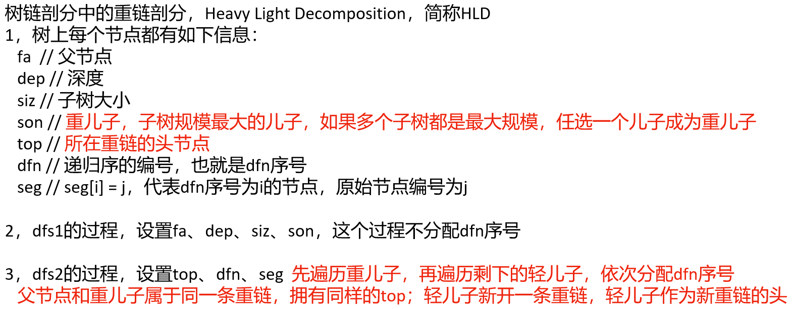
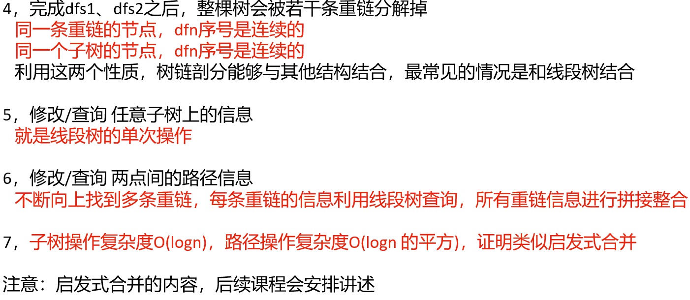

# 重链剖分





## [P3384 【模板】重链剖分/树链剖分](https://www.luogu.com.cn/problem/P3384)

> - **Question 1**
>   - 一共有 `n` 个节点，给定 `n - 1` 条边，节点连成一棵树，给定每个节点的初始权值，给定树的头节点编号 `root` ，一共有 `m` 条操作，每种操作是如下 `4` 种类型中的一种：
>     - 操作 `1 x y v` ： `x` 到 `y` 的路径上，每个节点值增加 `v` 。
>     - 操作 `2 x y` ： `x` 到 `y` 的路径上，打印所有节点值的累加和。
>     - 操作 `3 x v` ： `x` 为头的子树上，每个节点值增加 `v` 。
>     - 操作 `4 x` ： `x` 为头的子树上，打印所有节点值的累加和。
>   - **Tips**
>     - `1 <= n、m <= 10^5`
>     - `1 <= MOD <= 2^30`
>     - 输入的值都为 `int` 类型
>     - 查询操作时，打印 `(查询结果 % MOD)` ，题目会给定 `MOD` 值

## 左老师课堂讲述

> - **Question 2**
>   - 给定数组 `father` ，大小为 `N` ，表示有 N 个节点。
>   - `father[i] = j` 表示点 `i` 的父亲是点 `j` 。
>   - `father` 表示的树一定只有一颗而不是森林。
>   - 给定数组 `values` ，大小为 `N` 。 `values[i] = value` 表示节点 `i` 的权重是 `value` 。
>   - 实现如下的四个方法，让它们都很高效：
>     - `void addSubtree(int head, int value)` ：让某一个子树所有权重值加上 `value` 。
>     - `int querySubtree(int head)` ：查询某个子树所有节点值累加和。
>     - `void addChain(int a, int b, int num)` ：在树上从 `a` 到 `b` 的整条链上所有节点的权值加上 `num` 。
>     - `int queryChain(int a, int b)` ：查询在树上从 `a` 到 `b` 的整条链上所有节点的权值和。

## Java

> - **Question 1**

```java
// For Most Online Judge systems

import java.io.*;
import java.util.*;

public class Main {

    public static int MAXN = 100001;
    public static int n, m, root, MOD;
    public static int[] arr = new int[MAXN];

    public static int[] head = new int[MAXN];
    public static int[] next = new int[MAXN << 1];
    public static int[] to = new int[MAXN << 1];
    public static int cntg = 0;

    public static int[] fa = new int[MAXN];
    public static int[] dep = new int[MAXN];
    public static int[] siz = new int[MAXN];
    public static int[] son = new int[MAXN];
    public static int[] top = new int[MAXN];
    public static int[] dfn = new int[MAXN];
    public static int[] seg = new int[MAXN];
    public static int cntd = 0;

    public static long[] sum = new long[MAXN << 2];
    public static long[] addTag = new long[MAXN << 2];

    public static void addEdge(int u, int v) {
        next[++cntg] = head[u];
        to[cntg] = v;
        head[u] = cntg;
    }

    // 递归版，C++可以通过，java会爆栈
    // 来到节点u，节点u树上的父节点是f
    // dfs1的过程去设置 fa dep siz son
    public static void dfs1(int u, int f) {
        fa[u] = f;
        dep[u] = dep[f] + 1;
        siz[u] = 1;
        for (int e = head[u], v; e > 0; e = next[e]) {
            v = to[e];
            if (v != f) {
                dfs1(v, u);
            }
        }
        for (int e = head[u], v; e > 0; e = next[e]) {
            v = to[e];
            if (v != f) {
                siz[u] += siz[v];
                if (son[u] == 0 || siz[son[u]] < siz[v]) {
                    son[u] = v;
                }
            }
        }
    }

    // 递归版，C++可以通过，java会爆栈
    // 来到节点u，节点u所在重链的头节点是t
    // dfs2的过程去设置 top dfn seg
    public static void dfs2(int u, int t) {
        top[u] = t;
        dfn[u] = ++cntd;
        seg[cntd] = u;
        if (son[u] == 0) {
            return;
        }
        dfs2(son[u], t);
        for (int e = head[u], v; e > 0; e = next[e]) {
            v = to[e];
            if (v != fa[u] && v != son[u]) {
                dfs2(v, v);
            }
        }
    }

    public static int[][] fse = new int[MAXN][3];

    public static int stacksize, first, second, edge;

    public static void push(int fir, int sec, int edg) {
        fse[stacksize][0] = fir;
        fse[stacksize][1] = sec;
        fse[stacksize][2] = edg;
        stacksize++;
    }

    public static void pop() {
        --stacksize;
        first = fse[stacksize][0];
        second = fse[stacksize][1];
        edge = fse[stacksize][2];
    }

    // dfs1的迭代版
    public static void dfs3() {
        stacksize = 0;
        push(root, 0, -1);
        while (stacksize > 0) {
            pop();
            if (edge == -1) {
                fa[first] = second;
                dep[first] = dep[second] + 1;
                siz[first] = 1;
                edge = head[first];
            } else {
                edge = next[edge];
            }
            if (edge != 0) {
                push(first, second, edge);
                if (to[edge] != second) {
                    push(to[edge], first, -1);
                }
            } else {
                for (int e = head[first], v; e > 0; e = next[e]) {
                    v = to[e];
                    if (v != second) {
                        siz[first] += siz[v];
                        if (son[first] == 0 || siz[son[first]] < siz[v]) {
                            son[first] = v;
                        }
                    }
                }
            }
        }
    }

    // dfs2的迭代版
    public static void dfs4() {
        stacksize = 0;
        push(root, root, -1);
        while (stacksize > 0) {
            pop();
            if (edge == -1) { // edge == -1，表示第一次来到当前节点，并且先处理重儿子
                top[first] = second;
                dfn[first] = ++cntd;
                seg[cntd] = first;
                if (son[first] == 0) {
                    continue;
                }
                push(first, second, -2);
                push(son[first], second, -1);
                continue;
            } else if (edge == -2) { // edge == -2，表示处理完当前节点的重儿子，回到了当前节点
                edge = head[first];
            } else { // edge >= 0, 继续处理其他的边
                edge = next[edge];
            }
            if (edge != 0) {
                push(first, second, edge);
                if (to[edge] != fa[first] && to[edge] != son[first]) {
                    push(to[edge], to[edge], -1);
                }
            }
        }
    }

    public static void up(int i) {
        sum[i] = (sum[i << 1] + sum[i << 1 | 1]) % MOD;
    }

    public static void lazy(int i, long v, int n) {
        sum[i] = (sum[i] + v * n) % MOD;
        addTag[i] = (addTag[i] + v) % MOD;
    }

    public static void down(int i, int ln, int rn) {
        if (addTag[i] != 0) {
            lazy(i << 1, addTag[i], ln);
            lazy(i << 1 | 1, addTag[i], rn);
            addTag[i] = 0;
        }
    }

    public static void build(int l, int r, int i) {
        if (l == r) {
            sum[i] = arr[seg[l]] % MOD;
        } else {
            int mid = (l + r) / 2;
            build(l, mid, i << 1);
            build(mid + 1, r, i << 1 | 1);
            up(i);
        }
    }

    public static void add(int jobl, int jobr, int jobv, int l, int r, int i) {
        if (jobl <= l && r <= jobr) {
            lazy(i, jobv, r - l + 1);
        } else {
            int mid = (l + r) / 2;
            down(i, mid - l + 1, r - mid);
            if (jobl <= mid) {
                add(jobl, jobr, jobv, l, mid, i << 1);
            }
            if (jobr > mid) {
                add(jobl, jobr, jobv, mid + 1, r, i << 1 | 1);
            }
            up(i);
        }
    }

    public static long query(int jobl, int jobr, int l, int r, int i) {
        if (jobl <= l && r <= jobr) {
            return sum[i];
        }
        int mid = (l + r) / 2;
        down(i, mid - l + 1, r - mid);
        long ans = 0;
        if (jobl <= mid) {
            ans = (ans + query(jobl, jobr, l, mid, i << 1)) % MOD;
        }
        if (jobr > mid) {
            ans = (ans + query(jobl, jobr, mid + 1, r, i << 1 | 1)) % MOD;
        }
        return ans;
    }

    // 从x到y的路径上，所有节点的值增加v
    public static void pathAdd(int x, int y, int v) {
        while (top[x] != top[y]) {
            if (dep[top[x]] <= dep[top[y]]) {
                add(dfn[top[y]], dfn[y], v, 1, n, 1);
                y = fa[top[y]];
            } else {
                add(dfn[top[x]], dfn[x], v, 1, n, 1);
                x = fa[top[x]];
            }
        }
        add(Math.min(dfn[x], dfn[y]), Math.max(dfn[x], dfn[y]), v, 1, n, 1);
    }

    // x的子树上，所有节点的值增加v
    public static void subtreeAdd(int x, int v) {
        add(dfn[x], dfn[x] + siz[x] - 1, v, 1, n, 1);
    }

    // 从x到y的路径上，查询所有节点的累加和
    public static long pathSum(int x, int y) {
        long ans = 0;
        while (top[x] != top[y]) {
            if (dep[top[x]] <= dep[top[y]]) {
                ans = (ans + query(dfn[top[y]], dfn[y], 1, n, 1)) % MOD;
                y = fa[top[y]];
            } else {
                ans = (ans + query(dfn[top[x]], dfn[x], 1, n, 1)) % MOD;
                x = fa[top[x]];
            }
        }
        ans = (ans + query(Math.min(dfn[x], dfn[y]), Math.max(dfn[x], dfn[y]), 1, n, 1)) % MOD;
        return ans;
    }

    // x的子树上，查询所有节点的累加和
    public static long subtreeSum(int x) {
        return query(dfn[x], dfn[x] + siz[x] - 1, 1, n, 1);
    }

    public static void main(String[] args) throws IOException {
        BufferedReader br = new BufferedReader(new InputStreamReader(System.in));
        StreamTokenizer in = new StreamTokenizer(br);
        PrintWriter out = new PrintWriter(new OutputStreamWriter(System.out));
        in.nextToken();
        n = (int) in.nval;
        in.nextToken();
        m = (int) in.nval;
        in.nextToken();
        root = (int) in.nval;
        in.nextToken();
        MOD = (int) in.nval;
        for (int i = 1; i <= n; i++) {
            in.nextToken();
            arr[i] = (int) in.nval;
        }
        for (int i = 1, u, v; i < n; i++) {
            in.nextToken();
            u = (int) in.nval;
            in.nextToken();
            v = (int) in.nval;
            addEdge(u, v);
            addEdge(v, u);
        }
        dfs3(); // dfs3() 等同于 dfs1(root, 0)，调用迭代版防止爆栈
        dfs4(); // dfs4() 等同于 dfs2(root, root)，调用迭代版防止爆栈
        build(1, n, 1);
        for (int i = 1, op, x, y, v; i <= m; i++) {
            in.nextToken();
            op = (int) in.nval;
            if (op == 1) {
                in.nextToken();
                x = (int) in.nval;
                in.nextToken();
                y = (int) in.nval;
                in.nextToken();
                v = (int) in.nval;
                pathAdd(x, y, v);
            } else if (op == 2) {
                in.nextToken();
                x = (int) in.nval;
                in.nextToken();
                y = (int) in.nval;
                out.println(pathSum(x, y));
            } else if (op == 3) {
                in.nextToken();
                x = (int) in.nval;
                in.nextToken();
                v = (int) in.nval;
                subtreeAdd(x, v);
            } else {
                in.nextToken();
                x = (int) in.nval;
                out.println(subtreeSum(x));
            }
        }
        out.flush();
        out.close();
        br.close();
    }

}
```

> - **Question 2: dfs + 线段树**
>   - 主要是重链和dfs序的概念，然后根据dfs序在重链上连续的特性用线段树操作dfs序，转化为区间查询和区间累加。

```java
class TreeChain {
    
    // 时间戳 0 1 2 3 4
    private int time;
    // 节点个数是n，节点编号是1~n
    private int n;
    // 谁是头
    private int head;
    // 朴素树结构
    private int[][] tree;
    // 权重数组 原始的0节点权重是6 -> val[1] = 6
    private int[] values;
    // father数组一个平移，因为标号要+1
    private int[] father;
    // 深度数组！
    private int[] deep;
    // son[i] = 0 i这个节点，没有儿子
    // son[i] != 0 j i这个节点，重儿子是j
    private int[] son;
    // siz[i] i这个节点为头的子树，有多少个节点
    private int[] childSize;
    // top[i] = j i这个节点，所在的重链，头是j
    private int[] top;
    // dfn[i] = j i这个节点，在dfs序中是第j个
    private int[] originToDFS;
    // 如果原来的节点a，权重是10
    // 如果a节点在dfs序中是第5个节点, tnw[5] = 10
    private int[] dfsValues;
    private final SegmentTree segmentTree;
    
    public TreeChain(int[] father, int[] values) {
        initTree(father, values);
        dfs1(head, 0);
        dfs2(head, head);
        segmentTree = new SegmentTree(dfsValues);
        segmentTree.build(1, n, 1);
    }
    
    private void initTree(int[] father, int[] values) {
        time = 0;
        n = father.length + 1;
        tree = new int[n][];
        this.values = new int[n];
        this.father = new int[n];
        deep = new int[n];
        son = new int[n];
        childSize = new int[n];
        top = new int[n];
        originToDFS = new int[n];
        dfsValues = new int[n];
        n--;
        // 权重数组平移到新权重数组
        System.arraycopy(values, 0, this.values, 1, n);
        // countChild[i]表示i位置的节点的子树节点数
        int[] countChild = new int[n];
        for (int i = 0; i < n; i++) {
            if (father[i] == i) {
                // 找到了头
                // 记录头索引
                head = i + 1;
            } else {
                // 指定父亲的孩子数量++
                countChild[father[i]]++;
            }
        }
        // 0位置不要
        tree[0] = new int[0];
        // 根据自己的孩子个数建立数组
        for (int i = 0; i < n; i++) {
            tree[i + 1] = new int[countChild[i]];
        }
        for (int i = 0; i < n; i++) {
            // 当前不是头，说明有父节点
            if (i + 1 != head) {
                // 父节点平移位置的第几个孩子是我的平移
                tree[father[i] + 1][--countChild[father[i]]] = i + 1;
            }
        }
    }
    
    // curNode是当前节点
    // fatherNode是当前节点的父节点
    private void dfs1(int curNode, int fatherNode) {
        // 把父亲记录一下
        father[curNode] = fatherNode;
        // 我的深度等于父亲深度+1
        deep[curNode] = deep[fatherNode] + 1;
        // 以我为头的整颗树上目前只有我一个节点
        childSize[curNode] = 1;
        // 重链大小初始-1
        int maxChildSize = -1;
        // 遍历所有孩子
        for (int childNode : tree[curNode]) {
            // dfs去
            dfs1(childNode, curNode);
            // 我的子树节点数加上孩子的子树节点数
            childSize[curNode] += childSize[childNode];
            // 如果这个子树的节点数大于之前记录的
            if (childSize[childNode] > maxChildSize) {
                // 更新
                maxChildSize = childSize[childNode];
                // 重儿子设置
                son[curNode] = childNode;
            }
        }
    }
    
    // curNode是当前节点
    // headNode是当前节点所在重链的头节点
    private void dfs2(int curNode, int headNode) {
        // dfs序收集
        originToDFS[curNode] = ++time;
        // 重链头记录
        top[curNode] = headNode;
        // dfs序组织的权重表收集
        dfsValues[time] = values[curNode];
        // 如果有重儿子
        if (son[curNode] != 0) {
            // 先让重儿子填dfs序
            dfs2(son[curNode], headNode);
            // 然后让其他儿子填dfs序
            for (int child : tree[curNode]) {
                if (child != son[curNode]) {
                    // 轻儿子是其所在重链的头节点
                    dfs2(child, child);
                }
            }
        }
    }
    
    // head为头的子树上，所有节点值+value
    // 因为节点经过平移，所以head(原始节点) -> head(平移节点)
    // dfs序下，子树在一个连续区间内
    public void addSubtree(int head, int value) {
        // 原始点编号 -> 平移编号
        head++;
        // 平移编号 -> dfs编号 dfn[head]
        segmentTree.add(originToDFS[head], originToDFS[head] + childSize[head] - 1, value, 1, n, 1);
    }
    
    // head为头的子树上，查询所有节点值的和
    public int querySubtree(int head) {
        head++;
        return segmentTree.query(originToDFS[head], originToDFS[head] + childSize[head] - 1, 1, n, 1);
    }
    
    // a节点到b节点上的链条，所有节点的权重加上num
    // 两边往中间汇聚，沿重链跳转
    public void addChain(int a, int b, int num) {
        a++;
        b++;
        // 谁的层级深就加谁，沿着重链一直往上加
        while (top[a] != top[b]) {
            if (deep[top[a]] > deep[top[b]]) {
                segmentTree.add(originToDFS[top[a]], originToDFS[a], num, 1, n, 1);
                a = father[top[a]];
            } else {
                segmentTree.add(originToDFS[top[b]], originToDFS[b], num, 1, n, 1);
                b = father[top[b]];
            }
        }
        // 一条链上了
        // 把两者之间的相差节点加上
        if (deep[a] > deep[b]) {
            segmentTree.add(originToDFS[b], originToDFS[a], num, 1, n, 1);
        } else {
            segmentTree.add(originToDFS[a], originToDFS[b], num, 1, n, 1);
        }
    }
    
    // 查询a节点到b节点的链上，总权重和
    public int queryChain(int a, int b) {
        a++;
        b++;
        int ans = 0;
        while (top[a] != top[b]) {
            if (deep[top[a]] > deep[top[b]]) {
                ans += segmentTree.query(originToDFS[top[a]], originToDFS[a], 1, n, 1);
                a = father[top[a]];
            } else {
                ans += segmentTree.query(originToDFS[top[b]], originToDFS[b], 1, n, 1);
                b = father[top[b]];
            }
        }
        if (deep[a] > deep[b]) {
            ans += segmentTree.query(originToDFS[b], originToDFS[a], 1, n, 1);
        } else {
            ans += segmentTree.query(originToDFS[a], originToDFS[b], 1, n, 1);
        }
        return ans;
    }
    
}

// 线段树，左老师版
class SegmentTree {
    
    private int MAXN;
    private int[] arr;
    private int[] sum;
    private int[] lazy;
    
    public SegmentTree(int[] origin) {
        MAXN = origin.length;
        arr = origin;
        sum = new int[MAXN << 2];
        lazy = new int[MAXN << 2];
    }
    
    private void pushUp(int rt) {
        sum[rt] = sum[rt << 1] + sum[rt << 1 | 1];
    }
    
    private void pushDown(int rt, int ln, int rn) {
        if (lazy[rt] != 0) {
            lazy[rt << 1] += lazy[rt];
            sum[rt << 1] += lazy[rt] * ln;
            lazy[rt << 1 | 1] += lazy[rt];
            sum[rt << 1 | 1] += lazy[rt] * rn;
            lazy[rt] = 0;
        }
    }
    
    public void build(int l, int r, int rt) {
        if (l == r) {
            sum[rt] = arr[l];
            return;
        }
        int mid = (l + r) >> 1;
        build(l, mid, rt << 1);
        build(mid + 1, r, rt << 1 | 1);
        pushUp(rt);
    }
    
    public void add(int L, int R, int C, int l, int r, int rt) {
        if (L <= l && r <= R) {
            sum[rt] += C * (r - l + 1);
            lazy[rt] += C;
            return;
        }
        int mid = (l + r) >> 1;
        pushDown(rt, mid - l + 1, r - mid);
        if (L <= mid) {
            add(L, R, C, l, mid, rt << 1);
        }
        if (R > mid) {
            add(L, R, C, mid + 1, r, rt << 1 | 1);
        }
        pushUp(rt);
    }
    
    public int query(int L, int R, int l, int r, int rt) {
        if (L <= l && r <= R) {
            return sum[rt];
        }
        int mid = (l + r) >> 1;
        pushDown(rt, mid - l + 1, r - mid);
        int ans = 0;
        if (L <= mid) {
            ans += query(L, R, l, mid, rt << 1);
        }
        if (R > mid) {
            ans += query(L, R, mid + 1, r, rt << 1 | 1);
        }
        return ans;
    }
    
}
```
