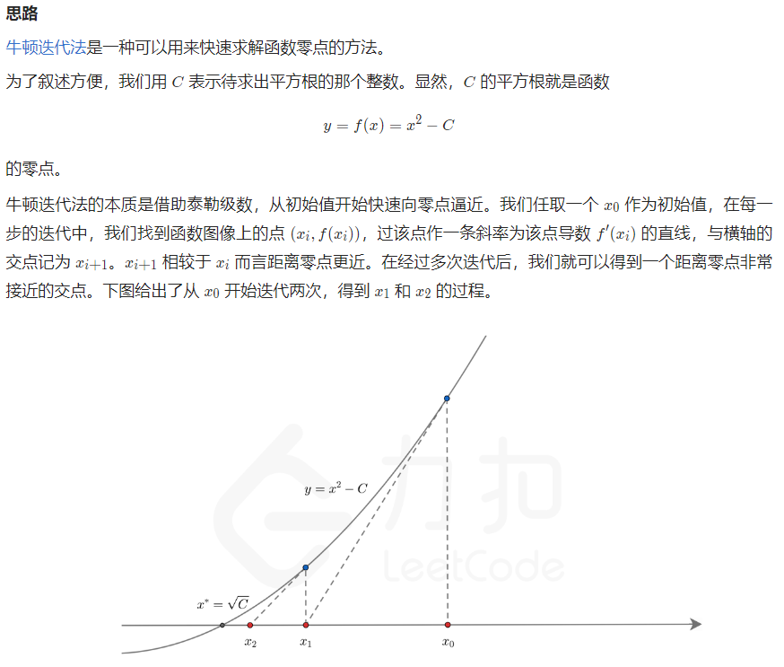
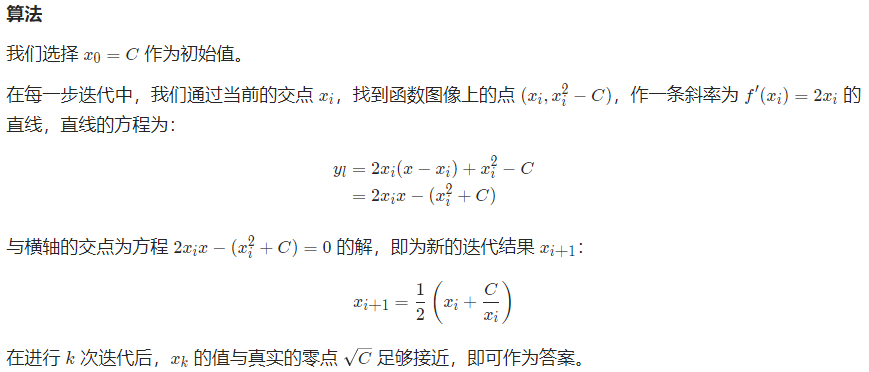

# 不用库函数求平方根

## [69. x 的平方根](https://leetcode.cn/problems/sqrtx/)

## [剑指 Offer II 072. 求平方根](https://leetcode.cn/problems/jJ0w9p/?favorite=e8X3pBZi)

> - ***Question***
>   - 给定一个非负整数 `x` ，计算并返回 `x` 的平方根，即实现 `int sqrt(int x)` 函数。
>   - 正数的平方根有两个，只输出其中的正数平方根。
>   - 如果平方根不是整数，输出只保留整数的部分，小数部分将被舍去。
>   - 不允许使用任何内置指数函数和算符
>   - ***tips:***
>     - `0 <= x <= 2 ^ 31 - 1`

---

## *Java*

> - ***袖珍计算器***
>   - 原理： `sqrt(x) = x ^ 0.5 = (e ^ ln(x)) ^ 0.5 = e ^ (0.5 * ln(x))`
>   - 由于计算机无法存储浮点数的精确值，在得到结果的整数部分 `ans` 后，我们应当找出 `ans` 与  `ans + 1` 中哪一个是真正的答案。
> - ***二分查找***
>   - 由于 x 平方根的整数部分 `ans` 是满足 `k ^ 2 <= x` 的最大 `k` 值，因此我们可以对 `k` 进行二分查找，从而得到答案。
>   - 二分查找的下界为 `0` ，上界可以粗略地设定为 `x` 。在二分查找的每一步中，我们只需要比较中间元素 `mid` 的平方与 `x` 的大小关系，并通过比较的结果调整上下界的范围。由于我们所有的运算都是整数运算，不会存在误差，因此在得到最终的答案 `ans` 后，也就不需要再去尝试 `ans + 1` 了。
> - ***牛顿迭代法***
>     
>     
>     

```java
class Solution {
    
    public int mySqrt(int x) {
        // return mySqrtByExpAndLog(x);
        // return mySqrtByBinarySearch(x);
        return mySqrtByNewton(x);
    }
    
    private int mySqrtByExpAndLog(int x) {
        if (x == 0) {
            return 0;
        }
        int ans = (int) Math.exp(0.5 * Math.log(x));
        return (long) (ans + 1) * (ans + 1) <= x ? ans + 1 : ans;
    }
    
    private int mySqrtByBinarySearch(int x) {
        int left = 0, right = x, ans = -1;
        while (left <= right) {
            int mid = left + (right - left) / 2;
            if ((long) mid * mid <= x) {
                ans = mid;
                left = mid + 1;
            } else {
                right = mid - 1;
            }
        }
        return ans;
    }
    
    private int mySqrtByNewton(int x) {
        if (x == 0) {
            return 0;
        }
        double C = x, x0 = x;
        while (true) {
            double xi = 0.5 * (x0 + C / x0);
            if (Math.abs(x0 - xi) < 1e-7) {
                break;
            }
            x0 = xi;
        }
        return (int) x0;
    }
    
}
```

---

> ***last change: 2022/11/7***

---
