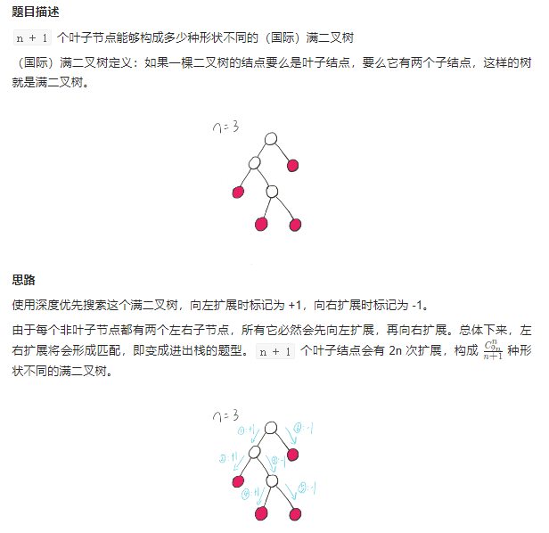
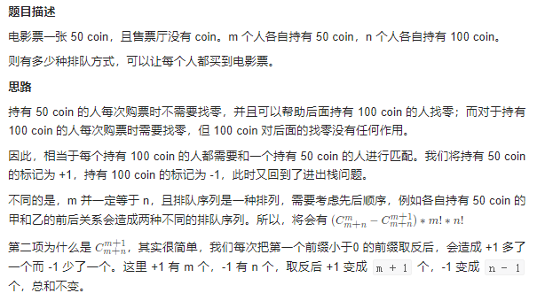

# 卡特兰数

## [96. 不同的二叉搜索树](https://leetcode.cn/problems/unique-binary-search-trees/)

> - ***Question***
>   - 给你一个整数 `n` ，求恰由 `n` 个节点组成且节点值从 `1` 到 `n` 互不相同的二叉搜索树有多少种？返回满足题意的二叉搜索树的种数。
>   - ***tips:***
>     - `1 <= n <= 19`

---

## *Java*

> - ***卡特兰数***
>   - 这是一种数列，其通项公式主要有两种：
>     - `Cn = 1 if n = 0`
>     - `Cn = C(2n, n) - (C(2n, n + 1) or C(2n, n - 1))`
>     - `Cn = C0 * Cn-1 + C1 * Cn-2 + ... + Cn-2 * C1 + Cn-1 * C0`
>     - 代码递归实现：`Cn+1 = 2(2n + 1) * Cn / (n + 2)` or `Cn = (4 * n - 2) * Cn-1 / (n + 1)`
>   - 阶乘公式用于解决括号配对问题，出入栈次序个数问题，股票涨落后不亏问题。
>   - 乘法公式可用于给定节点组成二叉树问题。
>   - 还可以解决凸多边形划分三角形问题，在 `n x n` 格点中不越过对角线的单调路径的个数问题，有 `n + 1` 个叶子的满二叉树的个数。
>   - 如果题目解题时用到的公式和卡特兰数通项公式一样，那就直接根据题目给定的项数，直接返回卡特兰数列对应位置的值即可。
>   - 一些题目到卡特兰数思路：
>     
>     
>     
>     

```java
class Solution {
    
    // 打表
    private final int[] CatalanNumber = {1, 1, 2, 5, 14, 42, 132, 429, 1430, 4862, 16796, 58786, 208012, 742900, 2674440, 9694845, 35357670, 129644790, 477638700, 1767263190};
    
    public int numTrees(int n) {
        // return CatalanNumber[n];
        return (int) getCatalanNumber(n);
    }
    
    // 递推式
    private long getCatalanNumber(int n) {
        if (n == 0) {
            return 0;
        }
        if (n == 1) {
            return 1;
        }
        return (4L * n - 2) * getCatalanNumber(n - 1) / (n + 1);
    }
    
}
```

---

> ***last change: 2022/11/14***

---
