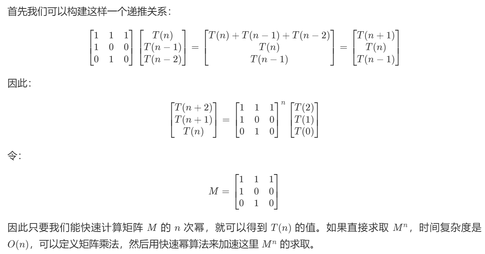

# 从求解斐波那契数列到具有严格递推式相关问题看矩阵快速幂算法

## [509. 斐波那契数](https://leetcode.cn/problems/fibonacci-number/)

## [剑指 Offer 10- I. 斐波那契数列](https://leetcode.cn/problems/fei-bo-na-qi-shu-lie-lcof/)

> - ***Question 1***
>   - 求斐波那契数列的第n项，给出答案需要和不需要取模的两种写法。
>   - 答案需要取模 `1e9+7 (1000000007)` ，如计算初始结果为： `1000000008` ，请返回 `1` 。
>   - ***tips:***
>     - 0 <= n <= 100

## [70. 爬楼梯](https://leetcode.cn/problems/climbing-stairs/)

> - ***Question 2***
>   - 假设你正在爬楼梯。需要 `n` 阶你才能到达楼顶。
>   - 每次你可以爬 `1` 或 `2` 个台阶。你有多少种不同的方法可以爬到楼顶呢？
>   - ***tips:***
>     - `1 <= n <= 45`

## [剑指 Offer 10- II. 青蛙跳台阶问题](https://leetcode.cn/problems/qing-wa-tiao-tai-jie-wen-ti-lcof/)

> - ***Question 3***
>   - 一只青蛙一次可以跳上 `1` 级台阶，也可以跳上 `2` 级台阶。求该青蛙跳上一个 `n` 级的台阶总共有多少种跳法。
>   - 答案需要取模 `1e9+7 (1000000007)` ，如计算初始结果为： `1000000008` ，请返回 `1` 。
>   - ***tips:***
>     - `0 <= n <= 100`

## [1137. 第 N 个泰波那契数](https://leetcode.cn/problems/n-th-tribonacci-number/)

> - ***Question 4***
>   - 泰波那契序列 `Tn` 定义如下： `T0 = 0, T1 = 1, T2 = 1,` ，且在 `n >= 0` 的条件下 `Tn+3 = Tn + Tn+1 + Tn+2` 。
>   - 给你整数 `n` ，请返回第 `n` 个泰波那契数 `Tn` 的值。
>   - ***tips:***
>     - `0 <= n <= 37`
>     - 答案保证是一个 `32` 位整数，即 `answer <= 2^31 - 1` 。

## [面试题 08.01. 三步问题](https://leetcode.cn/problems/three-steps-problem-lcci/)

> - ***Question 5***
>   - 三步问题。有个小孩正在上楼梯，楼梯有 `n` 阶台阶，小孩一次可以上 `1` 阶、 `2` 阶或 `3` 阶。实现一种方法，计算小孩有多少种上楼梯的方式。结果可能很大，你需要对结果模 `1000000007` 。
>   - ***tips:***
>     - `0 <= n <= 1000000`

---

## *Java*

> - ***动态规划 + 滚动数组***
>   - 暴力递归改记忆化搜索改动态规划后利用滚动数组压缩空间，与打表无异。
> - ***项数低时的通项公式法***
>   
> - ***二阶矩阵快速幂原理***
>   - 实际的次方和表达形式看注释，时间复杂度为 `O(logn)` ， `n` 为阶数。
>   

```java
// 计算斐波那契数列的第n项
class Solution {
    
    public int fib(int n) {
        if (n == 0) {
            return 0;
        } else if (n == 1 || n == 2) {
            return 1;
        } else if (n == 3) {
            return 2;
        } else {
            // return fibByDP(n);
            // return fibByMeter(n);
            // return fibByFormula(n);
            return fibByFastExponentiation(n);
        }
    }
    
    // 递归->动态规划->滚动数组压缩/打表的另外一种形式
    // 即逐个求出斐波那契数列的元素
    public int fibByDP(int n) {
        int p;
        int q = 1;
        int r = 2;
        for (int i = 4; i <= n; i++) {
            p = q;
            q = r;
            r = (p + q) % 1000000007;
        }
        return r;
    }
    
    // 和滚动数组一样的计算，设第0项为0，第n项变成第1项
    public int fibByMeter(int n) {
        int[] fibonacci = new int[n + 1];
        fibonacci[1] = 1;
        for (int i = 2; i < n + 1; i++) {
            fibonacci[i] = (fibonacci[i - 1] + fibonacci[i - 2]) % 1000000007;
        }
        return fibonacci[n];
    }
    
    // 求根公式，项数过大后精度不够了
    public int fibByFormula(int n) {
        double sqrt5 = Math.sqrt(5);
        double fibN = Math.pow((1 + sqrt5) / 2, n) - Math.pow((1 - sqrt5) / 2, n);
        return (int) Math.round(fibN / sqrt5);
    }
    
    // 矩阵快速幂
    public int fibByFastExponentiation(int n) {
        int[][] base = {{1, 1}, {1, 0}};
        // 取决于你想把哪个作为基准矩阵
        // int[][] res = matrixPower(base, n - 1);
        // return res[0][0];
        // 一般都使用|Fn, Fn-1| = |F0| * matrix ^ (n - 2)
        //                       |F1|
        // 即递推式右边的项数（包括系数为0的项）对应矩阵的n-几次方
        // 由
        // |F(3), F(2)| = |F(2), F(1)| * |1 1|
        //                               |1 0|    
        // 推得
        // |F(n), F(n - 1)| = |F(2), F(1)| * (|1 1| ^ (n - 2))
        //                                    |1 0|   
        int[][] res = matrixPower(base, n - 2);
        // 注意相加后还要再取一次模
        return (res[0][0] + res[0][1]) % 1000000007;
    }
    
    // 求矩阵matrix的power次幂
    public int[][] matrixPower(int[][] matrix, int power) {
        // 构建同型单位矩阵
        int[][] res = new int[matrix.length][matrix[0].length];
        // 对角线全为1
        for (int i = 0; i < matrix.length; i++) {
            res[i][i] = 1;
        }
        // 把指数变成二进制转换成加法，把幂运算换成多个较小幂运算的积
        for (; power > 0; power >>= 1) {
            // 二进制上这位为1代表它是因子
            // 需要就乘法
            if ((power & 1) == 1) {
                res = matrixMultiplication(res, matrix);
            }
            // 矩阵以平方级自增
            matrix = matrixMultiplication(matrix, matrix);
        }
        return res;
    }
    
    // 矩阵乘法
    public int[][] matrixMultiplication(int[][] A, int[][] B) {
        // 结果矩阵大小和因子相同
        int[][] ans = new int[A.length][A[0].length];
        for (int i = 0; i < A.length; i++) {
            for (int j = 0; j < A[0].length; j++) {
                // 注意类型转换
                long temp = 0;
                for (int k = 0; k < A.length; k++) {
                    temp += (long) A[i][k] * B[k][j];
                }
                ans[i][j] = (int) (temp % 1000000007);
                // 矩阵是二阶的简易写法
                // ans[i][j] = (int) (((long) A[i][0] * B[0][j] + (long) A[i][1] * B[1][j]) % 1000000007);
            }
        }
        return ans;
    }
    
}

// 2步问题
// 青蛙跳台阶和爬楼梯大思路一样，都是改编的斐波那契数列，只不过由于n - 2阶数太大，要求n - 1阶，而且最初几项要考虑，只不过青蛙跳台阶问题要求取模1e9+7（1000000007），另外一个不用，不用取模的要把代码中的取模部分删除
class Solution {
    
    // 青蛙跳台阶
    public int numWays(int n) {
        return climbStairs(n);
    }
    
    // 爬楼梯
    public int climbStairs(int n) {
        if (n == 0 || n == 1) {
            return 1;
        } else if (n == 2) {
            return 2;
        } else {
            // return formula(n);
            // return FastExponentiation(n);
            return DP(n);
        }
    }
    
    // 公式
    public int formula(int n) {
        double sqrt5 = Math.sqrt(5);
        double fibn = Math.pow((1 + sqrt5) / 2, n + 1) - Math.pow((1 - sqrt5) / 2, n + 1);
        return (int) Math.round(fibn / sqrt5);
    }
    
    // 快速幂
    public int FastExponentiation(int n) {
        int[][] base = {{1, 1}, {1, 0}};
        // 由
        // |F(3), F(2)| = |F(2), F(1)| * |1 1|
        //                               |1 0|
        // 推得
        // |F(n), F(n - 1)| = |F(1), F(0)| * (|1 1| ^ (n - 1))
        //                                    |1 0|
        int[][] res = matrixPower(base, n - 1);
        // 选n - 2阶处理数据越界很麻烦
        return (res[0][0] + res[1][0]) % 1000000007;
    }
    
    public int[][] matrixPower(int[][] matrix, int power) {
        int[][] res = new int[matrix.length][matrix[0].length];
        for (int i = 0; i < matrix.length; i++) {
            res[i][i] = 1;
        }
        for (; power > 0; power >>= 1) {
            if ((power & 1) == 1) {
                res = matrixMultiplication(res, matrix);
            }
            matrix = matrixMultiplication(matrix, matrix);
        }
        return res;
    }
    
    public int[][] matrixMultiplication(int[][] A, int[][] B) {
        int[][] res = new int[A.length][A[0].length];
        for (int i = 0; i < A.length; i++) {
            for (int j = 0; j < A[0].length; j++) {
                long temp = 0;
                for (int k = 0; k < A.length; k++) {
                    temp += (((long) A[i][k] * B[k][j]) % 1000000007);
                }
                res[i][j] = (int) (temp % 1000000007);
            }
        }
        return res;
    }
    
    // 滚动数组
    public int DP(int n) {
        int p;
        int q = 1;
        int r = 2;
        for (int i = 3; i <= n; i++) {
            p = q;
            q = r;
            // 不取模时就去掉
            r = (p + q) % 1000000007;
        }
        return r;
    }
    
}
```

> - ***三阶矩阵快速幂原理***
>   

```java
// 三阶的问题
// 两个问题的递推式相同，但是初始项不同
class Solution {
    
    // 泰波那契数列
    public int tribonacci(int n) {
        if (n == 0) {
            return 0;
        } else if (n <= 2) {
            return 1;
        } else if (n == 3) {
            return 2;
        } else if (n == 4) {
            return 4;
        } else {
            // return tribonacciByDP(n);
            return tribonacciByFastExponentiation(n);
        }
    }
    
    // dp
    private int tribonacciByDP(int n) {
        int p = 0, q = 0, r = 1, s = 1;
        for (int i = 3; i <= n; ++i) {
            p = q;
            q = r;
            r = s;
            s = p + q + r;
        }
        return s;
    }
    
    // 三阶快速幂
    private int tribonacciByFastExponentiation(int n) {
        // 注意次方的选取
        int[][] matrix = {{1, 1, 1}, {1, 0, 0}, {0, 1, 0}};
        int[][] ans = matrixPowerInTribonacci(matrix, n);
        return ans[0][2];
    }
    
    private int[][] matrixPowerInTribonacci(int[][] matrix, int power) {
        int[][] ans = new int[matrix.length][matrix[0].length];
        for (int i = 0; i < ans.length; ++i) {
            ans[i][i] = 1;
        }
        for (; power > 0; power >>= 1) {
            if ((power & 1) == 1) {
                ans = matrixMultiplicationInTribonacci(ans, matrix);
            }
            matrix = matrixMultiplicationInTribonacci(matrix, matrix);
        }
        return ans;
    }
    
    // 不需要取模
    private int[][] matrixMultiplicationInTribonacci(int[][] A, int[][] B) {
        int[][] ans = new int[A.length][A[0].length];
        for (int i = 0; i < A.length; ++i) {
            for (int j = 0; j < A[0].length; ++j) {
                for (int k = 0; k < A.length; ++k) {
                    ans[i][j] += A[i][k] * B[k][j];
                }
            }
        }
        return ans;
    }
    
    // 三步问题，加强版泰波那契，需要取模
    // F[i] = F[i - 1] + F[i - 2] + F[i - 3]
    public int waysToStep(int n) {
        if (n == 1) {
            return 1;
        } else if (n == 2) {
            return 2;
        } else if (n == 3) {
            return 4;
        } else {
            // return waysToStepByDP(n);
            return waysToStepByFastExponentiation(n);
        }
    }
    
    // 取模很麻烦
    private int waysToStepByFastExponentiation(int n) {
        int[][] base = {{1, 1, 0}, {1, 0, 1}, {1, 0, 0}};
        int[][] ans = matrixPowerInWaysToStep(base, n - 2);
        return ((ans[0][0] * 2 % 1000000007 + ans[1][0]) % 1000000007 + ans[2][0] % 1000000007) % 1000000007;
    }
    
    private int[][] matrixPowerInWaysToStep(int[][] matrix, int power) {
        int[][] ans = new int[matrix.length][matrix[0].length];
        for (int i = 0; i < matrix.length; i++) {
            ans[i][i] = 1;
        }
        for (; power > 0; power >>= 1) {
            if ((power & 1) == 1) {
                ans = matrixMultiplicationInWaysToStep(ans, matrix);
            }
            matrix = matrixMultiplicationInWaysToStep(matrix, matrix);
        }
        return ans;
    }
    
    private int[][] matrixMultiplicationInWaysToStep(int[][] A, int[][] B) {
        int[][] ans = new int[A.length][A[0].length];
        for (int i = 0; i < A.length; i++) {
            for (int j = 0; j < A[0].length; j++) {
                long temp = 0;
                for (int k = 0; k < A.length; k++) {
                    temp += (((long) A[i][k] * B[k][j]) % 1000000007);
                }
                ans[i][j] = (int) (temp % 1000000007);
            }
        }
        return ans;
    }
    
    private int waysToStepByDP(int n) {
        int p = 0, q = 1, r = 2, s = 4;
        for (int i = 4; i <= n; i++) {
            p = q;
            q = r;
            r = s;
            s = ((p + q) % 1000000007 + r) % 1000000007;
        }
        return s;
    }
    
}
```

---

> ***last change: 2022/11/10***

---
