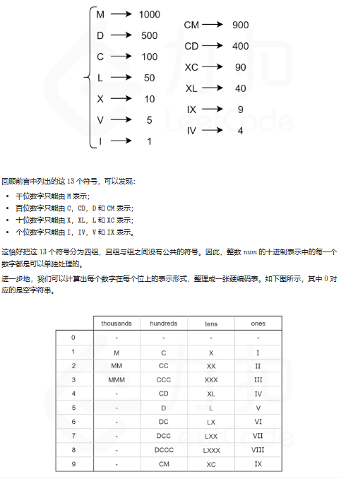

# 整数反转和字符串转整数

## [7. 整数反转](https://leetcode.cn/problems/reverse-integer/)

> - ***Question 1***数字转换系列问题
>   - 给你一个 `32` 位的有符号整数 `x` ，返回将 `x` 反转后的结果。
>   - 如果反转后整数超过 `32` 位的有符号整数的范围 `[−2^31, 2^31 − 1]` ，就返回 `0` 。
>   - 假设环境不允许存储 `64` 位整数（有符号或无符号）。
>   - ***tips:***
>     - `-2^31 <= x <= 2^31 - 1`

## [8. 字符串转换整数 (atoi)](https://leetcode.cn/problems/string-to-integer-atoi/)

> - ***Question 2***
>   - 请你来实现一个 `myAtoi(string s)` 函数，使其能将字符串转换成一个 `32` 位有符号整数（类似 `C/C++` 中的 `atoi` 函数）。
>   - 函数 `myAtoi(string s)` 的算法如下：
>     1. 读入字符串并丢弃无用的前导空格
>     2. 检查下一个字符（假设还未到字符末尾）为正还是负号，读取该字符（如果有）。确定最终结果是负数还是正数。如果两者都不存在，则假定结果为正。
>     3. 读入下一个字符，直到到达下一个非数字字符或到达输入的结尾。字符串的其余部分将被忽略。
>     4. 将前面步骤读入的这些数字转换为整数（即 `"123" -> 123, "0032" -> 32` ）。如果没有读入数字，则整数为 `0` 。必要时更改符号（从步骤 `2` 开始）。
>     5. 如果整数数超过 `32` 位有符号整数范围 `[−2^31,  2^31 − 1]` ，需要截断这个整数，使其保持在这个范围内。具体来说，小于 `−2^31` 的整数应该被固定为 `−2^31` ，大于 `2^31 − 1` 的整数应该被固定为 `2^31 − 1` 。
>     6. 返回整数作为最终结果。
>   - 注意：
>     - 本题中的空白字符只包括空格字符 ' ' 。
>     - 除前导空格或数字后的其余字符串外，请勿忽略任何其他字符。
>   - ***tips:***
>     - `0 <= s.length <= 200`
>     - `s` 由英文字母（大写和小写）、数字 `0-9`、空格和 `+, -, .` 组成

## [12. 整数转罗马数字](https://leetcode.cn/problems/integer-to-roman/)

> - ***Question 3***
>   - 罗马数字包含以下七种字符： `I (1), V (5), X (10), L (50), C (100), D (500), M (1000)` 。
>   - 例如，罗马数字 `2` 写做 ``II`` ，即为两个并列的 `1` 。 `12` 写做 `XII` ，即为 `X + II` 。 `27` 写做 `XXVII` , 即为 `XX + V + II` 。
>   - 通常情况下，罗马数字中小的数字在大的数字的右边。但也存在特例，例如 `4` 不写做 `IIII` ，而是 `IV` 。数字 `1` 在数字 `5` 的左边，所表示的数等于大数 `5` 减小数 `1` 得到的数值 `4` 。同样地，数字 `9` 表示为 `IX` 。这个特殊的规则只适用于以下六种情况：
>     - `I` 可以放在 `V (5)` 和 `X (10)` 的左边，来表示 `4` 和 `9` 。
>     - `X` 可以放在 `L (50)` 和 `C (100)` 的左边，来表示 `40` 和 `90` 。
>     - `C` 可以放在 `D (500)` 和 `M (1000)` 的左边，来表示 `400` 和 `900` 。
>   - 给你一个整数，将其转为罗马数字。
>   - ***tips:***
>     - `1 <= num <= 3999`

## [13. 罗马数字转整数](https://leetcode.cn/problems/roman-to-integer/)

> - ***Question 4***
>   - 给定一个罗马数字，将其转换成整数。
>   - 罗马数字与数字之间的转换规则如 `Question 3` 所示。
>   - ***tips:***
>     - `1 <= s.length <= 15`
>     - `s` 仅含字符 `('I', 'V', 'X', 'L', 'C', 'D', 'M')`
>     - 题目数据保证 `s` 是一个有效的罗马数字，且表示整数在范围 `[1, 3999]` 内
>     - 题目所给测试用例皆符合罗马数字书写规则，不会出现跨位等情况
>     - `IL` 和 `IM` 这样的例子并不符合题目要求， `49` 应该写作 `XLIX` ， `999` 应该写作 `CMXCIX`
>     - 关于罗马数字的详尽书写规则，可以参考[罗马数字 - Mathematics](https://b2b.partcommunity.com/community/knowledge/zh_CN/detail/10753/%E7%BD%97%E9%A9%AC%E6%95%B0%E5%AD%97#knowledge_article)

---

## *Java*

> - ***转成负数反转***

```java
class Solution {
    
    public int reverse(int x) {
        // 看看符号位是不是1
        boolean isNegativeNumber = ((x >>> 31) & 1) == 1;
        // 正数转负数
        x = isNegativeNumber ? x : -x;
        // 系统最小/10
        int quotient = Integer.MIN_VALUE / 10;
        // 系统最小%10
        int remainder = Integer.MIN_VALUE % 10;
        // 记录结果
        int ans = 0;
        while (x != 0) {
            // 你是负数，你比系统最小/10还小，那你乘10越界
            // 你是负数，你等于系统最小/10，但你加上x%10后比系统最小小，那你越界
            if (ans < quotient || (ans == quotient && x % 10 < remainder)) {
                return 0;
            }
            // 正常方法所需步骤
            ans = ans * 10 + x % 10;
            x /= 10;
        }
        // 正数取绝对值
        return isNegativeNumber ? ans : Math.abs(ans);
    }
    
}
```

> - ***用负数转换***
>   - 条件处理有点多，但核心逻辑和 `Question 1` 一样。

```java
class Solution {
    
    public int strToInt(String str) {
        return myAtoi(str);
    }
    
    public int myAtoi(String s) {
        if (s == null || s.equals("")) {
            return 0;
        }
        s = removeHeadZero(s.trim());
        if (s.equals("")) {
            return 0;
        }
        char[] str = s.toCharArray();
        if (!isValid(str)) {
            return 0;
        }
        // 是不是正数
        boolean isPositiveNumber = str[0] != '-';
        int quotient = Integer.MIN_VALUE / 10;
        int remainder = Integer.MIN_VALUE % 10;
        int ans = 0;
        int cur = 0;
        for (int i = (str[0] == '-' || str[0] == '+') ? 1 : 0; i < str.length; i++) {
            // 获取负数
            cur = '0' - str[i];
            if (ans < quotient || (ans == quotient && cur < remainder)) {
                return isPositiveNumber ? Integer.MAX_VALUE : Integer.MIN_VALUE;
            }
            ans = ans * 10 + cur;
        }
        // 正数溢出
        if (isPositiveNumber && ans == Integer.MIN_VALUE) {
            return Integer.MAX_VALUE;
        }
        return isPositiveNumber ? -ans : ans;
    }
    
    private String removeHeadZero(String str) {
        // 有没有正负号位
        boolean hasSign = str.startsWith("+") || str.startsWith("-");
        // 去来到第一个不是0的位置
        int start = hasSign ? 1 : 0;
        for (; start < str.length(); start++) {
            if (str.charAt(start) != '0') {
                break;
            }
        }
        int end = -1;
        for (int i = str.length() - 1; i >= (hasSign ? 1 : 0); i--) {
            if (str.charAt(i) < '0' || str.charAt(i) > '9') {
                end = i;
            }
        }
        // end 到了最左的不是数字字符的位置
        return (hasSign ? String.valueOf(str.charAt(0)) : "") + str.substring(start, end == -1 ? str.length() : end);
    }
    
    // 检查一个字符串内部是否合法
    private boolean isValid(char[] str) {
        // 开头不是符号或者数字
        if (str[0] != '-' && str[0] != '+' && (str[0] < '0' || str[0] > '9')) {
            return false;
        }
        // 字符里面只有符号
        if ((str[0] == '-' || str[0] == '+') && str.length == 1) {
            return false;
        }
        // 中间有不是数字的字符
        for (int i = 1; i < str.length; i++) {
            if (str[i] < '0' || str[i] > '9') {
                return false;
            }
        }
        return true;
    }
    
}
```

> - ***硬编码数字***
>   - 
>   - 利用模运算和除法运算，我们可以得到 `num` 每个位上的数字。最后根据 `num` 每个位上的数字，在硬编码表中查找对应的罗马字符，并将结果拼接在一起，即为 `num` 对应的罗马数字。

```java
class Solution {
    
    public static String intToRoman(int num) {
        String[] thousands = {"", "M", "MM", "MMM"};
        String[] hundreds = {"", "C", "CC", "CCC", "CD", "D", "DC", "DCC", "DCCC", "CM"};
        String[] tens = {"", "X", "XX", "XXX", "XL", "L", "LX", "LXX", "LXXX", "XC"};
        String[] ones = {"", "I", "II", "III", "IV", "V", "VI", "VII", "VIII", "IX"};
        return thousands[num / 1000] + hundreds[num % 1000 / 100] + tens[num % 100 / 10] + ones[num % 10];
    }
    
}
```

> - ***Question 4: 硬编码数字***

```java
class Solution {
    
    public int romanToInt(String s) {
        // C     M     X   C     I   X
        // 100  1000  10   100   1   10
        // 搞出每一个字母对应的数字数组
        int[] nums = new int[s.length()];
        for (int i = 0; i < s.length(); i++) {
            switch (s.charAt(i)) {
                case 'M':
                    nums[i] = 1000;
                    break;
                case 'D':
                    nums[i] = 500;
                    break;
                case 'C':
                    nums[i] = 100;
                    break;
                case 'L':
                    nums[i] = 50;
                    break;
                case 'X':
                    nums[i] = 10;
                    break;
                case 'V':
                    nums[i] = 5;
                    break;
                case 'I':
                    nums[i] = 1;
                    break;
            }
        }
        int sum = 0;
        for (int i = 0; i < nums.length - 1; i++) {
            // 一个字母要是比后一个字母代表的数字小，它对应的数字变成负数加到结果上，否则直接加
            if (nums[i] < nums[i + 1]) {
                sum -= nums[i];
            } else {
                sum += nums[i];
            }
        }
        // 加最后一个
        return sum + nums[nums.length - 1];
    }
    
}
```

---

> ***last change: 2023/4/15***

---
