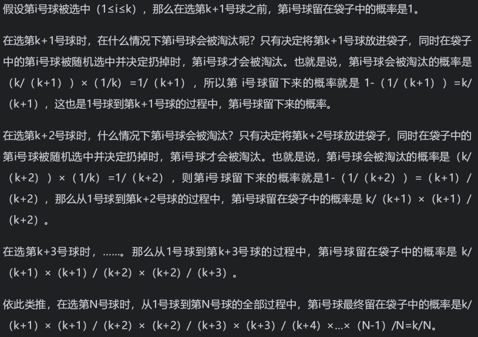

# 蓄水池算法

## 程序员代码面试指南：IT名企算法与数据结构题目最优解（第二版） 第9章 其他题目 蓄水池算法

> - ***Question***
>   - 有一台机器按自然数序列的方式吐出球：1号球，2号球，3号球……
>   - 你有一个袋子，袋子最多只能装下K个球，并且除袋子以外，你没有更多的空间。
>   - 设计一种选择方式，使得当机器吐出第 `N` 号球的时候（ `N` 大于 `K` ），袋子中的球数是 `K` 个，同时可以保证从 `1` 号球到 `N` 号球中的每一个被选进袋子的概率都是 `K/N` 。
>   - 举一个更具体的例子，有一个只能装下 `10` 个球的袋子，当吐出 `100` 个球时，袋子里有 `10` 个球，并且 `1~100` 号中的每一个球被选中的概率都是 `10/100` 。然后继续吐球，当吐出 `1000` 个球时，袋子里有 `10` 个球，并且 `1~1000` 号中的每一个球被选中的概率都是 `10/1000` 。继续吐球，当吐出 `i` 个球时，袋子里有 `10` 个球，并且 `1~i` 号中的每一个球被选中的概率都是 `10/i` ，即吐球的同时，已经吐出的球被选中的概率也动态地变化。

---

## *Java*

> - ***蓄水池算法***
>   - 对于第 `1` 到第 `k` 号球，直接放进袋子中；
>   - 对于第 `i (i > k)` 号球，以 `k/i` 的概率决定是否将第 `i` 号球放入袋子中：
>     - 如果决定将第 `i` 号球扔掉，那就永远扔掉
>     - 如果决定将第 `i` 号球放进袋子，请以 `1/k` 的概率随机地扔掉袋子中的一个球并用第 `i` 号球顶替它的位置
>   - 如下证明能保证从 `1` 号球到 `n` 号球中的每一个被选进袋子的概率都是 `k/n` ：
>     
>     

```java
class Solution {

    // 应用场景：
    // 某游戏全球各个地区都有一台服务器，并有一台总机。
    // 假设有这样一个活动：在1号00:00:00 - 23:59:59之间登录的用户中抽取100个用户给予奖励，怎么实现最好？
    // 直接在总机采用蓄水池算法，准备一个大小为100的空间来实时更新“抽取中”的用户，“球”即为各个服务器实时提交的当日首次登录的用户，到2号时直接公布“袋子”中的用户作为获奖者即可。

    // 返回1-i的随机整数
    public static int rand(int i) {
        // [0, i) -> [1, i + 1) -> [1, i]
        return (int) ((Math.random() * i) + 1);
    }

    // k是袋子长度
    // i是机器中球的个数
    public static int[] getKNumsRand(int k, int i) {
        // 没袋子或者没球
        if (i < 1 || k < 1) {
            return null;
        } else {
            // 实际的袋子
            int[] bag = new int[Math.min(k, i)];
            // 前k个数直接进袋子
            for (int bagi = 0; bagi < bag.length; bagi++) {
                bag[bagi] = bagi + 1;
            }
            for (int index = k + 1; index <= i; index++) {
                // 第i个数以k/i的概率进袋子 -> 在1-i之间随机抽数，抽到小于等于k的概率为k/i
                if (rand(index) <= k) {
                    // i位置的数随机替换袋子中的某个数
                    bag[rand(k) - 1] = index;
                }
            }
            return bag;
        }
    }
}
```

---

> ***last change: 2022/11/4***

---
