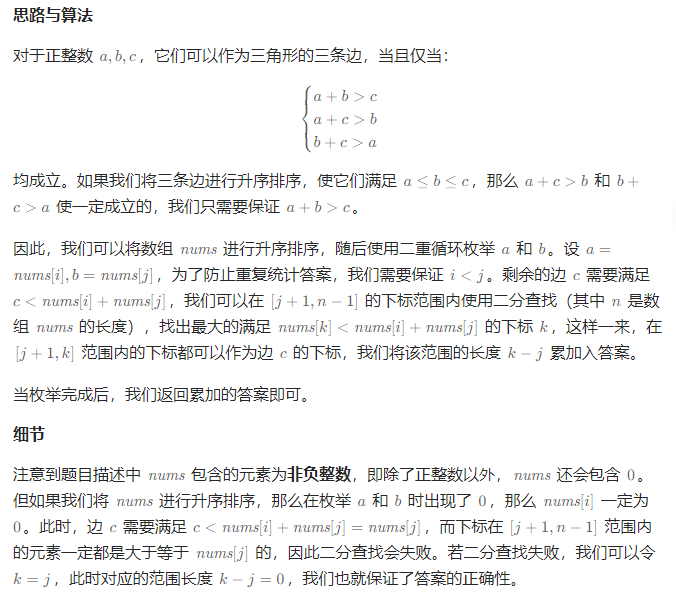

# 有效三角形的个数

## [611. 有效三角形的个数](https://leetcode.cn/problems/valid-triangle-number/)

> - ***Question***
>   - 给定一个包含非负整数的数组 `nums` ，返回其中可以组成三角形三条边的三元组个数。
>   - ***tips:***
>     - `1 <= nums.length <= 1000`
>     - `0 <= nums[i] <= 1000`

---

## *Java*

> - ***排序 + 二分查找***
>   - 

```java
import java.util.*;

class Solution {

    public int triangleNumber(int[] nums) {
        int n = nums.length;
        Arrays.sort(nums);
        int ans = 0;
        for (int i = 0; i < n; ++i) {
            for (int j = i + 1; j < n; ++j) {
                int left = j + 1, right = n - 1, k = j;
                while (left <= right) {
                    int mid = (left + right) / 2;
                    if (nums[mid] < nums[i] + nums[j]) {
                        k = mid;
                        left = mid + 1;
                    } else {
                        right = mid - 1;
                    }
                }
                ans += k - j;
            }
        }
        return ans;
    }

}
```
