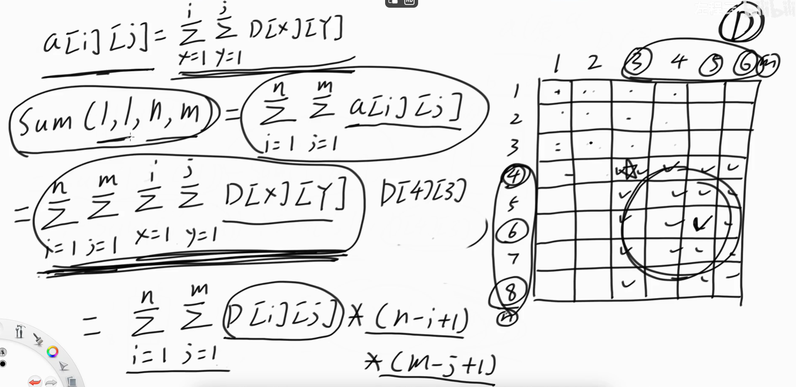
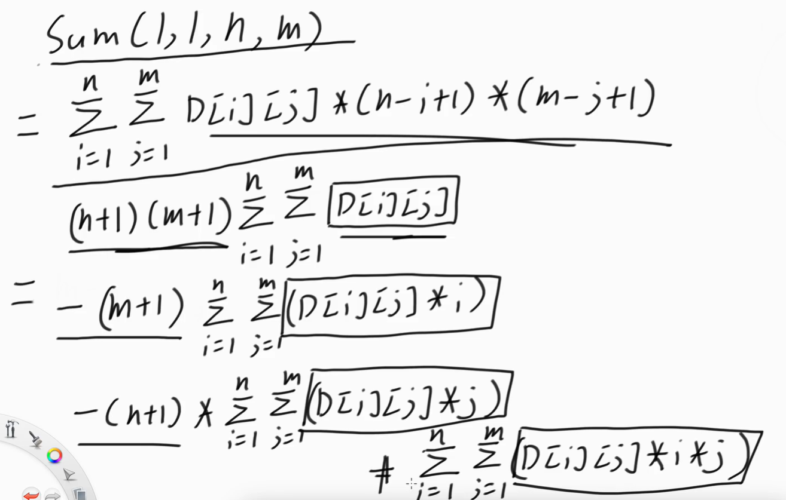

# 二叉（元）索引树（树状数组）BinaryIndexedTree代码模板

## [303. 区域和检索 - 数组不可变](https://leetcode.cn/problems/range-sum-query-immutable/)

## [307. 区域和检索 - 数组可修改](https://leetcode.cn/problems/range-sum-query-mutable/)

> - ***Question 1***
>   - 给你一个数组 `nums` ，请你完成三类查询：
>     - 一类查询要求更新数组 `nums` 下标对应的值。
>     - 一类查询要求数组 `nums` 下标对应的值全部加上一个新的值。
>     - 一类查询要求返回数组 `nums` 中索引 `left` 和 `right` 之间（包含边界）的 `nums` 元素的和。
>   - 实现 `NumArray` 类（线段树的功能）：
>     - `NumArray(int[] nums)` 用整数数组 `nums` 初始化对象。
>     - `void update(int index, int val)` / `void update(int left, int right, int val)` 将对应区间内的值更新为 `val` 。
>     - `void add(int index, int val)` / `void add(int left, int right, int val)` 将对应区间内的值全部加上 `val` 。
>     - `int sumRange(int left, int right)` 返回数组 `nums` 中索引 `left` 和索引 `right` 之间的 `nums` 元素的和。
>   - ***tips:***
>     - `1 <= nums.length <= 3 * 10^4`
>     - `-10^5 <= nums[i] <= 10^5`
>     - `0 <= index < nums.length`
>     - `-100 <= val <= 100`
>     - `0 <= left <= right < nums.length`
>     - 调用 `update` 和 `add` 和 `sumRange` 方法次数不大于 `3 * 10^4`

## [304. 二维区域和检索 - 矩阵不可变](https://leetcode.cn/problems/range-sum-query-2d-immutable/)

## [剑指 Offer II 013. 二维子矩阵的和](https://leetcode.cn/problems/O4NDxx/)

## [308. 二维区域和检索 - 可变](https://leetcode.cn/problems/range-sum-query-2d-mutable/)

> - ***Question 2***
>   - 给定一个二维矩阵 `matrix` ，实现 `NumMatrix` 类：
>     - `NumMatrix(int[][] matrix)` 给定整数矩阵 `matrix` 进行初始化。
>     - `int sumRegion(int row1, int col1, int row2, int col2)` 返回左上角 `(row1, col1)` 、右下角 `(row2, col2)` 所描述的子矩阵的元素总和。
>     - `void update(int row, int col, int val)` / `void update(int row1, int col1, int row2, int col2, int val)` 更新指定元素。
>     - `void add(int row, int col, int val)` / `void add(int row1, int col1, int row2, int col2, int val)` 指定范围内的元素都加上某个值。
>   - ***tips:***
>     - `m == matrix.length`
>     - `n == matrix[i].length`
>     - `1 <= m, n <= 200`
>     - `-10^5 <= matrix[i][j] <= 10^5`
>     - `0 <= row1 <= row2 < m`
>     - `0 <= col1 <= col2 < n`
>     - 最多调用 `10^4` 次 `update` 和 `add` 和 `sumRange` 方法

## [P3374 【模板】树状数组 1](https://www.luogu.com.cn/problem/P3374)

> - ***Question 3***
>   - 如题，已知一个数列，你需要进行下面两种操作：
>     - 将某一个数加上 `x` 。
>     - 求出某区间每一个数的和。
>   - ***输入描述***
>     - 第一行包含两个正整数 `n, m` ，分别表示该数列数字的个数和操作的总个数。
>     - 第二行包含 `n` 个用空格分隔的整数，其中第 `i` 个数字表示数列第 `i` 项的初始值。
>     - 接下来 `m` 行每行包含 `3` 个整数，表示一个操作，具体如下：
>       - `1 x k` 含义：将第 `x` 个数加上 `k`
>       - `2 x y` 含义：输出区间 `[x, y]` 内每个数的和
>   - ***输出描述***
>     - 输出包含若干行整数，即为所有操作 `2` 的结果。
>   - ***tips:***
>     - `1 <= n, m <= 5 * 10^5`

## [P3368 【模板】树状数组 2](https://www.luogu.com.cn/problem/P3368)

> - ***Question 4***
>   - 如题，已知一个数列，你需要进行下面两种操作：
>     - 将某区间每一个数加上 `x` 。
>     - 求出某一个数的值。
>   - ***输入描述***
>     - 第一行包含两个整数 `N, M`，分别表示该数列数字的个数和操作的总个数。
>     - 第二行包含 `N` 个用空格分隔的整数，其中第 `i` 个数字表示数列第 `i` 项的初始值。
>     - 接下来 `M` 行每行包含 `2` 或 `4` 个整数，表示一个操作，具体如下：
>       - 操作 `1` ：格式： `1 x y k` 含义：将区间 `[x, y]` 内每个数加上 `k` ；
>       - 操作 `2` ：格式： `2 x` 含义：输出第 `x` 个数的值。
>   - ***输出描述***
>     - 输出包含若干行整数，即为所有操作 `2` 的结果。
>   - ***tips:***
>     - `1 <= N, M <= 500000, 1 <= x, y <= n`
>     - 保证任意时刻序列中任意元素的绝对值都不大于 `2^30`

## [P3372 【模板】线段树 1](https://www.luogu.com.cn/problem/P3372)

> - ***Question 5***
>   - 如题，已知一个数列，你需要进行下面两种操作：
>     - 将某区间每一个数加上 `x` 。
>     - 求出某区间每一个数的和。
>   - ***输入描述***
>     - 第一行包含两个正整数 `n, m` ，分别表示该数列数字的个数和操作的总个数。
>     - 第二行包含 `n` 个用空格分隔的整数，其中第 `i` 个数字表示数列第 `i` 项的初始值。
>     - 接下来 `m` 行每行包含 `3` 或 `4` 个整数，表示一个操作，具体如下：
>       - `1 x y k` ：将区间 `[x, y]` 内每个数加上 `k` 。
>       - `2 x y` ：输出区间 `[x, y]` 内每个数的和。
>   - ***输出描述***
>     - 输出包含若干行整数，即为所有操作 `2` 的结果。
>   - ***tips:***
>     - `1 <= n, m <= 10^5`
>     - 保证任意时刻数列中所有元素的绝对值之和小于等于 `10^8`

## [P4514 上帝造题的七分钟](https://www.luogu.com.cn/problem/P4514)

> - ***Question 6***
>   - ***输入描述***
>     - 输入数据的第一行为 `X n m`，代表矩阵大小为 `n x m` 。
>     - 从输入数据的第二行开始到文件尾的每一行会出现以下两种操作：
>       - `L a b c d delta` ：代表将 `(a, b), (c, d)` 为顶点的矩形区域内的所有数字加上 `delta` 。
>       - `k a b c d` ：代表求 `(a, b), (c, d)` 为顶点的矩形区域内所有数字的和。
>   - ***输出描述***
>     - 针对每个 `k` 操作，在单独的一行输出答案。
>   - ***tips:***
>     - `1 <= n, m <= 2048`
>     - `-500 <= delta <= 500`
>     - 操作不超过 `2 * 10^5` 个，保证运算过程中及最终结果均不超过 `32` 位带符号整数类型的表示范围

---

## *Java*

> - ***一维BIT***
>   - 对于一个树状数组来说，其核心在于下标变换：
>     - 树状数组中的某个位置 `index` ，它存储 `index` 二进制中扔掉最后一个 `1` 然后再加上一个数值 `1` 到 `index` 之间的范围的数的总和。
>     - 原数组中一个位置 `index` 发生变动，从它开始树状数组后面 `index` 加上 `index` 二进制中最后一个 `1` 代表的数值（循环往复直到越界）的位置都变动。
>     - 原数组中 `index` 位置的前缀和从自己开始累加上树状数组中 `index` 减去 `index` 二进制中最后一个 `1` （循环往复直到越界）的位置的和（加上分前缀和）。
>   - 关键代码 `index & -index` 得到最后一个 `1` 。
>   - 树状数组选择从 `1` 开始是为了与改变某个位置的值时能够迅速找到受影响的位置二进制规律相结合的；
>   - 对于通过对和与自己的相反数得到的数进行相加减得到的二进制规律不要深究。
>   - 保存一份原始数组，并在 `update` 和 `add` 时同时保持更新，树状数组的修改在 `addNumAndChangeTree()` 上。
>   - 一次查询、删除、更新操作的时间复杂度都是 `O(logn)` ，其中 `n` 是数组 `nums` 的大小。
>   - 空间复杂度： `O(n)` 。保存 `tree` 需要 `O(n)` 的空间。

```java
class NumArray {
    
    private final int[] nums;
    private final int size;
    private final int[] tree;
    
    public NumArray(int[] nums) {
        this.nums = nums;
        this.size = nums.length + 1;
        this.tree = new int[size];
        // 初始化树状数组
        for (int i = 0; i < nums.length; ++i) {
            addNumAndChangeTree(i + 1, nums[i]);
        }
    }
    
    // 获取由index所对应的二进制数的最后一个1及其右边所有0组成的数
    private int getRightMostOne(int index) {
        // 一个数与上自己的相反数（取反 + 1）
        return index & -index;
    }
    
    // 当数组中的某一个位置的值执行了添加操作时调用该函数以调整树状数组
    private void addNumAndChangeTree(int index, int val) {
        // 更改index位置变动后树状数组中受影响的位置
        while (index < size) {
            tree[index] += val;
            // 和自己最后一个1相加，改变后再相加，加到越界为止
            // 其中所得到的位置就是包括了index位置的累加和
            index += getRightMostOne(index);
        }
    }
    
    // 求原数组中0 ~ index-1位置的前缀和
    private int getPrefixSum(int index) {
        int sum = 0;
        while (index > 0) {
            sum += tree[index];
            // 和add同理，只不过换成减法，找到我前面的所有分前缀和
            index -= getRightMostOne(index);
        }
        return sum;
    }
    
    public void update(int index, int val) {
        // 更新成val相当于原来的数加上与val的差值
        addNumAndChangeTree(index + 1, val - nums[index]);
        nums[index] = val;
    }
    
    public void update(int left, int right, int val) {
        for (int index = left; index <= right; ++index) {
            update(index, val);
        }
    }
    
    public void add(int index, int val) {
        addNumAndChangeTree(index + 1, val);
        nums[index] += val;
    }
    
    public void add(int left, int right, int val) {
        for (int index = left; index <= right; ++index) {
            add(index, val);
        }
    }
    
    // 求原数组中left-right的前缀和
    public int sumRange(int left, int right) {
        // 由于树状数组往后推移1位的特性，不需要考虑left等于0时的越界问题
        // 本来应该是getPrefixSum(right) - getPrefixSum(left - 1)
        return getPrefixSum(right + 1) - getPrefixSum(left);
    }
    
}
```

> - ***二维BIT***
>   - 直接将一维数组中的二进制规律推广到二维矩阵中的行和列上。
>   - 算一个区域的和需要用到一些几何方面的知识，即大减小再把多减的一份加回来。
>   - 记得初次更新要在 `addNumAndChangeTree` 中更新，在 `update` 中更新会有全 `0` 的错误。
>   - 其他步骤和一维树状数组一致，处理的范围变了而已，看 `addNumAndChangeTree` 方法注释。
>   - 不像线段树改二维非常难。

```java
class NumMatrix {
    
    private int[][] matrix;
    private int[][] tree;
    
    public NumMatrix(int[][] matrix) {
        if (matrix.length == 0 || matrix[0].length == 0) {
            return;
        }
        this.matrix = matrix;
        this.tree = new int[matrix.length + 1][matrix[0].length + 1];
        for (int i = 0; i < matrix.length; ++i) {
            for (int j = 0; j < matrix[0].length; ++j) {
                // 不能调用update，否则由于this.matrix已经赋值导致val - matrix[row][col]等于0进而使结果全为0
                addNumAndChangeTree(i, j, matrix[i][j]);
            }
        }
    }
    
    private int getRightMostOne(int index) {
        return index & -index;
    }
    
    // 下面两个函数传的都是树中的位置
    private void addNumAndChangeTree(int row, int col, int val) {
        // i和j的取值是因为传入的是原始矩阵中的位置，要加1才对于树中位置
        // 右下角区域所有满足的位置全改变
        for (int i = row + 1; i <= matrix.length; i += getRightMostOne(i)) {
            for (int j = col + 1; j <= matrix[0].length; j += getRightMostOne(j)) {
                tree[i][j] += val;
            }
        }
    }
    
    private int getPrefixSum(int row, int col) {
        int sum = 0;
        // 左上角满足的区域全获取
        for (int i = row + 1; i >= 1; i -= getRightMostOne(i)) {
            for (int j = col + 1; j >= 1; j -= getRightMostOne(j)) {
                sum += tree[i][j];
            }
        }
        return sum;
    }
    
    public void update(int row, int col, int val) {
        if (matrix.length == 0 || matrix[0].length == 0) {
            return;
        }
        addNumAndChangeTree(row, col, val - matrix[row][col]);
        matrix[row][col] = val;
    }
    
    public void update(int row1, int col1, int row2, int col2, int val) {
        // 区域内的值都改变
        for (int i = row1; i <= row2; ++i) {
            for (int j = col1; j <= col2; ++j) {
                update(i, j, val);
            }
        }
    }
    
    public void add(int row, int col, int val) {
        if (matrix.length == 0 || matrix[0].length == 0) {
            return;
        }
        addNumAndChangeTree(row, col, val);
        matrix[row][col] += val;
    }
    
    public void add(int row1, int col1, int row2, int col2, int val) {
        for (int i = row1; i <= row2; ++i) {
            for (int j = col1; j <= col2; ++j) {
                add(i, j, val);
            }
        }
    }
    
    public int sumRegion(int row1, int col1, int row2, int col2) {
        // 典中典计算公式
        // 避免因为左上角的越界而判空
        return getPrefixSum(row2, col2) - getPrefixSum(row2, col1 - 1) - getPrefixSum(row1 - 1, col2) + getPrefixSum(row1 - 1, col1 - 1);
    }
    
}

// 二维数组上单点增加、范围查询，使用树状数组的模版
class Solution {

    class NumMatrix {

        public int[][] tree;

        public int[][] nums;

        public int n;

        public int m;

        // 入参二维数组下标从0开始
        // 树状数组一定下标从1开始
        public NumMatrix(int[][] matrix) {
            n = matrix.length;
            m = matrix[0].length;
            tree = new int[n + 1][m + 1];
            nums = new int[n + 1][m + 1];
            for (int i = 0; i < n; i++) {
                for (int j = 0; j < m; j++) {
                    update(i, j, matrix[i][j]);
                }
            }
        }

        private int lowbit(int i) {
            return i & -i;
        }

        private void add(int x, int y, int v) {
            for (int i = x; i <= n; i += lowbit(i)) {
                for (int j = y; j <= m; j += lowbit(j)) {
                    tree[i][j] += v;
                }
            }
        }

        // 从(1,1)到(x,y)这个部分的累加和
        private int sum(int x, int y) {
            int ans = 0;
            for (int i = x; i > 0; i -= lowbit(i)) {
                for (int j = y; j > 0; j -= lowbit(j)) {
                    ans += tree[i][j];
                }
            }
            return ans;
        }

        // 实际二维数组的位置是(x,y)
        // 树状数组上的位置是(x+1, y+1)
        // 题目说的是单点更新，转化成单点增加(老值-新值)即可
        // 不要忘了在nums中把老值改成新值
        public void update(int x, int y, int v) {
            add(x + 1, y + 1, v - nums[x + 1][y + 1]);
            nums[x + 1][y + 1] = v;
        }

        // 实际二维数组的位置是(x,y)
        // 树状数组上的位置是(x+1, y+1)
        public int sumRegion(int a, int b, int c, int d) {
            return sum(c + 1, d + 1) - sum(a, d + 1) - sum(c + 1, b) + sum(a, b);
        }

    }

}
```

> - ***Question 3: 树状数组单点增加、范围查询模版***

```java
import java.io.*;

public class Main {

    public static int MAXN = 500001;

    // 原始数组的信息，根据课上说的关系，维护在树状数组中
    // 注意下标一定从1开始，不从0开始
    public static int[] tree = new int[MAXN];

    public static int n, m;

    // 得到i最右侧的1的状态
    // 其他位都是0
    public static int lowbit(int i) {
        return i & -i;
    }

    public static void add(int i, int v) {
        while (i <= n) {
            tree[i] += v;
            i += lowbit(i);
        }
    }

    // 返回1~i范围累加和
    public static int sum(int i) {
        int ans = 0;
        while (i > 0) {
            ans += tree[i];
            i -= lowbit(i);
        }
        return ans;
    }

    public static int range(int l, int r) {
        return sum(r) - sum(l - 1);
    }

    public static void main(String[] args) throws IOException {
        BufferedReader br = new BufferedReader(new InputStreamReader(System.in));
        StreamTokenizer in = new StreamTokenizer(br);
        PrintWriter out = new PrintWriter(new OutputStreamWriter(System.out));
        while (in.nextToken() != StreamTokenizer.TT_EOF) {
            n = (int) in.nval;
            in.nextToken();
            m = (int) in.nval;
            for (int i = 1, v; i <= n; i++) {
                in.nextToken();
                v = (int) in.nval;
                add(i, v);
            }
            for (int i = 1, a, b, c; i <= m; i++) {
                in.nextToken();
                a = (int) in.nval;
                in.nextToken();
                b = (int) in.nval;
                in.nextToken();
                c = (int) in.nval;
                if (a == 1) {
                    add(b, c);
                } else {
                    out.println(range(b, c));
                }
            }
        }
        out.flush();
        out.close();
        br.close();
    }

}
```

> - ***Question 4: 树状数组范围增加、单点查询模版***
>   - 如果用 `Question 3` 中的模版，范围增加就只能遍历范围内的所有数字一个个加，但如果我们求原始数组，然后对差分数组建立树状数组，那么对于树状数组的范围增加、单点查询就变成了差分数组的两点增加，范围查询，对差分数组的树状数组用 `Question 3` 中的模版即可。

```java
import java.io.*;

public class Main {

    public static int MAXN = 500002;

    // 树状数组不维护原数组的信息，维护原数组的差分信息
    // 注意下标一定从1开始，不从0开始
    public static int[] tree = new int[MAXN];

    public static int n, m;

    public static int lowbit(int i) {
        return i & -i;
    }

    public static void add(int i, int v) {
        while (i <= n) {
            tree[i] += v;
            i += lowbit(i);
        }
    }

    // 返回1~i范围累加和
    public static int sum(int i) {
        int ans = 0;
        while (i > 0) {
            ans += tree[i];
            i -= lowbit(i);
        }
        return ans;
    }

    public static void main(String[] args) throws IOException {
        BufferedReader br = new BufferedReader(new InputStreamReader(System.in));
        StreamTokenizer in = new StreamTokenizer(br);
        PrintWriter out = new PrintWriter(new OutputStreamWriter(System.out));
        while (in.nextToken() != StreamTokenizer.TT_EOF) {
            n = (int) in.nval;
            in.nextToken();
            m = (int) in.nval;
            for (int i = 1, v; i <= n; i++) {
                in.nextToken();
                v = (int) in.nval;
                // 单点初始化，转化为差分2个位置的加
                add(i, v);
                add(i + 1, -v);
            }
            for (int i = 1; i <= m; i++) {
                in.nextToken();
                int op = (int) in.nval;
                if (op == 1) {
                    in.nextToken();
                    int l = (int) in.nval;
                    in.nextToken();
                    int r = (int) in.nval;
                    in.nextToken();
                    int v = (int) in.nval;
                    add(l, v);
                    add(r + 1, -v);
                } else {
                    in.nextToken();
                    int index = (int) in.nval;
                    out.println(sum(index));
                }
            }
        }
        out.flush();
        out.close();
        br.close();
    }

}
```

> - ***Question 5: 树状数组范围增加、范围查询模版***

```java
// 原始数组a1 + ... + an
// = d1 + (d1 + d2) + ... + (d1 + ... + dk)
// = k * d1 + (k - 1) * d2 + (k - 2) * d3 + ... + (k - (k - 1)) * dk
// = k * (d1 + d2 + ... + dk) - ((1 - 1) * d1 + (2 - 1) * d2 + ... + (k - 1) * dk)
// 维护两个差分数组 原始差分数组和(i - 1) * di
// 范围求和转化为1到r减去1到l，1到k的求和用两个差分数组的求和实现
import java.io.*;

public class Main {

    public static int MAXN = 100001;

    // 维护原始数组的差分信息：Di
    public static long[] info1 = new long[MAXN];

    // 维护原始数组的差分加工信息：(i-1) * Di
    public static long[] info2 = new long[MAXN];

    public static int n, m;

    public static int lowbit(int i) {
        return i & -i;
    }

    // 判断加哪个数组
    public static void add(long[] tree, int i, long v) {
        while (i <= n) {
            tree[i] += v;
            i += lowbit(i);
        }
    }

    public static long sum(long[] tree, int i) {
        long ans = 0;
        while (i > 0) {
            ans += tree[i];
            i -= lowbit(i);
        }
        return ans;
    }

    // 原始数组中[l..r]每个数值+v
    // 两个差分数组都加
    public static void add(int l, int r, long v) {
        add(info1, l, v);
        add(info1, r + 1, -v);
        add(info2, l, (l - 1) * v);
        add(info2, r + 1, -(r * v));
    }

    // 原始数组中[l..r]范围上的累加和
    public static long range(int l, int r) {
        return sum(info1, r) * r - sum(info2, r) - sum(info1, l - 1) * (l - 1) + sum(info2, l - 1);
    }

    public static void main(String[] args) throws IOException {
        BufferedReader br = new BufferedReader(new InputStreamReader(System.in));
        StreamTokenizer in = new StreamTokenizer(br);
        PrintWriter out = new PrintWriter(new OutputStreamWriter(System.out));
        while (in.nextToken() != StreamTokenizer.TT_EOF) {
            n = (int) in.nval;
            in.nextToken();
            m = (int) in.nval;
            long cur;
            for (int i = 1; i <= n; i++) {
                in.nextToken();
                cur = (long) in.nval;
                add(i, i, cur);
            }
            long v;
            for (int i = 1, op, l, r; i <= m; i++) {
                in.nextToken();
                op = (int) in.nval;
                if (op == 1) {
                    in.nextToken();
                    l = (int) in.nval;
                    in.nextToken();
                    r = (int) in.nval;
                    in.nextToken();
                    v = (long) in.nval;
                    add(l, r, v);
                } else {
                    in.nextToken();
                    l = (int) in.nval;
                    in.nextToken();
                    r = (int) in.nval;
                    out.println(range(l, r));
                }
            }
        }
        out.flush();
        out.close();
        br.close();
    }

}
```

> - ***Question 6: 二维数组上范围增加、范围查询，使用树状数组模版***
>   - 原数组范围和怎么用差分数组求：化简后转化为 `4` 个差分。
>   - 
>   - 

```java
import java.io.*;

public class Main {

    public static int MAXN = 2050;

    public static int MAXM = 2050;

    // 维护信息 : d[i][j]
    public static int[][] info1 = new int[MAXN][MAXM];

    // 维护信息 : d[i][j] * i
    public static int[][] info2 = new int[MAXN][MAXM];

    // 维护信息 : d[i][j] * j
    public static int[][] info3 = new int[MAXN][MAXM];

    // 维护信息 : d[i][j] * i * j
    public static int[][] info4 = new int[MAXN][MAXM];

    public static int n, m;

    public static int lowbit(int i) {
        return i & -i;
    }

    public static void add(int x, int y, int v) {
        int v1 = v;
        int v2 = x * v;
        int v3 = y * v;
        int v4 = x * y * v;
        for (int i = x; i <= n; i += lowbit(i)) {
            for (int j = y; j <= m; j += lowbit(j)) {
                info1[i][j] += v1;
                info2[i][j] += v2;
                info3[i][j] += v3;
                info4[i][j] += v4;
            }
        }
    }

    // 以(1,1)左上角，以(x,y)右下角
    public static int sum(int x, int y) {
        int ans = 0;
        for (int i = x; i > 0; i -= lowbit(i)) {
            for (int j = y; j > 0; j -= lowbit(j)) {
                ans += (x + 1) * (y + 1) * info1[i][j] - (y + 1) * info2[i][j] - (x + 1) * info3[i][j] + info4[i][j];
            }
        }
        return ans;
    }

    // 参考二维差分
    public static void add(int a, int b, int c, int d, int v) {
        add(a, b, v);
        add(a, d + 1, -v);
        add(c + 1, b, -v);
        add(c + 1, d + 1, v);
    }

    public static int range(int a, int b, int c, int d) {
        return sum(c, d) - sum(a - 1, d) - sum(c, b - 1) + sum(a - 1, b - 1);
    }

    public static void main(String[] args) throws IOException {
        BufferedReader br = new BufferedReader(new InputStreamReader(System.in));
        StreamTokenizer in = new StreamTokenizer(br);
        PrintWriter out = new PrintWriter(new OutputStreamWriter(System.out));
        String op;
        int a, b, c, d, v;
        while (in.nextToken() != StreamTokenizer.TT_EOF) {
            op = in.sval;
            if (op.equals("X")) {
                in.nextToken();
                n = (int) in.nval;
                in.nextToken();
                m = (int) in.nval;
            } else if (op.equals("L")) {
                in.nextToken();
                a = (int) in.nval;
                in.nextToken();
                b = (int) in.nval;
                in.nextToken();
                c = (int) in.nval;
                in.nextToken();
                d = (int) in.nval;
                in.nextToken();
                v = (int) in.nval;
                add(a, b, c, d, v);
            } else {
                in.nextToken();
                a = (int) in.nval;
                in.nextToken();
                b = (int) in.nval;
                in.nextToken();
                c = (int) in.nval;
                in.nextToken();
                d = (int) in.nval;
                out.println(range(a, b, c, d));
            }
        }
        out.flush();
        out.close();
        br.close();
    }

}
```

> - ***总结***
>   - 树状数组一般用来维护可差分的信息，比如累加和、累乘积、或者出题人发现了某个可差分信息来出题考你。
>   - 不可差分的信息，比如最大值、最小值、除此之外的很多信息，不可差分的信息一般不用树状数组维护，会选择用线段树维护，因为线段树维护的方式思考难度更低。
>   - 大多数情况下，线段树可以替代树状数组，两者的时间复杂度差不多，单次调用都是 `O(logn)` 。
>   - 线段树的优势：用法全面、思考难度低、维护信息类型多（包括可差分信息、不可差分信息）；线段树的劣势：代码较多、使用空间较大、常数时间稍差。
>   - 树状数组优势：代码量少、使用空间少、常数时间优异；树状数组劣势：维护信息的类型少、维护某些不可差分的信息时思考难度大并且不易实现。

---

> ***last change: 2023/3/17***

---
