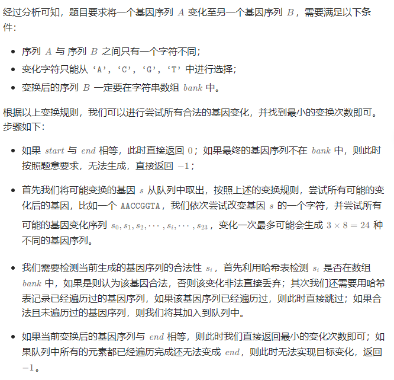
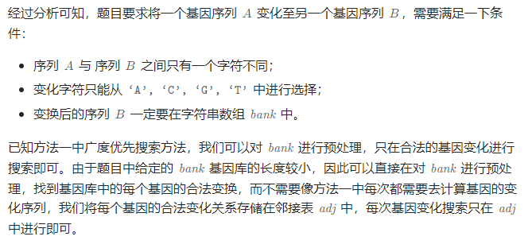

# 最小基因变化

## [433. 最小基因变化](https://leetcode.cn/problems/minimum-genetic-mutation/)

> - **Question**
>   - 基因序列可以表示为一条由 `8` 个字符组成的字符串，其中每个字符都是 `'A', 'C', 'G', 'T'` 之一。
>   - 假设我们需要调查从基因序列 `start` 变为 `end` 所发生的基因变化。一次基因变化就意味着这个基因序列中的一个字符发生了变化。
>   - 例如 `"AACCGGTT" --> "AACCGGTA"` 就是一次基因变化。
>   - 另有一个基因库 `bank` 记录了所有有效的基因变化，只有基因库中的基因才是有效的基因序列。（变化后的基因必须位于基因库 `bank` 中）
>   - 给你两个基因序列 `start` 和 `end` ，以及一个基因库 `bank` ，请你找出并返回能够使 `start` 变化为 `end` 所需的最少变化次数。如果无法完成此基因变化，返回 `-1` 。
>   - 注意：起始基因序列 `start` 默认是有效的，但是它并不一定会出现在基因库中。
>   - **Tips**
>     - `start.length == 8`
>     - end.length == 8`
>     - 0 <= bank.length <= 10`
>     - bank[i].length == 8`
>     - start, end, bank[i]` 仅由字符 `['A', 'C', 'G', 'T']` 组成

## Java

> - **BFS**
>   - 
>   - 

```java
import java.util.*;

class Solution {

    public int minMutation(String start, String end, String[] bank) {
        int m = start.length();
        int n = bank.length;
        List<Integer>[] adj = new List[n];
        for (int i = 0; i < n; i++) {
            adj[i] = new ArrayList<>();
        }
        int endIndex = -1;
        for (int i = 0; i < n; i++) {
            if (end.equals(bank[i])) {
                endIndex = i;
            }
            for (int j = i + 1; j < n; j++) {
                int mutations = 0;
                for (int k = 0; k < m; k++) {
                    if (bank[i].charAt(k) != bank[j].charAt(k)) {
                        mutations++;
                    }
                    if (mutations > 1) {
                        break;
                    }
                }
                if (mutations == 1) {
                    adj[i].add(j);
                    adj[j].add(i);
                }
            }
        }
        if (endIndex == -1) {
            return -1;
        }

        ArrayDeque<Integer> queue = new ArrayDeque<>();
        boolean[] visited = new boolean[n];
        int step = 1;
        for (int i = 0; i < n; i++) {
            int mutations = 0;
            for (int k = 0; k < m; k++) {
                if (start.charAt(k) != bank[i].charAt(k)) {
                    mutations++;
                }
                if (mutations > 1) {
                    break;
                }
            }
            if (mutations == 1) {
                queue.offer(i);
                visited[i] = true;
            }
        }
        while (!queue.isEmpty()) {
            int sz = queue.size();
            for (int i = 0; i < sz; i++) {
                int curr = queue.poll();
                if (curr == endIndex) {
                    return step;
                }
                for (int next : adj[curr]) {
                    if (visited[next]) {
                        continue;
                    }
                    visited[next] = true;
                    queue.offer(next);
                }
            }
            step++;
        }
        return -1;
    }

}
```
