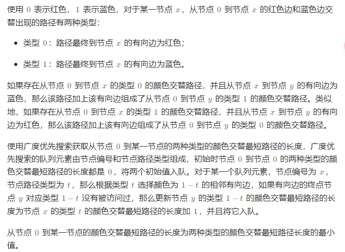

# 颜色交替的最短路径

## [1129. 颜色交替的最短路径](https://leetcode.cn/problems/shortest-path-with-alternating-colors/)

> - ***Question***
>   - 给定一个整数 `n` ，即有向图中的节点数，其中节点标记为 `0` 到 `n - 1` 。图中的每条边为红色或者蓝色，并且可能存在自环或平行边。
>   - 给定两个数组 `redEdges` 和 `blueEdges` ，其中：
>     - `redEdges[i] = [ai, bi]` 表示图中存在一条从节点 `ai` 到节点 `bi` 的红色有向边，
>     - `blueEdges[j] = [uj, vj]` 表示图中存在一条从节点 `uj` 到节点 `vj` 的蓝色有向边。
>   - 返回长度为 `n` 的数组 `answer` ，其中 `answer[X]` 是从节点 `0` 到节点 `X` 的红色边和蓝色边交替出现的最短路径的长度。如果不存在这样的路径，那么 `answer[x] = -1` 。
>   - ***tips:***
>     - `1 <= n <= 100`
>     - `0 <= redEdges.length, blueEdges.length <= 400`
>     - `redEdges[i].length == blueEdges[j].length == 2`
>     - `0 <= ai, bi, uj, vj < n`

---

## *Java*

> - ***BFS***
>   - 

```java
import java.util.*;

class Solution {

    public int[] shortestAlternatingPaths(int n, int[][] redEdges, int[][] blueEdges) {
        List<Integer>[][] next = new List[2][n];
        for (int i = 0; i < 2; i++) {
            for (int j = 0; j < n; j++) {
                next[i][j] = new ArrayList<>();
            }
        }
        for (int[] edge : redEdges) {
            next[0][edge[0]].add(edge[1]);
        }
        for (int[] edge : blueEdges) {
            next[1][edge[0]].add(edge[1]);
        }
        int[][] dist = new int[2][n]; // 两种类型的颜色最短路径的长度
        for (int i = 0; i < 2; i++) {
            Arrays.fill(dist[i], Integer.MAX_VALUE);
        }
        ArrayDeque<int[]> queue = new ArrayDeque<>();
        dist[0][0] = 0;
        dist[1][0] = 0;
        queue.offer(new int[]{0, 0});
        queue.offer(new int[]{0, 1});
        while (!queue.isEmpty()) {
            int[] pair = queue.poll();
            int x = pair[0], t = pair[1];
            for (int y : next[1 - t][x]) {
                if (dist[1 - t][y] != Integer.MAX_VALUE) {
                    continue;
                }
                dist[1 - t][y] = dist[t][x] + 1;
                queue.offer(new int[]{y, 1 - t});
            }
        }
        int[] answer = new int[n];
        for (int i = 0; i < n; i++) {
            answer[i] = Math.min(dist[0][i], dist[1][i]);
            if (answer[i] == Integer.MAX_VALUE) {
                answer[i] = -1;
            }
        }
        return answer;
    }

}

```
