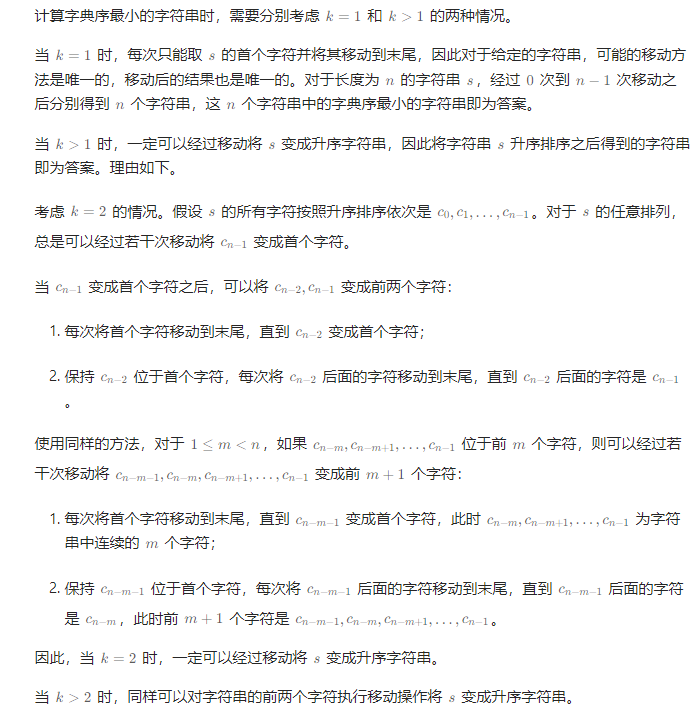

# 有序队列

## [899. 有序队列](https://leetcode.cn/problems/orderly-queue/)

> - ***Question***
>   - 给定一个字符串 `s` 和一个整数 `k` 。你可以从 `s` 的前 `k` 个字母中选择一个，并把它加到字符串的末尾。
>   - 返回在应用上述步骤的任意数量的移动后，字典序最小的字符串。
>   - ***tips:***
>     - `1 <= k <= S.length <= 1000`
>     - `s` 只由小写字母组成

---

## *Java*

> - ***模拟***
>   - 

```java
import java.util.*;

class Solution {

    public String orderlyQueue(String s, int k) {
        if (k == 1) {
            String smallest = s;
            StringBuilder sb = new StringBuilder(s);
            int n = s.length();
            for (int i = 1; i < n; i++) {
                char c = sb.charAt(0);
                sb.deleteCharAt(0);
                sb.append(c);
                if (sb.toString().compareTo(smallest) < 0) {
                    smallest = sb.toString();
                }
            }
            return smallest;
        } else {
            char[] arr = s.toCharArray();
            Arrays.sort(arr);
            return new String(arr);
        }
    }

}
```
