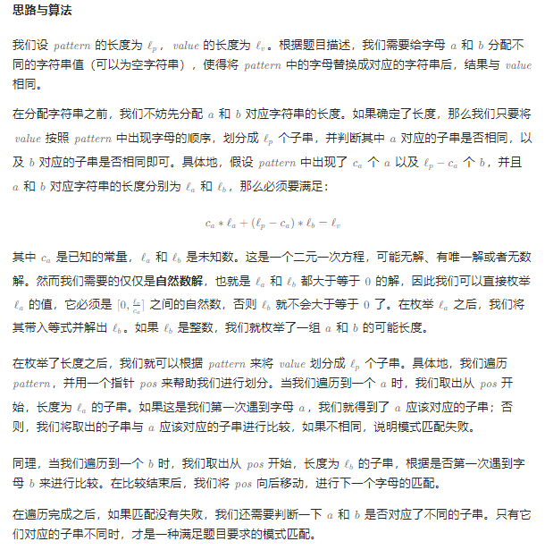
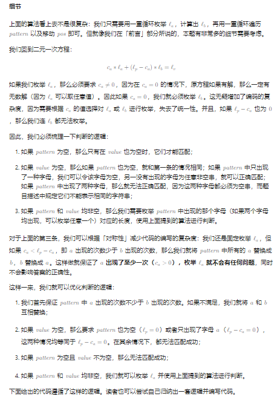
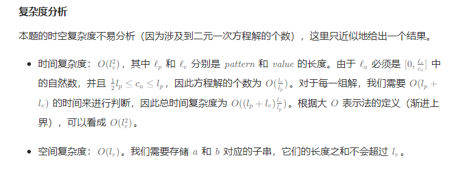

# 模式匹配

## [面试题 16.18. 模式匹配](https://leetcode.cn/problems/pattern-matching-lcci/)

> - **Question**
>   - 你有两个字符串，即 `pattern` 和 `value` 。 `pattern` 字符串由字母 `"a"` 和 `"b"` 组成，用于描述字符串中的模式。例如，字符串 `"catcatgocatgo"` 匹配模式 `"aabab"` （其中 `"cat"` 是 `"a"` ， `"go"` 是 `"b"` ），该字符串也匹配像 `"a"` 、 `"ab"` 和 `"b"` 这样的模式。但需注意 `"a"` 和 `"b"` 不能同时表示相同的字符串。编写一个方法判断 `value` 字符串是否匹配 `pattern` 字符串。
>   - **Tips**
>     - `1 <= len(pattern) <= 1000`
>     - `0 <= len(value) <= 1000`
>     - 你可以假设 `pattern` 只包含字母 `"a"` 和 `"b"` ， `value` 仅包含小写字母

## Java

> - **枚举**
>   - 
>   - 
>   - 

```java
class Solution {

    public boolean patternMatching(String pattern, String value) {
        int count_a = 0, count_b = 0;
        for (char ch : pattern.toCharArray()) {
            if (ch == 'a') {
                ++count_a;
            } else {
                ++count_b;
            }
        }
        if (count_a < count_b) {
            int temp = count_a;
            count_a = count_b;
            count_b = temp;
            char[] array = pattern.toCharArray();
            for (int i = 0; i < array.length; i++) {
                array[i] = array[i] == 'a' ? 'b' : 'a';
            }
            pattern = new String(array);
        }
        if (value.isEmpty()) {
            return count_b == 0;
        }
        if (pattern.isEmpty()) {
            return false;
        }
        for (int len_a = 0; count_a * len_a <= value.length(); ++len_a) {
            int rest = value.length() - count_a * len_a;
            if ((count_b == 0 && rest == 0) || (count_b != 0 && rest % count_b == 0)) {
                int len_b = (count_b == 0 ? 0 : rest / count_b);
                int pos = 0;
                boolean correct = true;
                String value_a = "", value_b = "";
                for (char ch : pattern.toCharArray()) {
                    if (ch == 'a') {
                        String sub = value.substring(pos, pos + len_a);
                        if (value_a.isEmpty()) {
                            value_a = sub;
                        } else if (!value_a.equals(sub)) {
                            correct = false;
                            break;
                        }
                        pos += len_a;
                    } else {
                        String sub = value.substring(pos, pos + len_b);
                        if (value_b.isEmpty()) {
                            value_b = sub;
                        } else if (!value_b.equals(sub)) {
                            correct = false;
                            break;
                        }
                        pos += len_b;
                    }
                }
                if (correct && !value_a.equals(value_b)) {
                    return true;
                }
            }
        }
        return false;
    }

}
```
