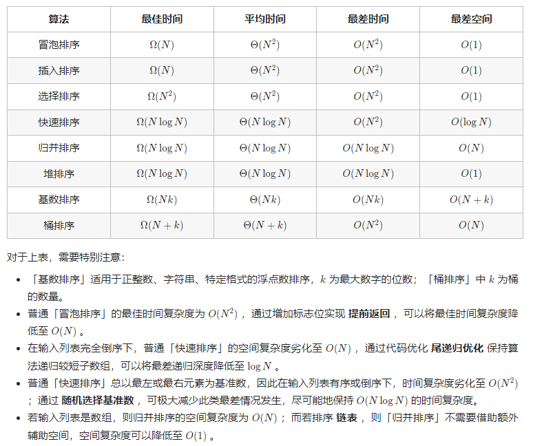

# 从对数组进行升序排序看各大排序模板

## [912. 排序数组](https://leetcode.cn/problems/sort-an-array/)

> - ***Question 1***
>   - 给你一个整数数组 nums，请你将该数组升序排列。
>   - ***tips:***
>     - `1 <= nums.length <= 5 * 10^4`
>     - `-5 * 10^4 <= nums[i] <= 5 * 10^4`

## [排序（归并排序）](https://www.nowcoder.com/practice/bc25055fb97e4a0bb564cb4b214ffa92)

> - ***Question 2***
>   - 给你一个 `n` 代表有 `n` 个数字，然后你需要使用归并排序将这些数字从小到大排好。
>   - ***输入描述***
>     - 第一行输入一个 `n` ，代表有 `n` 个数字。
>     - 第二行输入 `n` 个数。
>   - ***输出描述***
>     - 输出排序好后的 `n` 个数。

## [快速排序](https://www.nowcoder.com/practice/3385982ae71d4a1ca8bf3d03614c0325)

> - ***Question 3***
>   - 给你一个 `n` 代表有 `n` 个数字，然后你需要使用快速排序将这些数字从小到大排好。
>   - ***输入描述***
>     - 输入为两行。第一行一个整数 `n (1 <= n <= 100000)` ，表示一共有 `n` 个元素，第二行为 `n` 个数，即每个元素，每个整数都在 `32` 位 `int` 范围内。以空格分隔。
>   - ***输出描述***
>     - 输出一行，即排序之后的数组，以空格分隔，行末无空格。

## [排序（堆排序）](https://www.nowcoder.com/practice/ed8308a5f0f744fc936bdba78c15f810)

> - ***Question 4***
>   - 给你一个 `n` 代表有 `n` 个数字，然后你需要使用堆排序将这些数字从小到大排好。
>   - ***输入描述***
>     - 第一行输入一个 `n` ，代表有 `n` 个数字。
>     - 第二行输入 `n` 个数。
>   - ***输出描述***
>     - 输出排序好后的 `n` 个数。

## [排序（基数排序）](https://www.nowcoder.com/practice/ed8308a5f0f744fc936bdba78c15f810)

> - ***Question 5***
>   - 给你一个 `n` 代表有 `n` 个数字，然后你需要使用基数排序将这些数字从小到大排好。
>   - ***输入描述***
>     - 第一行输入一个 `n` ，代表有 `n` 个数字。
>     - 第二行输入 `n` 个数。
>   - ***输出描述***
>     - 输出排序好后的 `n` 个数。

---

## *Java*

> - ***Question 1: 排序***
>   - 实现了冒泡排序、选择排序、插入排序、希尔排序、归并排序（递归版和迭代版）、堆排序、快速排序（递归版和迭代版）、计数排序。
>   - 没有考虑溢出，适用大部分场景

```java
class Solution {
    
    // 冒泡排序，超时
    public void bubbleSort(int[] nums) {
        for (int i = nums.length - 1; i > 0; --i) {
            // 当前轮遍历发现是升序了，直接跳出比对
            boolean flag = true;
            for (int j = 0; j < i; ++j) {
                if (nums[j] > nums[j + 1]) {
                    swap(nums, j, j + 1);
                    flag = false;
                }
            }
            if (flag) {
                break;
            }
        }
    }
    
    // 选择排序，超时
    public void selectionSort(int[] nums) {
        for (int i = 0; i < nums.length - 1; ++i) {
            int minIndex = i;
            for (int j = i; j < nums.length; ++j) {
                if (nums[minIndex] > nums[j]) {
                    minIndex = j;
                }
            }
            swap(nums, i, minIndex);
        }
    }
    
    // 插入排序，超时
    public void insertionSort(int[] nums) {
        /*
        // 写法1
        // i指要拿去插入的位置
        for (int i = 1; i < nums.length; ++i) {
            // j指有序区的最后一个
            for (int j = i - 1; j >= 0 && nums[j] > nums[j + 1]; --j) {
                swap(nums, j, j + 1);
            }
        }
        */
        /*
        // 写法2
        for (int i = 1; i < nums.length; ++i) {
            int cur = nums[i];
            int index = i;
            while (index > 0 && nums[index - 1] > cur) {
                nums[index] = nums[index - 1];
                --index;
            }
            nums[index] = cur;
        }
        */
        // 写法3
        for (int i = 1; i < nums.length; ++i) {
            int newNumIndex = i;
            while (newNumIndex - 1 >= 0 && nums[newNumIndex - 1] > nums[newNumIndex]) {
                swap(nums, newNumIndex - 1, newNumIndex);
                --newNumIndex;
            }
        }
    }
    
    // 归并过程
    private void merge(int[] nums, int left, int mid, int right, int[] help) {
        int mergePoint = left;
        int leftPoint = left;
        int rightPoint = mid + 1;
        while (leftPoint <= mid && rightPoint <= right) {
            help[mergePoint++] = nums[leftPoint] > nums[rightPoint] ? nums[rightPoint++] : nums[leftPoint++];
        }
        while (leftPoint <= mid) {
            help[mergePoint++] = nums[leftPoint++];
        }
        while (rightPoint <= right) {
            help[mergePoint++] = nums[rightPoint++];
        }
        // for循环的简写
        if (right + 1 - left >= 0) System.arraycopy(help, left, nums, left, right + 1 - left);
        /*for (int i = left; i <= right; ++i) {
            nums[i] = help[i];
        }*/
    }
    
    // 归并排序递归版，全局临时数组+小区间插入排序+merge前判别有序优化版本
    public void mergeSortByRecursion(int[] nums, int left, int right, int[] help) {
        // 用插入排序优化小范围上的排序
        if (left + 60 > right) {
            insertionSortInSmallRange(nums, left, right);
        } else {
            // 中点计算巨坑
            int mid = (left + right) >> 1;
            mergeSortByRecursion(nums, left, mid, help);
            mergeSortByRecursion(nums, mid + 1, right, help);
            // 优化，如果左组的最大小于右组的最小，由双边有序直接return
            if (nums[mid] < nums[mid + 1]) {
                return;
            }
            merge(nums, left, mid, right, help);
        }
    }
    
    // 归并排序迭代版
    public void mergeSortByIteration(int[] nums) {
        int mergeSize = 1;
        int[] help = new int[nums.length];
        while (mergeSize < nums.length) {
            int left = 0;
            // 不考虑越界
            /*while (left < nums.length) {
                int mid = left + mergeSize - 1;
                if (mid >= nums.length) {
                    break;
                }
                int right = Math.min(mid + mergeSize, nums.length - 1);
                merge(nums, left, mid, right, help);
                left = right + 1;
            }*/
            // 考虑越界
            while (left < nums.length) {
                int mid;
                // 假定nums.length是整数最大值
                if ((nums.length - 1) - left + 1 >= mergeSize) {
                    // 可能有右组，也可能只有一个满的左组
                    mid = left + mergeSize - 1;
                } else {
                    // 没凑齐左组数组就结束了，不merge
                    break;
                }
                int right;
                if (nums.length - 1 - mid >= mergeSize) {
                    // 能凑够右组，可能有下一个左组
                    right = mid + mergeSize;
                } else {
                    // 右组没凑满就结束了，最后一个右组
                    right = nums.length - 1;
                }
                merge(nums, left, mid, right, help);
                if (right == nums.length - 1) {
                    // 这就是最后一个组
                    break;
                } else {
                    // 有下一个组
                    left = right + 1;
                }
            }
            // 除法向下取整的，不能取0
            if (mergeSize > nums.length / 2) {
                break;
            } else {
                mergeSize <<= 1;
            }
        }
    }
    
    // 荷兰国旗问题
    private int[] partition(int[] nums, int left, int right) {
        if (left == right) {
            return new int[]{left, right};
        }
        int lessAreaRight = left - 1;
        int moreAreaLeft = right;
        int point = left;
        while (point < moreAreaLeft) {
            if (nums[point] < nums[right]) {
                swap(nums, ++lessAreaRight, point++);
            } else if (nums[point] > nums[right]) {
                swap(nums, --moreAreaLeft, point);
            } else {
                ++point;
            }
        }
        swap(nums, moreAreaLeft, right);
        return new int[]{lessAreaRight + 1, moreAreaLeft};
    }
    
    // 三路随机快速排序递归版
    public void quickSortByRecursion(int[] nums, int left, int right) {
        if (left + 60 > right) {
            insertionSortInSmallRange(nums, left, right);
        } else {
            swap(nums, left + (int) (Math.random() * (right - left + 1)), right);
            int[] equalArea = partition(nums, left, right);
            quickSortByRecursion(nums, left, equalArea[0] - 1);
            quickSortByRecursion(nums, equalArea[1] + 1, right);
        }
    }
    
    // 操作信息类，模拟快排的参数
    private static class Info {
        
        public int left;
        public int right;
        
        public Info(int left, int right) {
            this.left = left;
            this.right = right;
        }
        
    }
    
    // 快速排序迭代版
    public void quickSortByIteration(int[] nums) {
        swap(nums, (int) (Math.random() * nums.length), nums.length - 1);
        int[] equalArea = partition(nums, 0, nums.length - 1);
        int equalAreaLeft = equalArea[0];
        int equalAreaRight = equalArea[1];
        // 栈模拟递归
        Deque<Info> stack = new ArrayDeque<>();
        stack.push(new Info(0, equalAreaLeft - 1));
        stack.push(new Info(equalAreaRight + 1, nums.length - 1));
        while (!stack.isEmpty()) {
            Info info = stack.pop();
            if (info.left < info.right) {
                // 把equal节点扔到最后
                swap(nums, info.left + (int) (Math.random() * (info.right - info.left + 1)), info.right);
                // 得到等于区
                equalArea = partition(nums, info.left, info.right);
                equalAreaLeft = equalArea[0];
                equalAreaRight = equalArea[1];
                // 入栈模拟递归
                stack.push(new Info(info.left, equalAreaLeft - 1));
                stack.push(new Info(equalAreaRight + 1, info.right));
            }
        }
    }
    
    // 上移
    private void heapInsert(int[] heap, int index) {
        // 我比我的父亲大，我就和它交换位置
        // 同时考虑了index = 0时heap[index] == heap[(index - 1) / 2]
        while (heap[index] > heap[(index - 1) / 2]) {
            swap(heap, index, (index - 1) / 2);
            index = (index - 1) / 2;
        }
    }
    
    // 下沉
    private void heapify(int[] heap, int index, int heapSize) {
        int left = index * 2 + 1;
        while (left < heapSize) {
            int largest = left + 1 < heapSize && heap[left + 1] > heap[left] ? left + 1 : left;
            largest = heap[largest] > heap[index] ? largest : index;
            if (largest == index) {
                break;
            } else {
                swap(heap, largest, index);
                index = largest;
                left = index * 2 + 1;
            }
        }
    }
    
    // 堆排序
    public void heapSort(int[] array) {
        if (array == null || array.length < 2) {
            return;
        }
        /*for (int i = 0; i < array.length; ++i) {
            heapInsert(array, i);
        }*/
        // 时间复杂度好于上面的循环
        for (int i = array.length - 1; i >= 0; --i) {
            heapify(array, i, array.length);
        }
        // 把最大的元素也就是头元素和末尾交换位置
        // 然后堆大小减一，最后一个位置有序，对交换过来的头元素做heapIFY
        int heapSize = array.length;
        swap(array, 0, --heapSize);
        while (heapSize > 0) {
            heapify(array, 0, heapSize);
            swap(array, 0, --heapSize);
        }
    }
    
    // 计数排序
    // 最快
    public void countSort(int[] nums) {
        int min = Integer.MAX_VALUE;
        int max = Integer.MIN_VALUE;
        for (int num : nums) {
            if (num < min) {
                min = num;
            }
            if (num > max) {
                max = num;
            }
        }
        int[] help = new int[max - min + 1];
        for (int num : nums) {
            ++help[num + (0 - min)];
        }
        int index = 0;
        for (int i = 0; i < help.length; ++i) {
            while (help[i] > 0) {
                nums[index++] = i - (0 - min);
                --help[i];
            }
        }
    }
    
    // 希尔排序
    public void shellSort(int[] nums) {
        for (int gap = nums.length / 2; gap > 0; gap /= 2) {
            // 从所有组的第二个元素开始对当前元素进行插入排序
            // 每一个组不是一起插入的
            // 是每个组的第二个元素各自执行完插入排序后，再执行第三个元素的插入排序（第一个元素是有序的）
            // 下面就是一个插入排序的过程
            for (int i = gap; i < nums.length; i++) {
                int temp = nums[i];
                int index = i;
                // 如果组内的上一个比我大，我就等于组内上一个
                while ((index >= gap) && (nums[index - gap] > temp)) {
                    nums[index] = nums[index - gap];
                    // 左移
                    index -= gap;
                }
                // 最后在替换
                nums[index] = temp;
            }
        }
    }
    
    // 利用系统自带的优先级队列实现堆排序
    public void heapSortByPriorityQueue(int[] nums) {
        PriorityQueue<Integer> heap = new PriorityQueue<>();
        for (int num : nums) {
            heap.offer(num);
        }
        for (int i = 0; i < nums.length; ++i) {
            nums[i] = heap.poll();
        }
    }
    
    // 主函数
    public int[] sortArray(int[] nums) {
        if (nums == null || nums.length < 2) {
            return nums;
        }
        // bubbleSort(nums);
        // selectionSort(nums);
        // insertionSort(nums);
        // mergeSortByRecursion(nums, 0, nums.length - 1, new int[nums.length]);
        // mergeSortByIteration(nums);
        // quickSortByRecursion(nums, 0, nums.length - 1);
        // quickSortByIteration(nums);
        // heapSort(nums);
        // countSort(nums);
        // shellSort(nums);
        // heapSortByPriorityQueue(nums);
        return nums;
    }
    
    // 用于优化时间复杂度为O(N*logN)的排序的插入排序
    private void insertionSortInSmallRange(int[] nums, int left, int right) {
        for (int i = left + 1; i <= right; ++i) {
            int cur = nums[i];
            int index = i;
            while (index > left && nums[index - 1] > cur) {
                nums[index] = nums[index - 1];
                --index;
            }
            nums[index] = cur;
        }
    }
    
    // 交换数组中的两个元素
    private void swap(int[] nums, int i, int j) {
        int temp = nums[i];
        nums[i] = nums[j];
        nums[j] = temp;
    }
    
}
```

> - ***Question 2: 归并排序但ACM模式***

```java
import java.io.BufferedReader;
import java.io.IOException;
import java.io.InputStreamReader;
import java.io.OutputStreamWriter;
import java.io.PrintWriter;
import java.io.StreamTokenizer;

public class Main {

    // 题目没有说数据量，按道理是要说的
    // 根据实验，长度500以内够用了
    // 如果有一天牛客升级了数据量导致出错
    // 把这个值改大即可
    public static int MAXN = 501;

    public static int[] arr = new int[MAXN];

    public static int[] help = new int[MAXN];

    public static int n;

    public static void main(String[] args) throws IOException {
        BufferedReader br = new BufferedReader(new InputStreamReader(System.in));
        StreamTokenizer in = new StreamTokenizer(br);
        PrintWriter out = new PrintWriter(new OutputStreamWriter(System.out));
        while (in.nextToken() != StreamTokenizer.TT_EOF) {
            n = (int) in.nval;
            for (int i = 0; i < n; i++) {
                in.nextToken();
                arr[i] = (int) in.nval;
            }
            // mergeSort1为递归方法
            // mergeSort2为非递归方法
            // 用哪个都可以
            // mergeSort1(0, n - 1);
            mergeSort2();
            out.print(arr[0]);
            for (int i = 1; i < n; i++) {
                out.print(" " + arr[i]);
            }
            out.println();
        }
        br.close();
        out.flush();
        out.close();
    }

    // 归并排序递归版
    // 假设l...r一共n个数
    // T(n) = 2 * T(n/2) + O(n)
    // a = 2, b = 2, c = 1
    // 根据master公式，时间复杂度O(n * logn)
    // 空间复杂度O(n)
    public static void mergeSort1(int l, int r) {
        if (l == r) {
            return;
        }
        int m = (l + r) / 2;
        mergeSort1(l, m);
        mergeSort1(m + 1, r);
        merge(l, m, r);
    }

    // 归并排序非递归版
    // 时间复杂度O(n * logn)
    // 空间复杂度O(n)
    public static void mergeSort2() {
        // 一共发生O(logn)次
        for (int l, m, r, step = 1; step < n; step <<= 1) {
            // 内部分组merge，时间复杂度O(n)
            l = 0;
            while (l < n) {
                m = l + step - 1;
                if (m + 1 >= n) {
                    break;
                }
                r = Math.min(l + (step << 1) - 1, n - 1);
                merge(l, m, r);
                l = r + 1;
            }
        }
    }

    // l....r 一共有n个数
    // O(n)
    public static void merge(int l, int m, int r) {
        int i = l;
        int a = l;
        int b = m + 1;
        while (a <= m && b <= r) {
            help[i++] = arr[a] <= arr[b] ? arr[a++] : arr[b++];
        }
        // 左侧指针、右侧指针，必有一个越界、另一个不越界
        while (a <= m) {
            help[i++] = arr[a++];
        }
        while (b <= r) {
            help[i++] = arr[b++];
        }
        for (i = l; i <= r; i++) {
            arr[i] = help[i];
        }
    }

}
```

> - ***Question 3: 快速排序但ACM模式***

```java
import java.io.BufferedReader;
import java.io.IOException;
import java.io.InputStreamReader;
import java.io.OutputStreamWriter;
import java.io.PrintWriter;
import java.io.StreamTokenizer;

public class Main {

    public static int MAXN = 1001;

    public static int[] arr = new int[MAXN];

    public static int n;

    public static void main(String[] args) throws IOException {
        BufferedReader br = new BufferedReader(new InputStreamReader(System.in));
        StreamTokenizer in = new StreamTokenizer(br);
        PrintWriter out = new PrintWriter(new OutputStreamWriter(System.out));
        while (in.nextToken() != StreamTokenizer.TT_EOF) {
            n = (int) in.nval;
            for (int i = 0; i < n; i++) {
                in.nextToken();
                arr[i] = (int) in.nval;
            }
            quickSort2(0, n - 1);
            out.print(arr[0]);
            for (int i = 1; i < n; i++) {
                out.print(" " + arr[i]);
            }
            out.println();
        }
        out.flush();
        out.close();
    }

    // 随机快速排序经典版(不推荐)
    public static void quickSort1(int l, int r) {
        // l == r，只有一个数
        // l > r，范围不存在，不用管
        if (l >= r) {
            return;
        }
        // 随机这一下，常数时间比较大
        // 但只有这一下随机，才能在概率上把快速排序的时间复杂度收敛到O(n * logn)
        // l......r 随机选一个位置，x这个值，做划分
        int x = arr[l + (int) (Math.random() * (r - l + 1))];
        int mid = partition1(l, r, x);
        quickSort1(l, mid - 1);
        quickSort1(mid + 1, r);
    }

    // 已知arr[l....r]范围上一定有x这个值
    // 划分数组 <=x放左边，>x放右边，并且确保划分完成后<=x区域的最后一个数字是x
    public static int partition1(int l, int r, int x) {
        // a : arr[l....a-1]范围是<=x的区域
        // xi : 记录在<=x的区域上任何一个x的位置，哪一个都可以
        int a = l, xi = 0;
        for (int i = l; i <= r; i++) {
            if (arr[i] <= x) {
                swap(a, i);
                if (arr[a] == x) {
                    xi = a;
                }
                a++;
            }
        }
        swap(xi, a - 1);
        return a - 1;
    }

    public static void swap(int i, int j) {
        int tmp = arr[i];
        arr[i] = arr[j];
        arr[j] = tmp;
    }

    // 随机快速排序改进版(推荐)
    public static void quickSort2(int l, int r) {
        if (l >= r) {
            return;
        }
        // 随机这一下，常数时间比较大
        // 但只有这一下随机，才能在概率上把快速排序的时间复杂度收敛到O(n * logn)
        int x = arr[l + (int) (Math.random() * (r - l + 1))];
        partition2(l, r, x);
        quickSort2(l, first - 1);
        quickSort2(last + 1, r);
    }

    // 荷兰国旗问题
    public static int first, last;

    // 已知arr[l....r]范围上一定有x这个值
    // 划分数组 <x放左边，==x放中间，>x放右边
    // 把全局变量first, last，更新成==x区域的左右边界
    public static void partition2(int l, int r, int x) {
        first = l;
        last = r;
        int i = l;
        while (i <= last) {
            if (arr[i] == x) {
                i++;
            } else if (arr[i] < x) {
                swap(first++, i++);
            } else {
                swap(i, last--);
            }
        }
    }

}
```

> - ***Question 4: 堆排序但ACM模式***

```java
import java.io.BufferedReader;
import java.io.IOException;
import java.io.InputStreamReader;
import java.io.OutputStreamWriter;
import java.io.PrintWriter;
import java.io.StreamTokenizer;

public class Main {

    public static int MAXN = 501;

    public static int[] arr = new int[MAXN];

    public static int n;

    public static void main(String[] args) throws IOException {
        BufferedReader br = new BufferedReader(new InputStreamReader(System.in));
        StreamTokenizer in = new StreamTokenizer(br);
        PrintWriter out = new PrintWriter(new OutputStreamWriter(System.out));
        while (in.nextToken() != StreamTokenizer.TT_EOF) {
            n = (int) in.nval;
            for (int i = 0; i < n; i++) {
                in.nextToken();
                arr[i] = (int) in.nval;
            }
            // heapSort1为从顶到底建堆然后排序
            // heapSort2为从底到顶建堆然后排序
            // 用哪个都可以
            // heapSort1();
            heapSort2();
            out.print(arr[0]);
            for (int i = 1; i < n; i++) {
                out.print(" " + arr[i]);
            }
            out.println();
        }
        out.flush();
        out.close();
    }

    // i位置的数，向上调整大根堆
    public static void heapInsert(int i) {
        while (arr[i] > arr[(i - 1) / 2]) {
            swap(i, (i - 1) / 2);
            i = (i - 1) / 2;
        }
    }

    // i位置的数，向下调整大根堆
    // 当前堆的大小为size
    public static void heapify(int i, int size) {
        int l = i * 2 + 1;
        while (l < size) {
            int best = l + 1 < size && arr[l + 1] > arr[l] ? l + 1 : l;
            best = arr[best] > arr[i] ? best : i;
            if (best == i) {
                break;
            }
            swap(best, i);
            i = best;
            l = i * 2 + 1;
        }
    }

    public static void swap(int i, int j) {
        int tmp = arr[i];
        arr[i] = arr[j];
        arr[j] = tmp;
    }

    // 从顶到底建立大根堆，O(n * logn)
    // 依次弹出堆内最大值并排好序，O(n * logn)
    // 整体时间复杂度O(n * logn)
    public static void heapSort1() {
        for (int i = 0; i < n; i++) {
            heapInsert(i);
        }
        int size = n;
        while (size > 1) {
            swap(0, --size);
            heapify(0, size);
        }
    }

    // 从底到顶建立大根堆，O(n)
    // 依次弹出堆内最大值并排好序，O(n * logn)
    // 整体时间复杂度O(n * logn)
    public static void heapSort2() {
        for (int i = n - 1; i >= 0; i--) {
            heapify(i, n);
        }
        int size = n;
        while (size > 1) {
            swap(0, --size);
            heapify(0, size);
        }
    }


}
```

> - ***Question 1 & Question 5: 基数排序***

```java
import java.io.BufferedReader;
import java.io.IOException;
import java.io.InputStreamReader;
import java.io.OutputStreamWriter;
import java.io.PrintWriter;
import java.io.StreamTokenizer;
import java.util.Arrays;

// 牛客
public class Main {

    // 可以设置进制，不一定10进制，随你设置
    public static int BASE = 10;

    // 题目没有说数据量，按道理是要说的
    // 根据实验，长度500以内够用了
    // 如果有一天牛客升级了数据量导致出错
    // 把这个值改大即可
    public static int MAXN = 501;

    public static int[] arr = new int[MAXN];

    public static int[] help = new int[MAXN];

    public static int[] cnts = new int[BASE];

    public static int n;

    public static void main(String[] args) throws IOException {
        BufferedReader br = new BufferedReader(new InputStreamReader(System.in));
        StreamTokenizer in = new StreamTokenizer(br);
        PrintWriter out = new PrintWriter(new OutputStreamWriter(System.out));
        while (in.nextToken() != StreamTokenizer.TT_EOF) {
            n = (int) in.nval;
            for (int i = 0; i < n; i++) {
                in.nextToken();
                arr[i] = (int) in.nval;
            }
            sort();
            out.print(arr[0]);
            for (int i = 1; i < n; i++) {
                out.print(" " + arr[i]);
            }
            out.println();
        }
        out.flush();
        out.close();
    }

    public static void sort() {
        // 如果会溢出，那么要改用long类型数组来排序
        // 找到数组中的最小值
        int min = arr[0];
        for (int i = 1; i < n; i++) {
            min = Math.min(min, arr[i]);
        }
        int max = 0;
        for (int i = 0; i < n; i++) {
            // 数组中的每个数字，减去数组中的最小值，就把arr转成了非负数组
            arr[i] -= min;
            // 记录数组中的最大值
            max = Math.max(max, arr[i]);
        }
        // 根据最大值在BASE进制下的位数，决定基数排序做多少轮
        radixSort(bits(max));
        // 数组中所有数都减去了最小值，所以最后不要忘了还原
        for (int i = 0; i < n; i++) {
            arr[i] += min;
        }
    }

    // 返回number在BASE进制下有几位
    public static int bits(int number) {
        int ans = 0;
        while (number > 0) {
            ans++;
            number /= BASE;
        }
        return ans;
    }

    // 基数排序核心代码
    // arr内要保证没有负数
    // m是arr中最大值在BASE进制下有几位
    public static void radixSort(int bits) {
        // 理解的时候可以假设BASE = 10
        for (int offset = 1; bits > 0; offset *= BASE, bits--) {
            Arrays.fill(cnts, 0);
            for (int i = 0; i < n; i++) {
                // 数字提取某一位的技巧
                cnts[(arr[i] / offset) % BASE]++;
            }
            for (int i = 1; i < BASE; i++) {
                cnts[i] = cnts[i] + cnts[i - 1];
            }
            for (int i = n - 1; i >= 0; i--) {
                // 前缀数量分区的技巧
                // 数字提取某一位的技巧
                help[--cnts[(arr[i] / offset) % BASE]] = arr[i];
            }
            for (int i = 0; i < n; i++) {
                arr[i] = help[i];
            }
        }
    }

}

// leetcode
class Solution {

    // 可以设置进制，不一定10进制，随你设置
    // 比如237 529 678，你用10进制需要排3轮但用1000进制只需要排1轮
    public static int BASE = 10;

    public static int MAXN = 50001;

    public static int[] help = new int[MAXN];

    public static int[] cnts = new int[BASE];

    public static int[] sortArray(int[] arr) {
        if (arr.length > 1) {
            // 如果会溢出，那么要改用long类型数组来排序
            int n = arr.length;
            // 找到数组中的最小值
            int min = arr[0];
            for (int i = 1; i < n; i++) {
                min = Math.min(min, arr[i]);
            }
            int max = 0;
            for (int i = 0; i < n; i++) {
                // 数组中的每个数字，减去数组中的最小值，就把arr转成了非负数组
                arr[i] -= min;
                // 记录数组中的最大值
                max = Math.max(max, arr[i]);
            }
            // 根据最大值在BASE进制下的位数，决定基数排序做多少轮
            radixSort(arr, n, bits(max));
            // 数组中所有数都减去了最小值，所以最后不要忘了还原
            for (int i = 0; i < n; i++) {
                arr[i] += min;
            }
        }
        return arr;
    }

    // 返回number在BASE进制下有几位
    public static int bits(int number) {
        int ans = 0;
        while (number > 0) {
            ans++;
            number /= BASE;
        }
        return ans;
    }

    // 基数排序核心代码
    // arr内要保证没有负数
    // n是arr的长度
    // bits是arr中最大值在BASE进制下有几位
    public static void radixSort(int[] arr, int n, int bits) {
        // 理解的时候可以假设BASE = 10
        for (int offset = 1; bits > 0; offset *= BASE, bits--) {
            Arrays.fill(cnts, 0);
            for (int i = 0; i < n; i++) {
                // 数字提取某一位的技巧
                cnts[(arr[i] / offset) % BASE]++;
            }
            // 处理成前缀次数累加的形式
            for (int i = 1; i < BASE; i++) {
                // 比如10进制
                // cnts[i]表示小于等于i的数字有几个
                cnts[i] = cnts[i] + cnts[i - 1];
            }
            for (int i = n - 1; i >= 0; i--) {
                // 前缀数量分区的技巧
                // 数字提取某一位的技巧
                // 倒序遍历arr 3 2 1 2 1 2
                // 小于等于0 0
                // 小于等于1 2
                // 小于等于2 5
                // 小于等于3 6
                // 最后一个是2 小于等于2的有5个，它应该填入索引4 小于等于2个数--
                // 最后一个是1 小于等于1的有2个，它应该填入索引1 小于等于1个数--
                // 最后一个是2 小于等于1的有4个，它应该填入索引3 小于等于2个数--
                // ...
                // 最后1 1 2 2 2 3，且没改变相对次序
                help[--cnts[(arr[i] / offset) % BASE]] = arr[i];
            }
            // help数组拷贝过去
            if (n >= 0) System.arraycopy(help, 0, arr, 0, n);
        }
    }

}
```

> - ***总结***
>   - 某些算法需要在排序算法的基础上使用（即在排序数组上运行），例如：二分查找：根据数组已排序的特性，才能每轮确定排除两部分中的哪一部分；双指针：例如合并两个排序链表，根据已排序特性，才能通过双指针移动在线性时间内将其合并为一个排序链表。
>   - 排序算法主要可根据稳定性、就地性、自适应性分类。理想的排序算法具有以下特性：
>     - 具有稳定性，即相等元素的相对位置不变化。根据相等元素在数组中的相对顺序是否被改变，排序算法可分为稳定排序和非稳定排序两类。何时需考虑排序算法的稳定性？数组排序中，由于元素皆为数字，因此稳定和非稳定排序皆可输出相同结果，此时无需考虑排序算法的稳定性。非稳定排序会改变相等元素的相对次序，这在实际应用场景中可能是不能接受的。
>       - 稳定排序在完成排序后，不改变相等元素在数组中的相对顺序。例如：冒泡排序、插入排序、归并排序、基数排序、桶排序。
>       - 非稳定排序在完成排序后，相等素在数组中的相对位置可能被改变。例如：选择排序、快速排序、堆排序。
>     - 具有就地性，即不使用额外的辅助空间。根据排序过程中是否使用额外内存（辅助数组），排序算法可分为原地排序和异地排序两类。一般地，由于不使用外部内存，原地排序相比非原地排序的执行效率更高。
>       - 原地排序不使用额外辅助数组，例如：冒泡排序、插入排序、选择排序、快速排序、堆排序。
>       - 非原地排序使用额外辅助数组，例如：归并排序、基数排序、桶排序。
>     - 具有自适应性，即时间复杂度受元素分布影响。根据算法时间复杂度是否受待排序数组的元素分布影响 ，排序算法可分为自适应排序和非自适应排序两类。
>       - 自适应排序的时间复杂度受元素分布影响；例如：冒泡排序、插入排序、快速排序、桶排序。
>       - 非自适应排序的时间复杂度恒定；例如：选择排序、归并排序、堆排序、基数排序。
>     - 是否基于比较。比较类排序基于元素之间的比较算子（小于、相等、大于）来决定元素的相对顺序；相对的，非比较排序则不基于比较算子实现。基于比较的排序算法的平均时间复杂度最优为 `O(NlogN)` ，而非比较排序算法可以达到线性级别的时间复杂度。
>       - 基于比较排序基于元素之间的比较完成排序，例如：冒泡排序、插入排序、选择排序、快速排序、归并排序、堆排序。
>       - 非基于比较排序不基于元素之间的比较完成排序，例如：基数排序、桶排序。
>   - 特别地，任意排序算法都不同时具有以上所有特性。因此，排序算法的选型使用取决于具体的列表类型、元素数量、元素分布情况等应用场景特点。
>   - 总体上看，排序算法追求时间与空间复杂度最低。而即使某些排序算法的时间复杂度相等，但实际性能还受输入列表性质、元素数量、元素分布等因素影响。设输入列表元素数量为 `N` ，常见排序算法的时间复杂度和空间复杂度如下图所示：
>   - 
>   - 

---

> ***last change: 2023/10/9***

---
