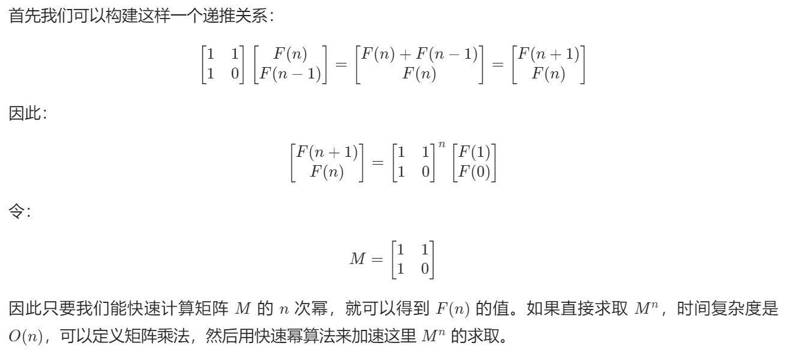

# 从求解斐波那契数列到具有严格递推式相关问题看矩阵快速幂算法（固定关系的一维k阶递推表达式）

## [509. 斐波那契数](https://leetcode.cn/problems/fibonacci-number/)

## [剑指 Offer 10- I. 斐波那契数列](https://leetcode.cn/problems/fei-bo-na-qi-shu-lie-lcof/)

> - ***Question 1***
>   - 求斐波那契数列的第n项，给出答案需要和不需要取模的两种写法。
>   - 答案需要取模 `1e9+7 (1000000007)` ，如计算初始结果为： `1000000008` ，请返回 `1` 。
>   - ***tips:***
>     - 0 <= n <= 100

## [70. 爬楼梯](https://leetcode.cn/problems/climbing-stairs/)

> - ***Question 2***
>   - 假设你正在爬楼梯。需要 `n` 阶你才能到达楼顶。
>   - 每次你可以爬 `1` 或 `2` 个台阶。你有多少种不同的方法可以爬到楼顶呢？
>   - ***tips:***
>     - `1 <= n <= 45`

## [剑指 Offer 10- II. 青蛙跳台阶问题](https://leetcode.cn/problems/qing-wa-tiao-tai-jie-wen-ti-lcof/)

> - ***Question 3***
>   - 一只青蛙一次可以跳上 `1` 级台阶，也可以跳上 `2` 级台阶。求该青蛙跳上一个 `n` 级的台阶总共有多少种跳法。
>   - 答案需要取模 `1e9+7 (1000000007)` ，如计算初始结果为： `1000000008` ，请返回 `1` 。
>   - ***tips:***
>     - `0 <= n <= 100`

## [1137. 第 N 个泰波那契数](https://leetcode.cn/problems/n-th-tribonacci-number/)

> - ***Question 4***
>   - 泰波那契序列 `Tn` 定义如下： `T0 = 0, T1 = 1, T2 = 1,` ，且在 `n >= 0` 的条件下 `Tn+3 = Tn + Tn+1 + Tn+2` 。
>   - 给你整数 `n` ，请返回第 `n` 个泰波那契数 `Tn` 的值。
>   - ***tips:***
>     - `0 <= n <= 37`
>     - 答案保证是一个 `32` 位整数，即 `answer <= 2^31 - 1` 。

## [面试题 08.01. 三步问题](https://leetcode.cn/problems/three-steps-problem-lcci/)

> - ***Question 5***
>   - 三步问题。有个小孩正在上楼梯，楼梯有 `n` 阶台阶，小孩一次可以上 `1` 阶、 `2` 阶或 `3` 阶。实现一种方法，计算小孩有多少种上楼梯的方式。结果可能很大，你需要对结果模 `1000000007` 。
>   - ***tips:***
>     - `0 <= n <= 1000000`

## [790. 多米诺和托米诺平铺](https://leetcode.cn/problems/domino-and-tromino-tiling/)

> - ***Question 6***
>   - 有两种形状的瓷砖：一种是 `2 x 1` 的多米诺形，另一种是形如 `L` 的托米诺形（二阶方阵挖去右下角）。两种形状都可以旋转。
>   - 给定整数 `n` ，返回可以平铺 `2 x n` 的面板的方法的数量。返回对 `10^9 + 7` 取模的值。
>   - 平铺指的是每个正方形都必须有瓷砖覆盖。两个平铺不同，当且仅当面板上有四个方向上的相邻单元中的两个，使得恰好有一个平铺有一个瓷砖占据两个正方形。
>   - ***tips:***
>     - `1 <= n <= 1000`

---

## *Java*

> - ***对数器展示矩阵快速幂***

```java
class Solution {

    public static void main(String[] args) {
        System.out.println("f1() : ");
        System.out.println("矩阵乘法展示开始");
        f1();
        System.out.println("矩阵乘法展示结束");
        System.out.println();

        System.out.println("f2() : ");
        System.out.println("矩阵快速幂展示开始");
        f2();
        System.out.println("矩阵快速幂展示结束");
        System.out.println();

        System.out.println("f3() : ");
        System.out.println("求斐波那契数列第n项");
        System.out.println("用矩阵乘法解决");
        System.out.println("展示开始");
        f3();
        System.out.println("展示结束");
        System.out.println();

        System.out.println("f4() : ");
        System.out.println("求斐波那契数列第n项");
        System.out.println("用矩阵快速幂解决");
        System.out.println("展示开始");
        f4();
        System.out.println("展示结束");
        System.out.println();
    }

    // 矩阵相乘
    // a的列数一定要等于b的行数
    public static int[][] multiply(int[][] a, int[][] b) {
        int n = a.length;
        int m = b[0].length;
        int k = a[0].length;
        int[][] ans = new int[n][m];
        for (int i = 0; i < n; i++) {
            for (int j = 0; j < m; j++) {
                for (int c = 0; c < k; c++) {
                    ans[i][j] += a[i][c] * b[c][j];
                }
            }
        }
        return ans;
    }

    // 矩阵快速幂
    // 要求矩阵m是正方形矩阵
    public static int[][] power(int[][] m, int p) {
        int n = m.length;
        // 对角线全是1、剩下数字都是0的正方形矩阵，称为单位矩阵
        // 相当于正方形矩阵中的1，矩阵a * 单位矩阵 = 矩阵a
        int[][] ans = new int[n][n];
        for (int i = 0; i < n; i++) {
            ans[i][i] = 1;
        }
        for (; p != 0; p >>= 1) {
            if ((p & 1) != 0) {
                ans = multiply(ans, m);
            }
            m = multiply(m, m);
        }
        return ans;
    }

    // 打印二维矩阵
    public static void print(int[][] m) {
        for (int i = 0; i < m.length; i++) {
            for (int j = 0; j < m[0].length; j++) {
                if (m[i][j] < 10) {
                    System.out.print(m[i][j] + "   ");
                } else if (m[i][j] < 100) {
                    System.out.print(m[i][j] + "  ");
                } else {
                    System.out.print(m[i][j] + " ");
                }
            }
            System.out.println();
        }
    }

    // 矩阵乘法的展示
    public static void f1() {
        int[][] a = {{1, 3}, {4, 2}};
        int[][] b = {{2, 3}, {3, 2}};
        //        2  3
        //        3  2
        //
        // 1  3  11  9
        // 4  2  14 16
        int[][] ans1 = multiply(a, b);
        print(ans1);
        System.out.println("======");
        int[][] c = {{2, 4}, {3, 2}};
        int[][] d = {{2, 3, 2}, {3, 2, 3}};
        //         2  3  2
        //         3  2  3
        //
        // 2  4   16 14 16
        // 3  2   12 13 12
        int[][] ans2 = multiply(c, d);
        print(ans2);
        System.out.println("======");
        int[][] e = {{2, 4}, {1, 2}, {3, 1}};
        int[][] f = {{2, 3}, {4, 1}};
        //          2  3
        //          4  1
        //
        // 2  4    20 10
        // 1  2    10  5
        // 3  1    10 10
        int[][] ans3 = multiply(e, f);
        print(ans3);
        System.out.println("======");
        int[][] g = {{3, 1, 2}};
        int[][] h = {{1, 2, 1}, {3, 2, 1}, {4, 2, -2}};
        //           1  2  1
        //           3  2  1
        //           4  2 -2
        //
        // 3  1  2  14 12  0
        int[][] ans4 = multiply(g, h);
        print(ans4);
    }

    // 矩阵快速幂用法的展示
    public static void f2() {
        // 只有正方形矩阵可以求幂
        int[][] a = {{1, 2}, {3, 4}};
        // 连乘得到矩阵a的5次方
        int[][] b = multiply(a, multiply(a, multiply(a, multiply(a, a))));
        print(b);
        System.out.println("======");
        // 矩阵快速幂得到矩阵a的5次方
        print(power(a, 5));
    }

    // 用矩阵乘法解决斐波那契第n项的问题
    public static void f3() {
        // 0  1  1  2  3  5  8 13 21 34...
        // 0  1  2  3  4  5  6  7  8  9
        int[][] start = {{1, 0}};
        int[][] m = {
                {1, 1},
                {1, 0}
        };
        int[][] a = multiply(start, m);
        //       1  1
        //       1  0
        //
        // 1  0  1  1
        print(a);
        System.out.println("======");
        int[][] b = multiply(a, m);
        //       1  1
        //       1  0
        //
        // 1  1  2  1
        print(b);
        System.out.println("======");
        int[][] c = multiply(b, m);
        //       1  1
        //       1  0
        //
        // 2  1  3  2
        print(c);
        System.out.println("======");
        int[][] d = multiply(c, m);
        //       1  1
        //       1  0
        //
        // 3  2  5  3
        print(d);
    }

    // 用矩阵快速幂解决斐波那契第n项的问题
    public static void f4() {
        // 0  1  1  2  3  5  8 13 21 34...
        // 0  1  2  3  4  5  6  7  8  9
        int[][] start = {{1, 0}};
        int[][] m = {
                {1, 1},
                {1, 0}
        };
        int[][] a = multiply(start, power(m, 1));
        print(a);
        System.out.println("======");
        int[][] b = multiply(start, power(m, 2));
        print(b);
        System.out.println("======");
        int[][] c = multiply(start, power(m, 3));
        print(c);
        System.out.println("======");
        int[][] d = multiply(start, power(m, 4));
        print(d);
    }

}
```

> - ***动态规划 + 滚动数组***
>   - 暴力递归改记忆化搜索改动态规划后利用滚动数组压缩空间，与打表无异。
> - ***项数低时的通项公式法***
>   
> - ***二阶矩阵快速幂原理***
>   - 实际的次方和表达形式看注释，时间复杂度为 `O(logn)` ， `n` 为阶数。
>   

```java
// 计算斐波那契数列的第n项
class Solution {
    
    public int fib(int n) {
        if (n == 0) {
            return 0;
        } else if (n == 1 || n == 2) {
            return 1;
        } else if (n == 3) {
            return 2;
        } else {
            // return fibByDP(n);
            // return fibByMeter(n);
            // return fibByFormula(n);
            return fibByFastExponentiation(n);
        }
    }
    
    // 递归->动态规划->滚动数组压缩/打表的另外一种形式
    // 即逐个求出斐波那契数列的元素
    public int fibByDP(int n) {
        int p;
        int q = 1;
        int r = 2;
        for (int i = 4; i <= n; i++) {
            p = q;
            q = r;
            r = (p + q) % 1000000007;
        }
        return r;
    }
    
    // 和滚动数组一样的计算，设第0项为0，第n项变成第1项
    public int fibByMeter(int n) {
        int[] fibonacci = new int[n + 1];
        fibonacci[1] = 1;
        for (int i = 2; i < n + 1; i++) {
            fibonacci[i] = (fibonacci[i - 1] + fibonacci[i - 2]) % 1000000007;
        }
        return fibonacci[n];
    }
    
    // 求根公式，项数过大后精度不够了
    public int fibByFormula(int n) {
        double sqrt5 = Math.sqrt(5);
        double fibN = Math.pow((1 + sqrt5) / 2, n) - Math.pow((1 - sqrt5) / 2, n);
        return (int) Math.round(fibN / sqrt5);
    }
    
    // 矩阵快速幂
    public int fibByFastExponentiation(int n) {
        int[][] base = {{1, 1}, {1, 0}};
        // 取决于你想把哪个作为基准矩阵
        // int[][] res = matrixPower(base, n - 1);
        // return res[0][0];
        // 一般都使用|Fn, Fn-1| = |F0| * matrix ^ (n - 2)
        //                       |F1|
        // 即递推式右边的项数（包括系数为0的项）对应矩阵的n-几次方
        // 由
        // |F(3), F(2)| = |F(2), F(1)| * |1 1|
        //                               |1 0|    
        // 推得
        // |F(n), F(n - 1)| = |F(2), F(1)| * (|1 1| ^ (n - 2))
        //                                    |1 0|   
        int[][] res = matrixPower(base, n - 2);
        // 注意相加后还要再取一次模
        return (res[0][0] + res[0][1]) % 1000000007;
    }
    
    // 求矩阵matrix的power次幂
    public int[][] matrixPower(int[][] matrix, int power) {
        // 构建同型单位矩阵
        int[][] res = new int[matrix.length][matrix[0].length];
        // 对角线全为1
        for (int i = 0; i < matrix.length; i++) {
            res[i][i] = 1;
        }
        // 把指数变成二进制转换成加法，把幂运算换成多个较小幂运算的积
        for (; power > 0; power >>= 1) {
            // 二进制上这位为1代表它是因子
            // 需要就乘法
            if ((power & 1) == 1) {
                res = matrixMultiplication(res, matrix);
            }
            // 矩阵以平方级自增
            matrix = matrixMultiplication(matrix, matrix);
        }
        return res;
    }
    
    // 矩阵乘法
    public int[][] matrixMultiplication(int[][] A, int[][] B) {
        // 结果矩阵大小和因子相同
        int[][] ans = new int[A.length][A[0].length];
        for (int i = 0; i < A.length; i++) {
            for (int j = 0; j < A[0].length; j++) {
                // 注意类型转换
                long temp = 0;
                for (int k = 0; k < A.length; k++) {
                    temp += (long) A[i][k] * B[k][j];
                }
                ans[i][j] = (int) (temp % 1000000007);
                // 矩阵是二阶的简易写法
                // ans[i][j] = (int) (((long) A[i][0] * B[0][j] + (long) A[i][1] * B[1][j]) % 1000000007);
            }
        }
        return ans;
    }
    
}

// 2步问题
// 青蛙跳台阶和爬楼梯大思路一样，都是改编的斐波那契数列，只不过由于n - 2阶数太大，要求n - 1阶，而且最初几项要考虑，只不过青蛙跳台阶问题要求取模1e9+7（1000000007），另外一个不用，不用取模的要把代码中的取模部分删除
class Solution {
    
    // 青蛙跳台阶
    public int numWays(int n) {
        return climbStairs(n);
    }
    
    // 爬楼梯
    public int climbStairs(int n) {
        if (n == 0 || n == 1) {
            return 1;
        } else if (n == 2) {
            return 2;
        } else {
            // return formula(n);
            // return FastExponentiation(n);
            return DP(n);
        }
    }
    
    // 公式
    public int formula(int n) {
        double sqrt5 = Math.sqrt(5);
        double fibn = Math.pow((1 + sqrt5) / 2, n + 1) - Math.pow((1 - sqrt5) / 2, n + 1);
        return (int) Math.round(fibn / sqrt5);
    }
    
    // 快速幂
    public int FastExponentiation(int n) {
        int[][] base = {{1, 1}, {1, 0}};
        // 由
        // |F(3), F(2)| = |F(2), F(1)| * |1 1|
        //                               |1 0|
        // 推得
        // |F(n), F(n - 1)| = |F(1), F(0)| * (|1 1| ^ (n - 1))
        //                                    |1 0|
        int[][] res = matrixPower(base, n - 1);
        // 选n - 2阶处理数据越界很麻烦
        return (res[0][0] + res[1][0]) % 1000000007;
    }
    
    public int[][] matrixPower(int[][] matrix, int power) {
        int[][] res = new int[matrix.length][matrix[0].length];
        for (int i = 0; i < matrix.length; i++) {
            res[i][i] = 1;
        }
        for (; power > 0; power >>= 1) {
            if ((power & 1) == 1) {
                res = matrixMultiplication(res, matrix);
            }
            matrix = matrixMultiplication(matrix, matrix);
        }
        return res;
    }
    
    public int[][] matrixMultiplication(int[][] A, int[][] B) {
        int[][] res = new int[A.length][A[0].length];
        for (int i = 0; i < A.length; i++) {
            for (int j = 0; j < A[0].length; j++) {
                long temp = 0;
                for (int k = 0; k < A.length; k++) {
                    temp += (((long) A[i][k] * B[k][j]) % 1000000007);
                }
                res[i][j] = (int) (temp % 1000000007);
            }
        }
        return res;
    }
    
    // 滚动数组
    public int DP(int n) {
        int p;
        int q = 1;
        int r = 2;
        for (int i = 3; i <= n; i++) {
            p = q;
            q = r;
            // 不取模时就去掉
            r = (p + q) % 1000000007;
        }
        return r;
    }
    
}
```

> - ***三阶矩阵快速幂原理***
>   

```java
// 三阶的问题
// 两个问题的递推式相同，但是初始项不同
class Solution {
    
    // 泰波那契数列
    public int tribonacci(int n) {
        if (n == 0) {
            return 0;
        } else if (n <= 2) {
            return 1;
        } else if (n == 3) {
            return 2;
        } else if (n == 4) {
            return 4;
        } else {
            // return tribonacciByDP(n);
            return tribonacciByFastExponentiation(n);
        }
    }
    
    // dp
    private int tribonacciByDP(int n) {
        int p = 0, q = 0, r = 1, s = 1;
        for (int i = 3; i <= n; ++i) {
            p = q;
            q = r;
            r = s;
            s = p + q + r;
        }
        return s;
    }
    
    // 三阶快速幂
    private int tribonacciByFastExponentiation(int n) {
        // 注意次方的选取
        int[][] matrix = {{1, 1, 1}, {1, 0, 0}, {0, 1, 0}};
        int[][] ans = matrixPowerInTribonacci(matrix, n);
        return ans[0][2];
    }
    
    private int[][] matrixPowerInTribonacci(int[][] matrix, int power) {
        int[][] ans = new int[matrix.length][matrix[0].length];
        for (int i = 0; i < ans.length; ++i) {
            ans[i][i] = 1;
        }
        for (; power > 0; power >>= 1) {
            if ((power & 1) == 1) {
                ans = matrixMultiplicationInTribonacci(ans, matrix);
            }
            matrix = matrixMultiplicationInTribonacci(matrix, matrix);
        }
        return ans;
    }
    
    // 不需要取模
    private int[][] matrixMultiplicationInTribonacci(int[][] A, int[][] B) {
        int[][] ans = new int[A.length][A[0].length];
        for (int i = 0; i < A.length; ++i) {
            for (int j = 0; j < A[0].length; ++j) {
                for (int k = 0; k < A.length; ++k) {
                    ans[i][j] += A[i][k] * B[k][j];
                }
            }
        }
        return ans;
    }
    
    // 三步问题，加强版泰波那契，需要取模
    // F[i] = F[i - 1] + F[i - 2] + F[i - 3]
    public int waysToStep(int n) {
        if (n == 1) {
            return 1;
        } else if (n == 2) {
            return 2;
        } else if (n == 3) {
            return 4;
        } else {
            // return waysToStepByDP(n);
            return waysToStepByFastExponentiation(n);
        }
    }
    
    // 取模很麻烦
    private int waysToStepByFastExponentiation(int n) {
        int[][] base = {{1, 1, 0}, {1, 0, 1}, {1, 0, 0}};
        int[][] ans = matrixPowerInWaysToStep(base, n - 2);
        return ((ans[0][0] * 2 % 1000000007 + ans[1][0]) % 1000000007 + ans[2][0] % 1000000007) % 1000000007;
    }
    
    private int[][] matrixPowerInWaysToStep(int[][] matrix, int power) {
        int[][] ans = new int[matrix.length][matrix[0].length];
        for (int i = 0; i < matrix.length; i++) {
            ans[i][i] = 1;
        }
        for (; power > 0; power >>= 1) {
            if ((power & 1) == 1) {
                ans = matrixMultiplicationInWaysToStep(ans, matrix);
            }
            matrix = matrixMultiplicationInWaysToStep(matrix, matrix);
        }
        return ans;
    }
    
    private int[][] matrixMultiplicationInWaysToStep(int[][] A, int[][] B) {
        int[][] ans = new int[A.length][A[0].length];
        for (int i = 0; i < A.length; i++) {
            for (int j = 0; j < A[0].length; j++) {
                long temp = 0;
                for (int k = 0; k < A.length; k++) {
                    temp += (((long) A[i][k] * B[k][j]) % 1000000007);
                }
                ans[i][j] = (int) (temp % 1000000007);
            }
        }
        return ans;
    }
    
    private int waysToStepByDP(int n) {
        int p = 0, q = 1, r = 2, s = 4;
        for (int i = 4; i <= n; i++) {
            p = q;
            q = r;
            r = s;
            s = ((p + q) % 1000000007 + r) % 1000000007;
        }
        return s;
    }
    
}
```

> - ***Question 6: 打表找规律 + 矩阵快速幂***

```java
class Solution {

    // f(1) = 1
    // f(2) = 2
    // f(3) = 5
    // f(4) = 11
    // f(n) = 2 * f(n-1) + f(n-3)
    // 打表或者公式化简都可以发现规律，这里推荐打表找规律
    public static void main(String[] args) {
        for (int i = 1; i <= 9; i++) {
            System.out.println("铺满 2 * " + i + " 的区域方法数 : " + f(i, 0));
        }
    }

    // 暴力方法
    // 为了找规律
    // 如果h==0，返回2*n的区域铺满的方法数
    // 如果h==1，返回1 + 2*n的区域铺满的方法数
    public static int f(int n, int h) {
        if (n == 0) {
            return h == 0 ? 1 : 0;
        }
        if (n == 1) {
            return 1;
        }
        if (h == 1) {
            return f(n - 1, 0) + f(n - 1, 1);
        } else {
            return f(n - 1, 0) + f(n - 2, 0) + 2 * f(n - 2, 1);
        }
    }

    // 正式方法
    // 矩阵快速幂
    // 时间复杂度O(logn)
    public static int numTilings(int n) {
        return f2(n - 1);
    }

    public static int MOD = 1000000007;

    public static int f2(int n) {
        if (n == 0) {
            return 1;
        }
        if (n == 1) {
            return 2;
        }
        if (n == 2) {
            return 5;
        }
        int[][] start = {{5, 2, 1}};
        int[][] base = {
                {2, 1, 0},
                {0, 0, 1},
                {1, 0, 0}
        };
        int[][] ans = multiply(start, power(base, n - 2));
        return ans[0][0];
    }

    // 矩阵相乘 + 乘法取模
    // a的列数一定要等于b的行数
    public static int[][] multiply(int[][] a, int[][] b) {
        int n = a.length;
        int m = b[0].length;
        int k = a[0].length;
        int[][] ans = new int[n][m];
        for (int i = 0; i < n; i++) {
            for (int j = 0; j < m; j++) {
                for (int c = 0; c < k; c++) {
                    ans[i][j] = (int) (((long) a[i][c] * b[c][j] + ans[i][j]) % MOD);
                }
            }
        }
        return ans;
    }

    // 矩阵快速幂
    public static int[][] power(int[][] m, int p) {
        int n = m.length;
        int[][] ans = new int[n][n];
        for (int i = 0; i < n; i++) {
            ans[i][i] = 1;
        }
        for (; p != 0; p >>= 1) {
            if ((p & 1) != 0) {
                ans = multiply(ans, m);
            }
            m = multiply(m, m);
        }
        return ans;
    }

}
```

---

> ***last change: 2024/1/19***

---
