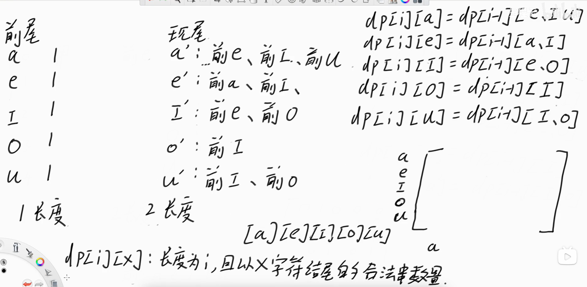

# 固定关系的k维一阶递推表达式

## [1220. 统计元音字母序列的数目](https://leetcode.cn/problems/count-vowels-permutation/)

> - ***Question 1***
>   - 给你一个整数 `n` ，请你帮忙统计一下我们可以按下述规则形成多少个长度为 n 的字符串：
>     - 字符串中的每个字符都应当是小写元音字母（'a', 'e', 'i', 'o', 'u'）
>     - 每个元音 'a' 后面都只能跟着 'e'
>     - 每个元音 'e' 后面只能跟着 'a' 或者是 'i'
>     - 每个元音 'i' 后面 不能 再跟着另一个 'i'
>     - 每个元音 'o' 后面只能跟着 'i' 或者是 'u'
>     - 每个元音 'u' 后面只能跟着 'a'
>   - 由于答案可能会很大，所以请你返回模 `10^9 + 7` 之后的结果。
>   - ***tips:***
>     - `1 <= n <= 2 * 10^4`

## [552. 学生出勤记录 II](https://leetcode.cn/problems/student-attendance-record-ii/)

> - ***Question 2***
>   - 可以用字符串表示一个学生的出勤记录，其中的每个字符用来标记当天的出勤情况（缺勤、迟到、到场）。记录中只含下面三种字符：
>     - 'A'：Absent，缺勤
>     - 'L'：Late，迟到
>     - 'P'：Present，到场
>   - 如果学生能够同时满足下面两个条件，则可以获得出勤奖励：
>     - 按总出勤计，学生缺勤（'A'）严格少于两天。
>     - 学生不会存在连续 `3` 天或连续 `3` 天以上的迟到（'L'）记录。
>   - 给你一个整数 `n` ，表示出勤记录的长度（次数）。请你返回记录长度为 `n` 时，可能获得出勤奖励的记录情况数量 。答案可能很大，所以返回对 `10^9 + 7` 取余的结果。
>   - ***tips:***
>     - `1 <= n <= 10^`5

## [551. 学生出勤记录 I](https://leetcode.cn/problems/student-attendance-record-i/)

> - ***Question 3***
>   - 可以用字符串表示一个学生的出勤记录，其中的每个字符用来标记当天的出勤情况（缺勤、迟到、到场）。记录中只含下面三种字符：
>     - 'A'：Absent，缺勤
>     - 'L'：Late，迟到
>     - 'P'：Present，到场
>   - 如果学生能够同时满足下面两个条件，则可以获得出勤奖励：
>     - 按总出勤计，学生缺勤（'A'）严格少于两天。
>     - 学生不会存在连续 `3` 天或连续 `3` 天以上的迟到（'L'）记录。
>   - 如果学生可以获得出勤奖励，返回 `true` ；否则，返回 `false` 。
>   - ***tips:***
>     - `1 <= s.length <= 1000`
>     - `s[i]` 为 'A'、'L' 或 'P'

---

## *Java*

> - ***Question 1***
>   - 

```java
class Solution {

    // 正式方法
    // 矩阵快速幂
    // 时间复杂度O(logn)
    public static int MOD = 1000000007;

    public static int countVowelPermutation(int n) {
        // 长度为1的时候，以a、e、i、o、u结尾的合法数量
        int[][] start = {{1, 1, 1, 1, 1}};
        int[][] base = {
                {0, 1, 0, 0, 0},
                {1, 0, 1, 0, 0},
                {1, 1, 0, 1, 1},
                {0, 0, 1, 0, 1},
                {1, 0, 0, 0, 0}
        };
        int[][] ans = multiply(start, power(base, n - 1));
        int ret = 0;
        for (int a : ans[0]) {
            ret = (ret + a) % MOD;
        }
        return ret;
    }

    // 矩阵相乘 + 乘法取模
    // a的列数一定要等于b的行数
    public static int[][] multiply(int[][] a, int[][] b) {
        int n = a.length;
        int m = b[0].length;
        int k = a[0].length;
        int[][] ans = new int[n][m];
        for (int i = 0; i < n; i++) {
            for (int j = 0; j < m; j++) {
                for (int c = 0; c < k; c++) {
                    ans[i][j] = (int) (((long) a[i][c] * b[c][j] + ans[i][j]) % MOD);
                }
            }
        }
        return ans;
    }

    // 矩阵快速幂
    public static int[][] power(int[][] m, int p) {
        int n = m.length;
        int[][] ans = new int[n][n];
        for (int i = 0; i < n; i++) {
            ans[i][i] = 1;
        }
        for (; p != 0; p >>= 1) {
            if ((p & 1) != 0) {
                ans = multiply(ans, m);
            }
            m = multiply(m, m);
        }
        return ans;
    }

}
```

> - ***Question 2***
>   - 

```java
class Solution {

    // 正式方法
    // 矩阵快速幂
    // 时间复杂度O(logn)
    public static int MOD = 1000000007;

    public static int checkRecord(int n) {
        // 1天的情况下，各种状态的合法数量
        int[][] start = {{1, 1, 0, 1, 0, 0}};
        int[][] base = {
                {1, 1, 0, 1, 0, 0},
                {1, 0, 1, 1, 0, 0},
                {1, 0, 0, 1, 0, 0},
                {0, 0, 0, 1, 1, 0},
                {0, 0, 0, 1, 0, 1},
                {0, 0, 0, 1, 0, 0}
        };
        int[][] ans = multiply(start, power(base, n - 1));
        int ret = 0;
        for (int a : ans[0]) {
            ret = (ret + a) % MOD;
        }
        return ret;
    }

    // 矩阵相乘 + 乘法取模
    // a的列数一定要等于b的行数
    public static int[][] multiply(int[][] a, int[][] b) {
        int n = a.length;
        int m = b[0].length;
        int k = a[0].length;
        int[][] ans = new int[n][m];
        for (int i = 0; i < n; i++) {
            for (int j = 0; j < m; j++) {
                for (int c = 0; c < k; c++) {
                    ans[i][j] = (int) (((long) a[i][c] * b[c][j] + ans[i][j]) % MOD);
                }
            }
        }
        return ans;
    }

    // 矩阵快速幂
    public static int[][] power(int[][] m, int p) {
        int n = m.length;
        int[][] ans = new int[n][n];
        for (int i = 0; i < n; i++) {
            ans[i][i] = 1;
        }
        for (; p != 0; p >>= 1) {
            if ((p & 1) != 0) {
                ans = multiply(ans, m);
            }
            m = multiply(m, m);
        }
        return ans;
    }

}
```

> - ***Question 3: 一次遍历***

```java
class Solution {

    public boolean checkRecord(String s) {
        int absents = 0, lates = 0;
        int n = s.length();
        for (int i = 0; i < n; i++) {
            char c = s.charAt(i);
            if (c == 'A') {
                absents++;
                if (absents >= 2) {
                    return false;
                }
            }
            if (c == 'L') {
                lates++;
                if (lates >= 3) {
                    return false;
                }
            } else {
                lates = 0;
            }
        }
        return true;
    }

}
```

---

> ***last change: 2024/1/19***

---
