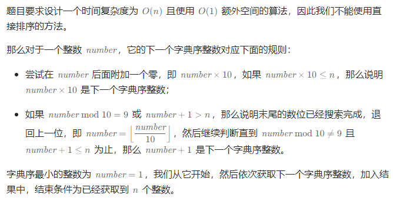

# 字典序排数

## [386. 字典序排数](https://leetcode.cn/problems/lexicographical-numbers/)

> - ***Question***
>   - 给你一个整数 `n` ，按字典序返回范围 `[1, n]` 内所有整数。
>   - ***tips:***
>     - `1 <= n <= 5 * 10^4`

---

## *Java*

> - ***DFS***
>   - 

```java
class Solution {
    
    public List<Integer> lexicalOrder(int n) {
        List<Integer> ret = new ArrayList<Integer>();
        int number = 1;
        for (int i = 0; i < n; i++) {
            ret.add(number);
            if (number * 10 <= n) {
                number *= 10;
            } else {
                while (number % 10 == 9 || number + 1 > n) {
                    number /= 10;
                }
                number++;
            }
        }
        return ret;
    }

}
```
