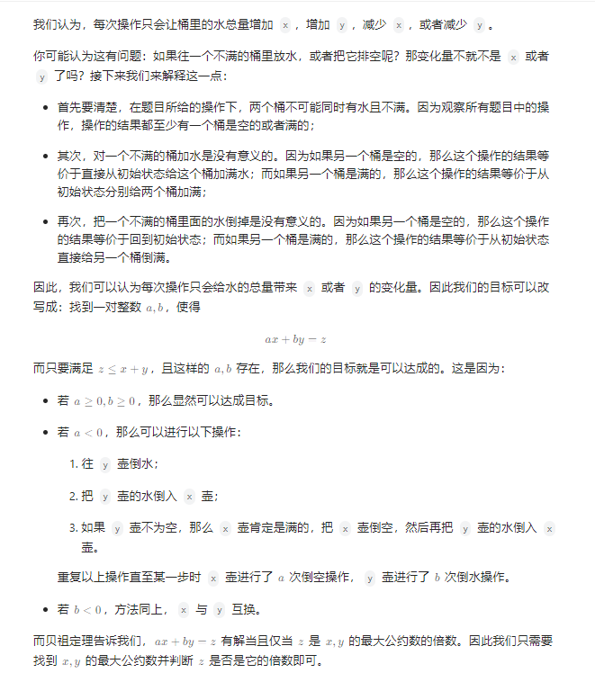

# 水壶问题

## [365. 水壶问题](https://leetcode.cn/problems/water-and-jug-problem/)

> - ***Question***
>   - 有两个水壶，容量分别为 `x` 和 `y` 升。水的供应是无限的。确定是否有可能使用这两个壶准确得到 `target` 升。你可以：
>   - 装满任意一个水壶
>   - 清空任意一个水壶
>   - 将水从一个水壶倒入另一个水壶，直到接水壶已满，或倒水壶已空。
>   - ***tips:***
>     - `1 <= x, y, target <= 10^3`

---

## *Java*

> - ***数学***
>   - 

```java

```
