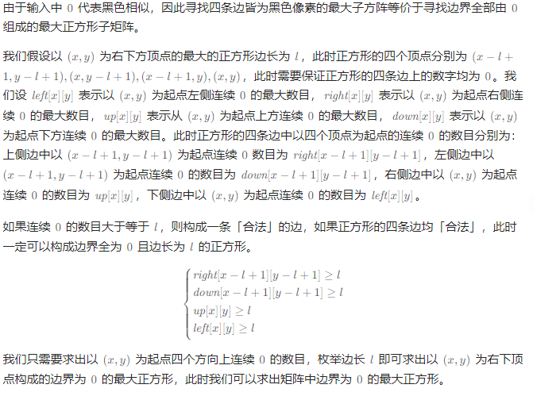
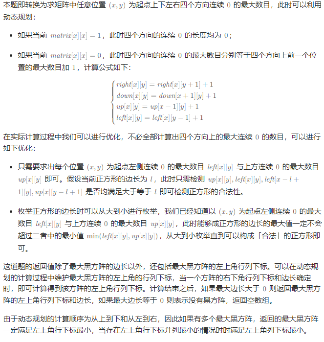

# 最大的以某个数为边界的正方形

## [1139. 最大的以 1 为边界的正方形](https://leetcode.cn/problems/largest-1-bordered-square/)

> - ***Question 1***
>   - 给你一个由若干 `0` 和 `1` 组成的二维网格 `grid` ，请你找出边界全部由 `1` 组成的最大正方形子网格，并返回该子网格中的元素数量。如果不存在，则返回 `0` 。
>   - ***tips:***
>     - `1 <= grid.length <= 100`
>     - `1 <= grid[0].length <= 100`
>     - `grid[i][j]` 为 `0` 或 `1`

## [面试题 17.23. 最大黑方阵](https://leetcode.cn/problems/max-black-square-lcci/)

> - ***Question***
>   - 给定一个方阵，其中每个单元非黑即白。设计一个算法，找出 `4` 条边皆为黑色像素的最大子方阵。\
>   - 返回一个数组 `[r, c, size]` ，其中 `r, c` 分别代表子方阵左上角的行号和列号， `size` 是子方阵的边长。若有多个满足条件的子方阵，返回 `r` 最小的，若 `r` 相同，返回 `c` 最小的子方阵。若无满足条件的子方阵，返回空数组。
>   - ***tips:***
>     - `matrix.length == matrix[0].length <= 200`

---

## *Java*

> - ***Question 1: 预处理结构 + 一次遍历***
>   - 在一个二维网格中选一个长方形只需要确定左上角点和右下角点，选一个点的复杂度为 `O(N^2)` ，那么总的复杂度为 `O(N^4)` 。而对于正方形来说，我们只需要确定左上角点，再选出边长即可，选边长的复杂度为 `O(N^)` ，那么总的复杂度为 `O(N^3)` 。

```java
class Solution {
    
    public int largest1BorderedSquare(int[][] grid) {
        // right[i][j]表示包括grid[i][j]在内，其右方有多少个连续的1，如果本身是0，那么右方全是1也填0
        int[][] right = new int[grid.length][grid[0].length];
        // 同理，只不过是下方
        int[][] down = new int[grid.length][grid[0].length];
        setBorderMap(grid, right, down);
        int ans = 0;
        // 三层循环的时间复杂度为O(N^3)
        // 我遍历所有的点
        for (int i = 0; i < grid.length; i++) {
            for (int j = 0; j < grid[0].length; j++) {
                // 每个点选一遍边长
                for (int border = 1; border <= Math.min(grid.length - i, grid[0].length - j); border++) {
                    // 左上角点下方和右方连续的1的数量大于要求的边长
                    // 右上角的下方和左下角的右方同理
                    if (right[i][j] >= border && down[i][j] >= border && right[i + border - 1][j] >= border && down[i][j + border - 1] >= border) {
                        // 元素数量等于面积
                        ans = Math.max(ans, border * border);
                    }
                }
            }
        }
        return ans;
    }
    
    // 生成边界数组
    private void setBorderMap(int[][] grid, int[][] right, int[][] down) {
        int row = grid.length;
        int col = grid[0].length;
        // 右下角
        if (grid[row - 1][col - 1] == 1) {
            right[row - 1][col - 1] = 1;
            down[row - 1][col - 1] = 1;
        }
        // 最右边
        for (int i = row - 2; i >= 0; i--) {
            if (grid[i][col - 1] == 1) {
                right[i][col - 1] = 1;
                down[i][col - 1] = down[i + 1][col - 1] + 1;
            }
        }
        // 最下边
        for (int j = col - 2; j >= 0; j--) {
            if (grid[row - 1][j] == 1) {
                right[row - 1][j] = right[row - 1][j + 1] + 1;
                down[row - 1][j] = 1;
            }
        }
        for (int i = row - 2; i >= 0; i--) {
            for (int j = col - 2; j >= 0; j--) {
                if (grid[i][j] == 1) {
                    right[i][j] = right[i][j + 1] + 1;
                    down[i][j] = down[i + 1][j] + 1;
                }
            }
        }
    }
    
}
```

> - ***Question 2: 动态规划***
>   - 
>   - 

```java
class Solution {

    public int[] findSquare(int[][] matrix) {
        int n = matrix.length;
        int[][] left = new int[n + 1][n + 1];
        int[][] up = new int[n + 1][n + 1];
        int r = 0, c = 0, size = 0;
        for (int i = 1; i <= n; i++) {
            for (int j = 1; j <= n; j++) {
                if (matrix[i - 1][j - 1] == 0) {
                    left[i][j] = left[i][j - 1] + 1;
                    up[i][j] = up[i - 1][j] + 1;
                    int border = Math.min(left[i][j], up[i][j]);
                    while (left[i - border + 1][j] < border || up[i][j - border + 1] < border) {
                        border--;
                    }
                    if (border > size) {
                        r = i - border;
                        c = j - border;
                        size = border;
                    }
                }
            }
        }
        return size > 0 ? new int[]{r, c, size} : new int[0];
    }

}
```

---

> ***last change: 2024/3/24***

---
