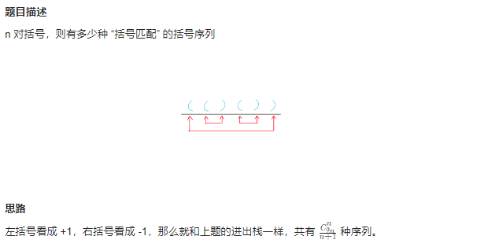

# 卡特兰数

## [96. 不同的二叉搜索树](https://leetcode.cn/problems/unique-binary-search-trees/)

> - ***Question 1***
>   - 给你一个整数 `n` ，求恰由 `n` 个节点组成且节点值从 `1` 到 `n` 互不相同的二叉搜索树有多少种？返回满足题意的二叉搜索树的种数。
>   - ***tips:***
>     - `1 <= n <= 19`

## [95. 不同的二叉搜索树 II](https://leetcode.cn/problems/unique-binary-search-trees-ii/)

> - ***Question 2***
>   - 给你一个整数 `n` ，请你生成并返回所有由 `n` 个节点组成且节点值从 `1` 到 `n` 互不相同的不同 二叉搜索树。可以按任意顺序返回答案。
>   - ***tips:***
>     - `1 <= n <= 8`

---

## *Java*

> - ***Question 1: 卡特兰数***
>   - 这是一种数列，其通项公式主要有两种：
>     - `Cn = 1 if n = 0`
>     - `Cn = C(2n, n) - (C(2n, n + 1) or C(2n, n - 1))`
>     - `Cn = C0 * Cn-1 + C1 * Cn-2 + ... + Cn-2 * C1 + Cn-1 * C0`
>     - 代码递归实现：`Cn+1 = 2(2n + 1) * Cn / (n + 2)` or `Cn = (4 * n - 2) * Cn-1 / (n + 1)`
>   - 阶乘公式用于解决括号配对问题，出入栈次序个数问题，股票涨落后不亏问题。
>   - 乘法公式可用于给定节点组成二叉树问题。
>   - 还可以解决凸多边形划分三角形问题，在 `n x n` 格点中不越过对角线的单调路径的个数问题，有 `n + 1` 个叶子的满二叉树的个数。
>   - 如果题目解题时用到的公式和卡特兰数通项公式一样，那就直接根据题目给定的项数，直接返回卡特兰数列对应位置的值即可。

```java
class Solution {
    
    // 打表
    private final int[] CatalanNumber = {1, 1, 2, 5, 14, 42, 132, 429, 1430, 4862, 16796, 58786, 208012, 742900, 2674440, 9694845, 35357670, 129644790, 477638700, 1767263190};
    
    // 树的个数
    public int numTrees(int n) {
        // return CatalanNumber[n];
        return (int) getCatalanNumber(n);
    }
    
    // 递推式
    private long getCatalanNumber(int n) {
        if (n == 0) {
            return 0;
        }
        if (n == 1) {
            return 1;
        }
        return (4L * n - 2) * getCatalanNumber(n - 1) / (n + 1);
    }
    
}
```

> - ***Question 2: 回溯***
>   - 二叉搜索树关键的性质是根节点的值大于左子树所有节点的值，小于右子树所有节点的值，且左子树和右子树也同样为二叉搜索树。因此在生成所有可行的二叉搜索树的时候，假设当前序列长度为 nnn，如果我们枚举根节点的值为 `i` ，那么根据二叉搜索树的性质我们可以知道左子树的节点值的集合为 `[1 ~ i - 1]` ，右子树的节点值的集合为 `[i + 1 ~ n]` 。而左子树和右子树的生成相较于原问题是一个序列长度缩小的子问题，因此我们可以想到用回溯的方法来解决这道题目。
>   - 我们定义 `generateTrees(start, end)` 函数表示当前值的集合为 `[start, end]` ，返回序列 `[start, end]` 生成的所有可行的二叉搜索树。按照上文的思路，我们考虑枚举 `[start, end]` 中的值 iii 为当前二叉搜索树的根，那么序列划分为了 `[start, i - 1]` 和 `[i + 1, end]` 两部分。我们递归调用这两部分，即 `generateTrees(start, i - 1)` 和 `generateTrees(i + 1, end)` ，获得所有可行的左子树和可行的右子树，那么最后一步我们只要从可行左子树集合中选一棵，再从可行右子树集合中选一棵拼接到根节点上，并将生成的二叉搜索树放入答案数组即可。递归的入口即为 `generateTrees(1, n)` ，出口为当 `start > end` 的时候，当前二叉搜索树为空，返回空节点即可。

```java
import java.util.*;

// 普通二叉树节点
class TreeNode {

    int val;
    TreeNode left;
    TreeNode right;

    TreeNode() {
    }

    TreeNode(int val) {
        this.val = val;
    }

    TreeNode(int val, TreeNode left, TreeNode right) {
        this.val = val;
        this.left = left;
        this.right = right;
    }

}

class Solution {

    public List<TreeNode> generateTrees(int n) {
        if (n == 0) {
            return new ArrayList<>();
        }
        return generateTrees(1, n);
    }

    public List<TreeNode> generateTrees(int start, int end) {
        List<TreeNode> allTrees = new ArrayList<>();
        if (start > end) {
            allTrees.add(null);
            return allTrees;
        }

        // 枚举可行根节点
        for (int i = start; i <= end; i++) {
            // 获得所有可行的左子树集合
            List<TreeNode> leftTrees = generateTrees(start, i - 1);

            // 获得所有可行的右子树集合
            List<TreeNode> rightTrees = generateTrees(i + 1, end);

            // 从左子树集合中选出一棵左子树，从右子树集合中选出一棵右子树，拼接到根节点上
            for (TreeNode left : leftTrees) {
                for (TreeNode right : rightTrees) {
                    TreeNode currTree = new TreeNode(i);
                    currTree.left = left;
                    currTree.right = right;
                    allTrees.add(currTree);
                }
            }
        }
        return allTrees;
    }

}
```

> - ***一些题目的卡特兰数思路***





---

> ***last change: 2022/11/14***

---
