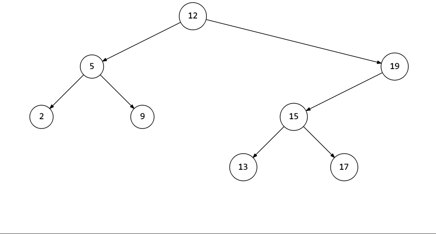

# 二叉搜索树序列

## [面试题 04.09. 二叉搜索树序列](https://leetcode.cn/problems/bst-sequences-lcci/)

> - ***Question***
>   - 从左向右遍历一个数组，通过不断将其中的元素插入树中可以逐步地生成一棵二叉搜索树。
>   - 给定一个由不同节点组成的二叉搜索树 `root` ，输出所有可能生成此树的数组。
>   - ***tips:***
>     - 二叉搜索树中的节点数在 `[0, 1000]` 的范围内
>     - `1 <= 节点值 <= 10^6`
>     - 用例保证符合要求的数组数量不超过 `5000`

---

## *Java*

> - ***BFS***
>   - 每一个节点都必须排在它的子孙结点前面。考虑如下例子：
>   - 
>   - 比如针对这棵二叉树，数组第一个元素一定是 `[12]` ，然后因为每一个节点都必须排在它的子孙结点前面，所以前两个元素只有两种情况 `[12, 5], [12, 19]` 。
>   - 同理，如果前两个元素是 `[12, 5]` ，那么第三个元素一定是 `2` 或者 `9` 或者 `19` （注意这里 `19` 的情况不要忘了），当然 `19` 的子树是不能取的，因为根节点 `19` 还没加入数组；
>   - 如果前两个元素是 `[12, 19]` ，那么第三个元素一定是 `5` 或者 `15` 。所以数组前三个元素可以确定只有 `[12, 5, 2], [12, 5, 9], [12, 5, 19], [12, 19, 5], [12, 19, 15], ...` 。
>   - 对于这种找出所有情况的题目，回溯法是最容易想到的方法之一了，这道题也可以用回溯法，可以发现刚才选元素的过程和层序遍历的过程其实是一致的：
>     - 最开始 `queue` 中只有 `12` ，只能选 `12` ，将 `12` 出队并将它的两个子节点入队，得到 `[12]` ；
>     - 选了 `12` 之后 `queue` 中剩下 `5, 19` ，就从 `5` 和 `19` 中选一个，得到 `[12, 5], [12, 19]` ；
>       - 如果选了 `5` ，将 `5` 出队并将它的两个子节点入队，那么此时 `queue` 中剩下 `19, 2, 9` ，得到 `[12, 5, 2], [12, 5, 9], [12, 5, 19]` ；
>       - 如果选了 `19` ，将 `19` 出队并将它的子节点入队，那么此时 `queue` 中剩下 `5, 15` ，得到 `[12, 19, 5], [12, 19, 15]` ；后续同理。

```java
import java.util.*;

class TreeNode {

    int val;
    TreeNode left;
    TreeNode right;

    TreeNode() {
    }

    TreeNode(int val) {
        this.val = val;
    }

    TreeNode(int val, TreeNode left, TreeNode right) {
        this.val = val;
        this.left = left;
        this.right = right;
    }

}

class Solution {

    private List<List<Integer>> ans;

    public List<List<Integer>> BSTSequences(TreeNode root) {
        ans = new ArrayList<>();
        List<Integer> path = new ArrayList<>();
        // 如果 root==null 返回 [[]]
        if (root == null) {
            ans.add(path);
            return ans;
        }
        List<TreeNode> queue = new LinkedList<>();
        queue.add(root);
        // 开始进行回溯
        bfs(queue, path);
        return ans;
    }

    private void bfs(List<TreeNode> queue, List<Integer> path) {
        // queue 为空说明遍历完了，可以返回了
        if (queue.isEmpty()) {
            ans.add(new ArrayList<>(path));
            return;
        }
        // 将 queue 拷贝一份，用于稍后回溯
        List<TreeNode> copy = new ArrayList<>(queue);
        // 对 queue 进行循环，每循环考虑 “是否 「将当前 cur 节点从 queue 中取出并将其左右子节点加入 queue ，然后将 cur.val 加入到 path 末尾」 ” 的情况进行回溯
        for (int i = 0; i < queue.size(); i++) {
            TreeNode cur = queue.get(i);
            path.add(cur.val);
            queue.remove(i);
            // 将左右子节点加入队列
            if (cur.left != null) queue.add(cur.left);
            if (cur.right != null) queue.add(cur.right);
            bfs(queue, path);
            // 恢复 path 和 queue ，进行回溯
            path.remove(path.size() - 1);
            queue = new ArrayList<>(copy);
        }
    }

}
```
