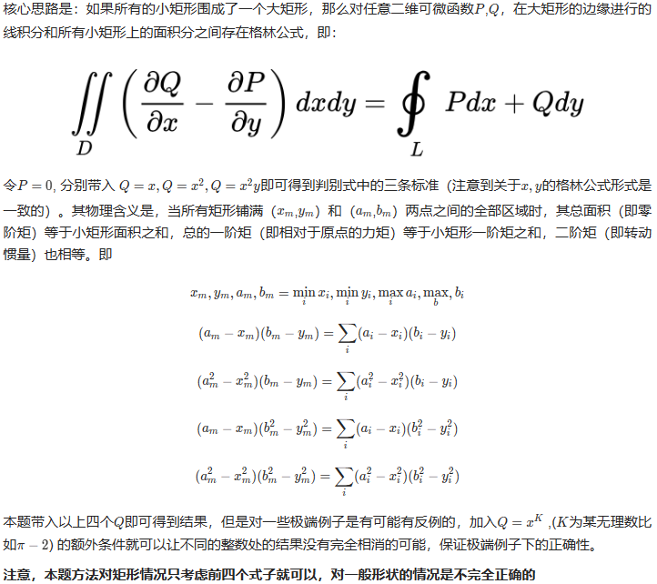

# 完美矩形

## [391. 完美矩形](https://leetcode.cn/problems/perfect-rectangle/)

> - ***Question***
>   - 给你一个数组 `rectangles` ，其中 `rectangles[i] = [xi, yi, ai, bi]` 表示一个坐标轴平行的矩形。这个矩形的左下顶点是 `(xi, yi)` ，右上顶点是 `(ai, bi)` 。
>   - 如果所有矩形一起精确覆盖了某个矩形区域，则返回 `true` ；否则，返回 `false` 。
>   - ***tips:***
>     - `1 <= rectangles.length <= 2 * 10^4`
>     - `rectangles[i].length == 4`
>     - `-10^5 <= xi, yi, ai, bi <= 10^5`

## Java

> - ***贪心 + 哈希表***
>   - 精确覆盖意味着：
>     - 矩形区域中不能有空缺，即矩形区域的面积等于所有矩形的面积之和。
>     - 矩形区域中不能有相交区域。
>   - 我们需要一个统计量来判定是否存在相交区域。由于精确覆盖意味着矩形的边和顶点会重合在一起，我们不妨统计每个矩形顶点的出现次数。同一个位置至多只能存在四个顶点，在满足该条件的前提下，如果矩形区域中有相交区域，这要么导致矩形区域四角的顶点出现不止一次，要么导致非四角的顶点存在出现一次或三次的顶点。
>   - 因此要满足精确覆盖，除了要满足矩形区域的面积等于所有矩形的面积之和，还要满足矩形区域四角的顶点只能出现一次，且其余顶点的出现次数只能是两次或四次。
>   - 在代码实现时，我们可以遍历矩形数组，计算矩形区域四个顶点的位置，以及矩形面积之和，并用哈希表统计每个矩形的顶点的出现次数。遍历完成后，检查矩形区域的面积是否等于所有矩形的面积之和，以及每个顶点的出现次数是否满足上述要求。

```java
class Solution {
    
    public static boolean isRectangleCover(int[][] matrix) {
        if (matrix.length == 0 || matrix[0].length == 0) {
            return false;
        }
        int left = Integer.MAX_VALUE;
        int right = Integer.MIN_VALUE;
        int down = Integer.MAX_VALUE;
        int up = Integer.MIN_VALUE;
        HashMap<Integer, HashMap<Integer, Integer>> map = new HashMap<>();
        int area = 0;
        for (int[] rect : matrix) {
            // 加4个顶点
            add(map, rect[0], rect[1]);
            add(map, rect[0], rect[3]);
            add(map, rect[2], rect[1]);
            add(map, rect[2], rect[3]);
            // 计算小矩形面积和
            area += (rect[2] - rect[0]) * (rect[3] - rect[1]);
            // 更新最小外接矩形边界
            left = Math.min(rect[0], left);
            down = Math.min(rect[1], down);
            right = Math.max(rect[2], right);
            up = Math.max(rect[3], up);
        }
        // 点是否符合要求，面积是否符合要要求
        return checkPoints(map, left, down, right, up) && area == (right - left) * (up - down);
    }
    
    // 往表中加点
    public static void add(HashMap<Integer, HashMap<Integer, Integer>> map, int row, int col) {
        if (!map.containsKey(row)) {
            map.put(row, new HashMap<>());
        }
        map.get(row).put(col, map.get(row).getOrDefault(col, 0) + 1);
    }
    
    public static boolean checkPoints(HashMap<Integer, HashMap<Integer, Integer>> map, int left, int down, int right, int up) {
        // 四个边角是否只出现1次
        if (map.get(left).getOrDefault(down, 0) != 1
                || map.get(left).getOrDefault(up, 0) != 1
                || map.get(right).getOrDefault(down, 0) != 1
                || map.get(right).getOrDefault(up, 0) != 1) {
            return false;
        }
        // 移除大矩形四个顶点
        map.get(left).remove(down);
        map.get(left).remove(up);
        map.get(right).remove(down);
        map.get(right).remove(up);
        // 剩下的点是否出现两次或者4次
        for (int key : map.keySet()) {
            for (int value : map.get(key).values()) {
                if ((value & 1) != 0) {
                    return false;
                }
            }
        }
        return true;
    }
    
}
```

> - ***截止2023年4月27日看到的所有题中最酷的解法之一之高等数学加大学物理***
>   - 
