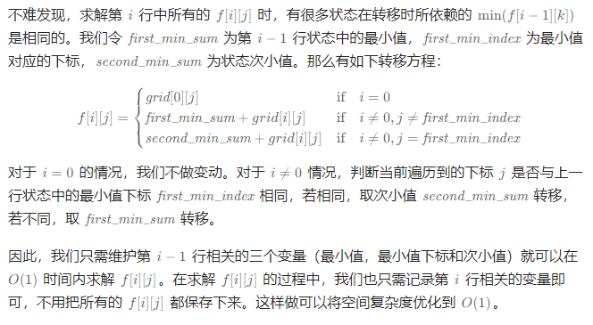

# 下降路径最小和

## [931. 下降路径最小和](https://leetcode.cn/problems/minimum-falling-path-sum/)

> - ***Question 1***
>   - 给你一个 `n x n` 的方形整数数组 `matrix` ，请你找出并返回通过 `matrix` 的下降路径的最小和。
>   - 下降路径可以从第一行中的任何元素开始，并从每一行中选择一个元素。在下一行选择的元素和当前行所选元素最多相隔一列（即位于正下方或者沿对角线向左或者向右的第一个元素）。具体来说，位置 `(row, col)` 的下一个元素应当是 `(row + 1, col - 1)` 、 `(row + 1, col)` 或者 `(row + 1, col + 1)` 。
>   - ***tips:***
>     - `n == matrix.length == matrix[i].length`
>     - `1 <= n <= 100`
>     - `-100 <= matrix[i][j] <= 100`

## [1289. 下降路径最小和 II](https://leetcode.cn/problems/minimum-falling-path-sum-ii/)

> - ***Question 2***
>   - 给你一个 `n x n` 整数矩阵 `grid` ，请你返回非零偏移下降路径数字和的最小值。
>   - 非零偏移下降路径定义为：从 `grid` 数组中的每一行选择一个数字，且按顺序选出来的数字中，相邻数字不在原数组的同一列。
>   - ***tips:***
>     - `n == grid.length == grid[i].length`
>     - `1 <= n <= 200`
>     - `-99 <= grid[i][j] <= 99`

---

## *Java*

> - ***Question 1: 动态规划***
>   - 题目需要求出矩阵的和最小下降路径，可以求出末行每个元素的和最小下降路径，然后找到其中和最小的那一条路径即可。而根据题意，每个坐标仅可以通过它的上一排紧邻的三个坐标到达（左上，正上，右上），根据贪心思想，每个坐标的和最小下降路径长度即为它的上一排紧邻的三个坐标的和最小下降路径长度的最小值，再加上当前坐标的和。用 dp  表示和最小下降路径长度的话，即为 `dp[i][j] = matrix[i][j] + min⁡(dp[i - 1][j - 1], dp[i - 1][j], dp[i - 1][j + 1])` ，第一列和最后一列有边界情况，需要特殊处理。而第一行每个元素的和最小下降路径长度为它们本身的值。最后返回最后一行的和最小下降路径长度的最小值即可。

```java
import java.util.Arrays;

class Solution {

    public int minFallingPathSum(int[][] matrix) {
        int n = matrix.length;
        int[][] dp = new int[n][n];
        System.arraycopy(matrix[0], 0, dp[0], 0, n);
        for (int i = 1; i < n; i++) {
            for (int j = 0; j < n; j++) {
                int mn = dp[i - 1][j];
                if (j > 0) {
                    mn = Math.min(mn, dp[i - 1][j - 1]);
                }
                if (j < n - 1) {
                    mn = Math.min(mn, dp[i - 1][j + 1]);
                }
                dp[i][j] = mn + matrix[i][j];
            }
        }
        return Arrays.stream(dp[n - 1]).min().getAsInt();
    }

}
```

> - ***Question 2: 动态规划***
>   - 令状态 `f[i][j]` 表示从数组 `grid` 的前 `i` 行中的每一行选择一个数字，并且第 `i` 行选择的数字为 `grid[i][j]` 时，可以得到的路径和最小值。 `f[i][j]` 可以从第 `i - 1` 行除了 `f[i - 1][j]` 之外的任意状态转移而来，因此有如下状态转移方程： `f[i][j] = grid[0][j] if i == 0, min(f[i - 1][k]) + grid[i][j] if i != 0 and j != k` 。最终，我们取第 `n - 1` 行中的最小值，即最小的 `min⁡(f[n][j])` 作为答案。

```java
class Solution {

    public int minFallingPathSum(int[][] grid) {
        int n = grid.length;
        int[][] d = new int[n][n];
        for (int i = 0; i < n; i++) {
            for (int j = 0; j < n; j++) {
                d[i][j] = Integer.MAX_VALUE;
            }
        }
        System.arraycopy(grid[0], 0, d[0], 0, n);
        for (int i = 1; i < n; i++) {
            for (int j = 0; j < n; j++) {
                for (int k = 0; k < n; k++) {
                    if (j == k) {
                        continue;
                    }
                    d[i][j] = Math.min(d[i][j], d[i - 1][k] + grid[i][j]);
                }
            }
        }
        int res = Integer.MAX_VALUE;
        for (int j = 0; j < n; j++) {
            res = Math.min(res, d[n - 1][j]);
        }
        return res;
    }

}
```

> - ***Question 2: 优化***
>   - 

```java
class Solution {

    public int minFallingPathSum(int[][] grid) {
        int n = grid.length;
        int first_min_sum = 0;
        int second_min_sum = 0;
        int first_min_index = -1;

        for (int i = 0; i < n; i++) {
            int cur_first_min_sum = Integer.MAX_VALUE;
            int cur_second_min_sum = Integer.MAX_VALUE;
            int cur_first_min_index = -1;

            for (int j = 0; j < n; j++) {
                int cur_sum = (j != first_min_index ? first_min_sum : second_min_sum) + grid[i][j];
                if (cur_sum < cur_first_min_sum) {
                    cur_second_min_sum = cur_first_min_sum;
                    cur_first_min_sum = cur_sum;
                    cur_first_min_index = j;
                } else if (cur_sum < cur_second_min_sum) {
                    cur_second_min_sum = cur_sum;
                }
            }
            first_min_sum = cur_first_min_sum;
            second_min_sum = cur_second_min_sum;
            first_min_index = cur_first_min_index;
        }
        return first_min_sum;
    }

}
```
