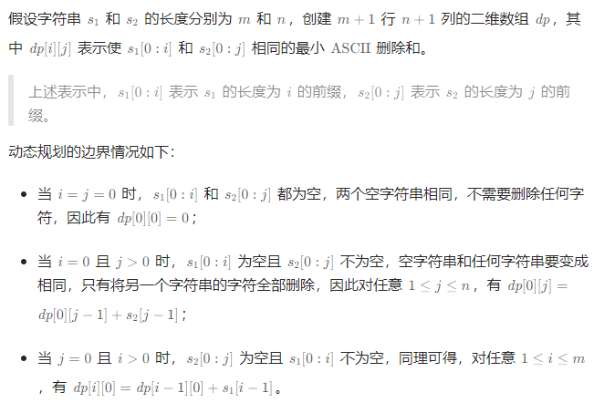
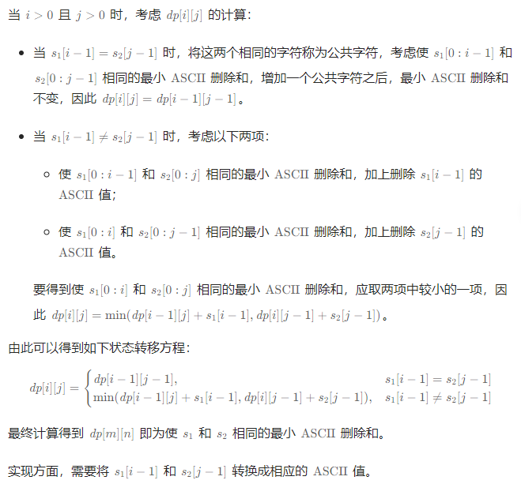

# 两个字符串的最小ASCII删除和

## [712. 两个字符串的最小ASCII删除和](https://leetcode.cn/problems/minimum-ascii-delete-sum-for-two-strings/)

> - ***Question***
>   - 给定两个字符串 `s1` 和 `s2` ，返回使两个字符串相等所需删除字符的 `ASCII` 值的最小和。
>   - ***tips:***
>     - `0 <= s1.length, s2.length <= 1000`
>     - `s1` 和 `s2` 由小写英文字母组成

---

## *Java*

> - ***动态规划***
>   - 
>   - 

```java
class Solution {

    public int minimumDeleteSum(String s1, String s2) {
        int m = s1.length(), n = s2.length();
        int[][] dp = new int[m + 1][n + 1];
        for (int i = 1; i <= m; i++) {
            dp[i][0] = dp[i - 1][0] + s1.codePointAt(i - 1);
        }
        for (int j = 1; j <= n; j++) {
            dp[0][j] = dp[0][j - 1] + s2.codePointAt(j - 1);
        }
        for (int i = 1; i <= m; i++) {
            int code1 = s1.codePointAt(i - 1);
            for (int j = 1; j <= n; j++) {
                int code2 = s2.codePointAt(j - 1);
                if (code1 == code2) {
                    dp[i][j] = dp[i - 1][j - 1];
                } else {
                    dp[i][j] = Math.min(dp[i - 1][j] + code1, dp[i][j - 1] + code2);
                }
            }
        }
        return dp[m][n];
    }

}
```

---

> ***last change: 2024/3/28***

---
