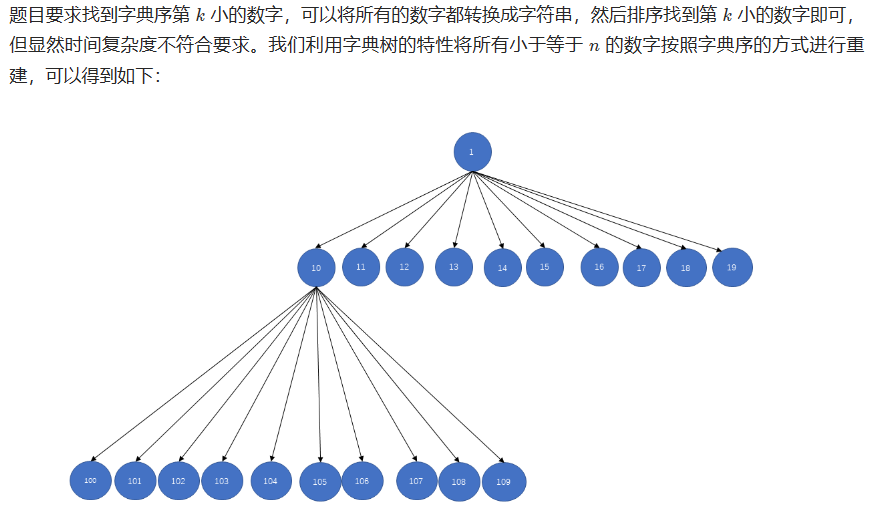

# 字典序的第K小数字

## [440. 字典序的第K小数字](https://leetcode.cn/problems/k-th-smallest-in-lexicographical-order/)

> - **Question**
>   - 给定整数 `n` 和 `k` ，返回 `[1, n]` 中字典序第 `k` 小的数字。
>   - **Tips**
>     - `1 <= k <= n <= 10^9`

## Java

> - **字典树**
>   - 
>   - 
>   - 时间复杂度 `O((logn)^2)` ，其中 `n` 为给定的数值的大小。每次计算子树下的节点数目的搜索深度最大为 `log(10, n)` ，最多需要搜索 `log(10, n)` 层，每一层最多需要计算 `10` 次，最多需要计算 `10 x (log(10, n))^2` 次。空间复杂度 `O(1)` ，不需要开辟额外的空间，只需常数空间记录常量即可。

```java
class Solution {
    
    public int findKthNumber(int n, int k) {
        int curr = 1;
        k--;
        while (k > 0) {
            int steps = getSteps(curr, n);
            if (steps <= k) {
                // 同一层的下一个
                k -= steps;
                curr++;
            } else {
                // 下一层的最左孩子
                curr = curr * 10;
                k--;
            }
        }
        return curr;
    }
    
    // 以curr为头的整棵树的节点数
    public int getSteps(int curr, long n) {
        int steps = 0;
        long first = curr;
        long last = curr;
        while (first <= n) {
            steps += Math.min(last, n) - first + 1;
            first = first * 10;
            last = last * 10 + 9;
        }
        return steps;
    }
    
}
```

> - **数位DP**
>   - 好难。

```java
// 这道题在leetcode上，所有题解都只能做到O( (logN) 平方)的解
// 我们课上讲的是O(logN)的解
// 打败所有题解
class Solution {
    
    public static int[] offset = {0, 1, 10, 100, 1000, 10000, 100000, 1000000, 10000000, 100000000, 1000000000};
    
    public static int[] number = {0, 1, 11, 111, 1111, 11111, 111111, 1111111, 11111111, 111111111, 1111111111};
    
    public static int findKthNumber(int n, int k) {
        // 数字num，有几位，len位
        // 65237, 5位，len = 5
        int len = len(n);
        // 65237, 开头数字，6，first
        int first = n / offset[len];
        // 65237，左边有几个？
        int left = (first - 1) * number[len];
        int pick = 0;
        int already = 0;
        if (k <= left) {
            // k / a 向上取整-> (k + a - 1) / a
            pick = (k + number[len] - 1) / number[len];
            already = (pick - 1) * number[len];
            return kth((pick + 1) * offset[len] - 1, len, k - already);
        }
        int mid = number[len - 1] + (n % offset[len]) + 1;
        if (k - left <= mid) {
            return kth(n, len, k - left);
        }
        k -= left + mid;
        len--;
        pick = (k + number[len] - 1) / number[len] + first;
        already = (pick - first - 1) * number[len];
        return kth((pick + 1) * offset[len] - 1, len, k - already);
    }
    
    public static int len(int n) {
        int len = 0;
        while (n != 0) {
            n /= 10;
            len++;
        }
        return len;
    }
    
    public static int kth(int max, int len, int kth) {
        // 中间范围还管不管的着！
        // 有任何一步，中间位置没命中，左或者右命中了，那以后就都管不着了！
        // 但是开始时，肯定是管的着的！
        boolean closeToMax = true;
        int ans = max / offset[len];
        while (--kth > 0) {
            max %= offset[len--];
            int pick = 0;
            if (!closeToMax) {
                pick = (kth - 1) / number[len];
                ans = ans * 10 + pick;
                kth -= pick * number[len];
            } else {
                int first = max / offset[len];
                int left = first * number[len];
                if (kth <= left) {
                    closeToMax = false;
                    pick = (kth - 1) / number[len];
                    ans = ans * 10 + pick;
                    kth -= pick * number[len];
                    continue;
                }
                kth -= left;
                int mid = number[len - 1] + (max % offset[len]) + 1;
                if (kth <= mid) {
                    ans = ans * 10 + first;
                    continue;
                }
                closeToMax = false;
                kth -= mid;
                len--;
                pick = (kth + number[len] - 1) / number[len] + first;
                ans = ans * 10 + pick;
                kth -= (pick - first - 1) * number[len];
            }
        }
        return ans;
    }
    
}
```
