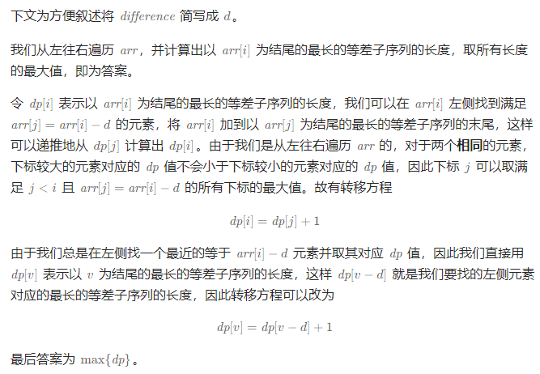

# 最长定差子序列

## [1218. 最长定差子序列](https://leetcode.cn/problems/longest-arithmetic-subsequence-of-given-difference/)

> - ***Question***
>   - 给你一个整数数组 `arr` 和一个整数 `difference` ，请你找出并返回 `arr` 中最长等差子序列的长度，该子序列中相邻元素之间的差等于 `difference` 。
>   - 子序列是指在不改变其余元素顺序的情况下，通过删除一些元素或不删除任何元素而从 `arr` 派生出来的序列。
>   - ***tips:***
>     - `1 <= arr.length <= 10^5`
>     - `-10^4 <= arr[i], difference <= 10^4`

---

## *Java*

> - ***动态规划***
>   - 

```java
import java.util.*;

class Solution {

    public int longestSubsequence(int[] arr, int difference) {
        int ans = 0;
        HashMap<Integer, Integer> dp = new HashMap<>();
        for (int v : arr) {
            dp.put(v, dp.getOrDefault(v - difference, 0) + 1);
            ans = Math.max(ans, dp.get(v));
        }
        return ans;
    }

}
```

---

> ***last change: 2024/3/28***

---
