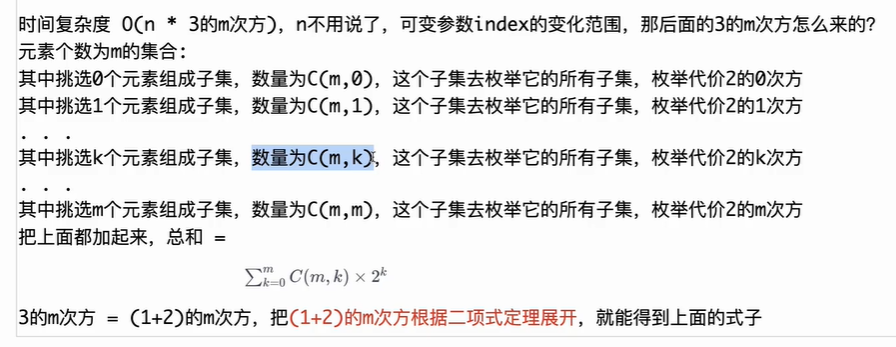

# 分配重复整数

## [1655. 分配重复整数](https://leetcode.cn/problems/distribute-repeating-integers/)

> - ***Question***
>   - 给你一个长度为 `n` 的整数数组 `nums` ，这个数组中至多有 `50` 个不同的值。同时你有 `m` 个顾客的订单 `quantity` ，其中，整数 `quantity[i]` 是第 `i` 位顾客订单的数目。请你判断是否能将 `nums` 中的整数分配给这些顾客，且满足：
>     - 第 `i` 位顾客恰好有 `quantity[i]` 个整数。
>     - 第 `i` 位顾客拿到的整数都是相同的。
>     - 每位顾客都满足上述两个要求。
>   - 如果你可以分配 `nums` 中的整数满足上面的要求，那么请返回 `true` ，否则返回 `false` 。
>   - ***tips:***
>     - `n == nums.length`
>     - `1 <= n <= 10^5`
>     - `1 <= nums[i] <= 1000`
>     - `m == quantity.length`
>     - `1 <= m <= 10`
>     - `1 <= quantity[i] <= 10^5`
>     - `nums` 中至多有 `50` 个不同的数字。

## Java

> - ***状态压缩DP***
>   - 

```java
// 不能用贪心：nums[1,1,2,2,1] quantity=[2,2,1]
class Solution {

    // 时间复杂度O(n * 3的m次方)，空间复杂度O(n * 2的m次方)
    public static boolean canDistribute(int[] nums, int[] quantity) {
        Arrays.sort(nums);
        int n = 1;
        for (int i = 1; i < nums.length; i++) {
            if (nums[i - 1] != nums[i]) {
                n++;
            }
        }
        // 词频表
        int[] cnt = new int[n];
        int c = 1;
        for (int i = 1, j = 0; i < nums.length; i++) {
            if (nums[i - 1] != nums[i]) {
                cnt[j++] = c;
                c = 1;
            } else {
                c++;
            }
        }
        cnt[n - 1] = c;
        int m = quantity.length;
        int[] sum = new int[1 << m];
        // 下面这个枚举是生成quantity中的每个子集，所需要数字的个数
        for (int i = 0, v, h; i < quantity.length; i++) {
            v = quantity[i];
            h = 1 << i;
            for (int j = 0; j < h; j++) {
                sum[h | j] = sum[j] + v;
            }
        }
        int[][] dp = new int[1 << m][n];
        return f(cnt, sum, (1 << m) - 1, 0, dp);
    }

    // 当前来到的数字，编号index，个数cnt[index]，看看就用这个数字，能满足多少种情况
    // status : 订单状态，1还需要去满足，0已经满足过了
    public static boolean f(int[] cnt, int[] sum, int status, int index, int[][] dp) {
        if (status == 0) {
            return true;
        }
        // status != 0
        if (index == cnt.length) {
            return false;
        }
        if (dp[status][index] != 0) {
            return dp[status][index] == 1;
        }
        boolean ans = false;
        int k = cnt[index];
        // 这是整个实现最核心的枚举
        // j枚举了status的所有子集（含几个1）状态
        // 建议记住
        // for (int j = status; j > 0; j = (j - 1) & status) {}
        for (int j = status; j > 0; j = (j - 1) & status) {
            if (sum[j] <= k && f(cnt, sum, status ^ j, index + 1, dp)) {
                ans = true;
                break;
            }
        }
        if (!ans) {
            ans = f(cnt, sum, status, index + 1, dp);
        }
        dp[status][index] = ans ? 1 : -1;
        return ans;
    }

}
```
