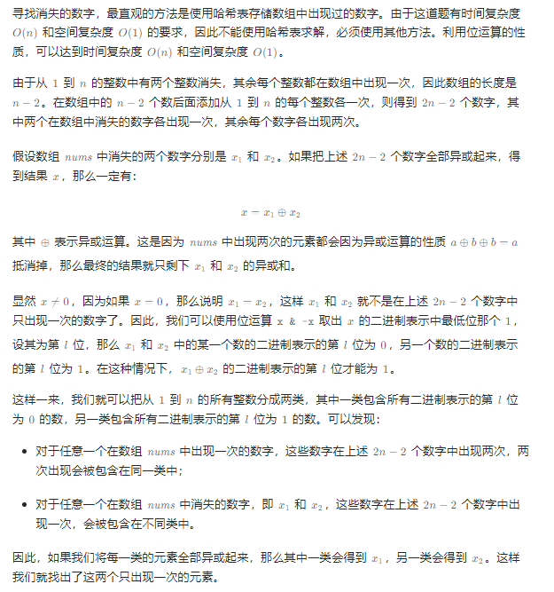

# 1到n上缺失的数字

## [268. 丢失的数字](https://leetcode.cn/problems/missing-number/)

## [剑指 Offer 53 - II. 0～n-1中缺失的数字](https://leetcode.cn/problems/que-shi-de-shu-zi-lcof/)

## [面试题 17.04. 消失的数字](https://leetcode.cn/problems/missing-number-lcci/)

> - **Question 1**
>   - 给定一个包含 `[0, n]` 中 `n` 个数的数组 `nums` ，找出 `[0, n]` 这个范围内没有出现在数组中的那个数。
>   - 要求线性时间复杂度、仅使用额外常数空间的算法解决此问题。即不能使用排序，哈希表。
>   - **Tips**
>     - `n == nums.length`
>     - `1 <= n <= 10^4`
>     - `0 <= nums[i] <= n`
>     - `nums` 中的所有数字都独一无二

## [剑指 Offer 03. 数组中重复的数字](https://leetcode.cn/problems/shu-zu-zhong-zhong-fu-de-shu-zi-lcof/)

> - **Question 2**
>   - 找出数组中重复的数字。
>   - 在一个长度为 `n` 的数组 `nums` 里的所有数字都在 `0 ~ n - 1` 的范围内。数组中某些数字是重复的，但不知道有几个数字重复了，也不知道每个数字重复了几次。请找出数组中任意一个重复的数字。
>   - **Tips**
>     - `2 <= n <= 100000`

## [442. 数组中重复的数据](https://leetcode.cn/problems/find-all-duplicates-in-an-array/)

> - **Question 3**
>   - 给你一个长度为 `n` 的整数数组 `nums` ，其中 `nums` 的所有整数都在范围 `[1, n]` 内，且每个整数出现一次或两次。请你找出所有出现两次的整数，并以数组形式返回。
>   - 你必须设计并实现一个时间复杂度为 `O(n)` 且仅使用常量额外空间的算法解决此问题。
>   - **Tips**
>     - `n == nums.length`
>     - `1 <= n <= 10^5`
>     - `1 <= nums[i] <= n`

## [448. 找到所有数组中消失的数字](https://leetcode.cn/problems/find-all-numbers-disappeared-in-an-array/)

> - **Question 4**
>   - 给你一个含 `n` 个整数的数组 `nums` ，其中 `nums[i]` 在区间 `[1, n]` 内。请你找出所有在 `[1, n]` 范围内但没有出现在 `nums` 中的数字，并以数组的形式返回结果。
>   - **Tips**
>     - `n == nums.length`
>     - `1 <= n <= 10^5`
>     - `1 <= nums[i] <= n`

## 左老师课堂讲述

> - **Question 5**
>   - `1, 2, 3, ..., n - 1, n, n, n + 1, n + 2, ...` ，在这个序列中，只有一个数字 `n` 有重复，问在这个序列是有序或者无序的情况下，怎么找到重复数字 `n` 。

## [面试题 17.19. 消失的两个数字](https://leetcode.cn/problems/missing-two-lcci/)

> - **Question 6**
>   - 给定一个数组，包含从 `1` 到 `N` 所有的整数，但其中缺了两个数字。你能在 `O(N)` 时间内只用 `O(1)` 的空间找到它们吗？
>   - 以任意顺序返回这两个数字均可。
>   - **Tips**
>     - `nums.length <= 30000`

## Java

> - **Question 1: 原地哈希**

```java
class Solution {
    
    public int missingNumber(int[] nums) {
        // 原数组作为哈希表
        // nums[i]存储i
        // 注意如果数组中有n，那么它就呆在那个下标，后面有nums[i] != i，缺失的就是那个下标
        for (int i = 0; i < nums.length; i++) {
            if (nums[i] != i && nums[i] < nums.length) {
                swap(nums, i, nums[i]);
                i--;
            }
        }
        for (int i = 0; i < nums.length; i++) {
            if (nums[i] != i) {
                return i;
            }
        }
        // 数组中每个位置和值都对的上
        // 那就缺失最后一个元素，因为数组长度为n-1
        return nums.length;
    }
    
    private void swap(int[] nums, int i, int j) {
        int temp = nums[i];
        nums[i] = nums[j];
        nums[j] = temp;
    }
    
}
```

> - **Question 1: 位运算**

```java
class Solution {

    // nums中有0-n中缺一个
    // 我们在nums后面拼上0-n所有变成新的nums
    // nums中除缺失的数字出现1次外剩下的数字全部出现了2次
    // 由异或运算a ^ a = 0
    // 把所有元素异或一遍，剩下的就是缺失的
    public int missingNumber(int[] nums) {
        int xor = 0;
        for (int i = 0; i < nums.length; i++) {
            xor ^= nums[i];
        }
        for (int i = 0; i <= nums.length; i++) {
            xor ^= i;
        }
        return xor;
    }

}
```

> - **Question 1: 高斯求和**

```java
class Solution {
    
    public int missingNumber(int[] nums) {
        // 0-n的和等于1-n的和等于高斯求和公式
        // 减去数组和即为少的那一个
        return nums.length * (nums.length + 1) / 2 - Arrays.stream(nums).sum();
    }
    
}
```

> - **Question 2: 原地哈希**

```java
class Solution {
    
    // 同Question 1
    public int findRepeatNumber(int[] nums) {
        for (int i = 0; i < nums.length; i++) {
            // nums[i] == i跳过
            if (nums[i] != i) {
                if (nums[nums[i]] == nums[i]) {
                    // 找到重复的返回
                    return nums[i];
                } else {
                    // 不然就交换
                    swap(nums, i, nums[i]);
                    i--;
                }
            }
        }
        return -1;
    }
    
    private void swap(int[] nums, int i, int j) {
        int temp = nums[i];
        nums[i] = nums[j];
        nums[j] = temp;
    }
    
}
```

> - **Question 3: 原地哈希**

```java
class Solution {

    public List<Integer> findDuplicates(int[] nums) {
        // 有数字出现2次，说明有数字没有出现过
        // 将数字nums[i]放在下标为nums[i]-1的位置
        // 如果i出现一次，那么i放在下标i-1
        // 如果i出现多次，那么另外一个i放在不冲突的j位置，即j+1没有出现在数字中
        for (int i = 0; i < nums.length; ++i) {
            // 放到nums[i]-1位置
            while (nums[i] != nums[nums[i] - 1]) {
                swap(nums, i, nums[i] - 1);
            }
        }
        List<Integer> ans = new ArrayList<Integer>();
        for (int i = 0; i < nums.length; ++i) {
            // 正常情况nums[i] - 1 == i
            if (nums[i] - 1 != i) {
                ans.add(nums[i]);
            }
        }
        return ans;
    }

    public void swap(int[] nums, int i, int j) {
        int temp = nums[i];
        nums[i] = nums[j];
        nums[j] = temp;
    }

}
```

> - **Question 4: 原地哈希**

```java
class Solution {

    // 由于nums的数字范围均在[1,n] 中，我们可以利用这一范围之外的数字，来表达是否存在的含义。
    // 具体来说，遍历nums，每遇到一个数x，就让nums[x−1]增加n。
    // 由于nums中所有数均在[1,n]中，增加以后，这些数必然大于n。最后我们遍历 nums，若nums[i] 未大于n，就说明没有遇到过数i+1。这样我们就找到了缺失的数字。
    // 注意，当我们遍历到某个位置时，其中的数可能已经被增加过，因此需要对n取模来还原出它本来的值。
    public List<Integer> findDisappearedNumbers(int[] nums) {
        for (int num : nums) {
            int x = (num - 1) % nums.length;
            nums[x] += nums.length;
        }
        List<Integer> ans = new ArrayList<Integer>();
        for (int i = 0; i < nums.length; i++) {
            if (nums[i] <= nums.length) {
                ans.add(i + 1);
            }
        }
        return ans;
    }

}
```

> - **Question 4: 下标循环怼**

```java
class Solution {
    
    public List<Integer> findDisappearedNumbers(int[] nums) {
        int index = 0;
        // 让nums[index]上放index+1
        while (index < nums.length) {
            // 自己本身是，或者要换的地方已经是了，这个数不动，看下一个位置
            if (nums[index] == index + 1 || nums[nums[index] - 1] == nums[index]) {
                index++;
            } else {
                // 不然就交换
                swap(nums, index, nums[index] - 1);
            }
        }
        // 只要位置上的数字不符合要求，说明缺失了那个数字，有一个重复的数字占据了这个位置
        List<Integer> ans = new ArrayList<>();
        for (int i = 0; i < nums.length; i++) {
            if (nums[i] != i + 1) {
                ans.add(i + 1);
            }
        }
        return ans;
    }
    
    private void swap(int[] nums, int i, int j) {
        int temp = nums[i];
        nums[i] = nums[j];
        nums[j] = temp;
    }
    
}
```

> - **Question 5: 单链表的入环节点解决无序 + 二分查找解决有序 + 哈希表验证**

```java
class Solution {

    // 为了测试
    // 绝对正确，但是直接遍历+哈希表，没有得分的方法
    public static int right(int[] arr) {
        HashSet<Integer> set = new HashSet<>();
        for (int num : arr) {
            if (set.contains(num)) {
                return num;
            }
            set.add(num);
        }
        return -1;
    }

    // 符合题目要求的、无序数组，找重复数
    // 时间复杂度O(N)，额外空间复杂度O(1)
    // 可以去单链表入环节点那里找
    public static int findDuplicate(int[] arr) {
        if (arr == null || arr.length < 2) {
            return -1;
        }
        int slow = arr[0];
        int fast = arr[arr[0]];
        while (slow != fast) {
            slow = arr[slow];
            fast = arr[arr[fast]];
        }
        // slow == fast
        fast = 0;
        while (slow != fast) {
            fast = arr[fast];
            slow = arr[slow];
        }
        // 再相遇就在入环节点！一个结论
        return slow;
    }

    // 符合题目要求的、有序数组，找重复数
    // 时间复杂度O(logN)，额外空间复杂度O(1)
    // 二分查找
    // 假设是从1-n
    // 下标从0-n-1
    // 比如当前来到下标4，如果上面的值是5，就看右边是不是5，如果是那么找到了，如果不是说明左边不可能重复，因为在有序且重复的情况下下标4上面不可能是5，只可能是右边重复
    // 如果不是5那就是左边重复
    public static int findDuplicateSorted(int[] arr) {
        if (arr == null || arr.length < 2) {
            return -1;
        }
        int l = 0;
        int r = arr.length - 1;
        int m = 0;
        int ans = -1;
        while (l <= r) {
            m = (l + r) / 2;
            if ((m - 1 >= 0 && arr[m - 1] == arr[m]) || (m + 1 < arr.length && arr[m + 1] == arr[m])) {
                ans = arr[m];
                break;
            }
            if (m - l == arr[m] - arr[l]) {
                l = m + 1;
            } else {
                r = m - 1;
            }
        }
        return ans;
    }

    // 为了测试
    public static int[] randomArray(int n) {
        int[] ans = new int[n + 1];
        for (int i = 0; i < n; i++) {
            ans[i] = i + 1;
        }
        ans[n] = (int) (Math.random() * n) + 1;
        for (int i = n; i > 0; i--) {
            int j = (int) (Math.random() * (i + 1));
            int tmp = ans[i];
            ans[i] = ans[j];
            ans[j] = tmp;
        }
        return ans;
    }

    // 为了测试
    public static void main(String[] args) {
        int N = 10;
        int testTime = 5000;
        System.out.println("测试开始");
        for (int i = 0; i < testTime; i++) {
            int[] arr = randomArray((int) (Math.random() * N) + 1);
            if (right(arr) != findDuplicate(arr)) {
                System.out.println("未排序情况出错!");
            }
            Arrays.sort(arr);
            if (right(arr) != findDuplicateSorted(arr)) {
                System.out.println("排序情况出错!");
                for (int num : arr) {
                    System.out.print(num + " ");
                }
                System.out.println();
                System.out.println(right(arr));
                System.out.println(findDuplicateSorted(arr));
                break;
            }
        }
        System.out.println("测试结束");
    }

}
```

> - **Question 6: 位运算**
>   - 

```java
class Solution {

    public int[] missingTwo(int[] nums) {
        int xorsum = 0;
        int n = nums.length + 2;
        for (int num : nums) {
            xorsum ^= num;
        }
        for (int i = 1; i <= n; i++) {
            xorsum ^= i;
        }
        // 防止溢出
        int lsb = (xorsum == Integer.MIN_VALUE ? xorsum : xorsum & (-xorsum));
        int type1 = 0, type2 = 0;
        for (int num : nums) {
            if ((num & lsb) != 0) {
                type1 ^= num;
            } else {
                type2 ^= num;
            }
        }
        for (int i = 1; i <= n; i++) {
            if ((i & lsb) != 0) {
                type1 ^= i;
            } else {
                type2 ^= i;
            }
        }
        return new int[]{type1, type2};
    }

}
```
