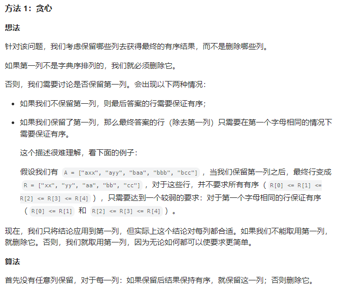
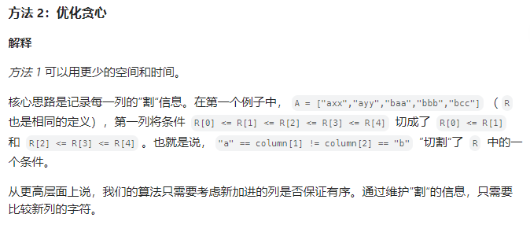

# 删列造序

## [944. 删列造序](https://leetcode.cn/problems/delete-columns-to-make-sorted/)

> - ***Question 1***
>   - 给你由 `n` 个小写字母字符串组成的数组 `strs` ，其中每个字符串长度相等。
>   - 这些字符串可以每个一行，排成一个网格。
>   - 你需要找出并删除 不是按字典序非严格递增排列的 列。在上面的例子（下标从 `0` 开始）中，列 `0: 'a', 'b', 'c'` 和列 `2: 'c', 'e', 'e'` 都是按字典序非严格递增排列的，而列 `1: 'b', 'c', 'a'` 不是，所以要删除列 `1` 。
>   - 返回你需要删除的列数。
>   - ***tips:***
>     - `n == strs.length`
>     - `1 <= n <= 100`
>     - `1 <= strs[i].length <= 1000`
>     - `strs[i]` 由小写英文字母组成

## [955. 删列造序 II](https://leetcode.cn/problems/delete-columns-to-make-sorted-ii/)

> - ***Question 2***
>   - 给定由 `n` 个字符串组成的数组 `strs` ，其中每个字符串长度相等。
>   - 选取一个删除索引序列，对于 `strs` 中的每个字符串，删除对应每个索引处的字符。
>   - 比如，有 `strs = ["abcdef", "uvwxyz"]` ，删除索引序列 `{0, 2, 3}` ，删除后 `strs` 为 `["bef", "vyz"]` 。
>   - 假设，我们选择了一组删除索引 `answer` ，那么在执行删除操作之后，最终得到的数组的元素是按字典序 `strs[0] <= strs[1] <= strs[2] ... <= strs[n - 1]` 排列的，然后请你返回 `answer.length` 的最小可能值。
>   - ***tips:***
>     - `n == strs.length`
>     - `1 <= n <= 100`
>     - `1 <= strs[i].length <= 100`
>     - `strs[i]` 由小写英文字母组成

## [960. 删列造序 III](https://leetcode.cn/problems/delete-columns-to-make-sorted-iii/)

> - ***Question 3***
>   - 给定由 `n` 个小写字母字符串组成的数组 `strs` ，其中每个字符串长度相等。
>   - 选取一个删除索引序列，对于 `strs` 中的每个字符串，删除对应每个索引处的字符。
>   - 比如，有 `strs = ["abcdef", "uvwxyz"]` ，删除索引序列 `{0, 2, 3}` ，删除后为 `["bef", "vyz"]` 。
>   - 假设，我们选择了一组删除索引 `answer` ，那么在执行删除操作之后，最终得到的数组的行中的每个元素都是按字典序排列的（即  `(strs[0][0] <= strs[0][1] <= ... <= strs[0][strs[0].length - 1])` 和 `(strs[1][0] <= strs[1][1] <= ... <= strs[1][strs[1].length - 1])` ，依此类推）。
>   - 请返回 `answer.length` 的最小可能值。
>   - ***tips:***
>     - `n == strs.length`
>     - `1 <= n <= 100`
>     - `1 <= strs[i].length <= 100`
>     - `strs[i]` 由小写英文字母组成

## Java

> - ***Question 1: 直接遍历***
>   - 题目要求删除不是按字典序升序排列的列，由于每个字符串的长度都相等，我们可以逐列访问字符串数组，统计不是按字典序升序排列的列。
>   - 对于第 `j` 列的字符串，我们需要检测所有相邻字符是否均满足 `strs[i - 1][j] <= strs[i][j]` 。

```java
class Solution {

    public int minDeletionSize(String[] strs) {
        int row = strs.length;
        int col = strs[0].length();
        int ans = 0;
        for (int j = 0; j < col; ++j) {
            for (int i = 1; i < row; ++i) {
                if (strs[i - 1].charAt(j) > strs[i].charAt(j)) {
                    ans++;
                    break;
                }
            }
        }
        return ans;
    }

}
```

> - ***Question 2: 贪心***
>   - 

```java
import java.util.*;

class Solution {

    public int minDeletionSize(String[] A) {
        int N = A.length;
        int W = A[0].length();
        int ans = 0;

        // cur : all rows we have written
        // For example, with A = ["abc","def","ghi"] we might have
        // cur = ["ab", "de", "gh"].
        String[] cur = new String[N];
        for (int j = 0; j < W; ++j) {
            // cur2 : What we potentially can write, including the
            //        newest column col = [A[i][j] for i]
            // Eg. if cur = ["ab","de","gh"] and col = ("c","f","i"),
            // then cur2 = ["abc","def","ghi"].
            String[] cur2 = Arrays.copyOf(cur, N);
            for (int i = 0; i < N; ++i)
                cur2[i] += A[i].charAt(j);

            if (isSorted(cur2))
                cur = cur2;
            else
                ans++;
        }

        return ans;
    }

    public boolean isSorted(String[] A) {
        for (int i = 0; i < A.length - 1; ++i)
            if (A[i].compareTo(A[i + 1]) > 0)
                return false;

        return true;
    }

}
```

> - ***Question 2: 优化贪心***
>   - 

```java
class Solution {

    public int minDeletionSize(String[] A) {
        int N = A.length;
        int W = A[0].length();
        // cuts[j] is true : we don't need to check any new A[i][j] <= A[i][j+1]
        boolean[] cuts = new boolean[N - 1];

        int ans = 0;
        search:
        for (int j = 0; j < W; ++j) {
            // Evaluate whether we can keep this column
            for (int i = 0; i < N - 1; ++i)
                if (!cuts[i] && A[i].charAt(j) > A[i + 1].charAt(j)) {
                    // Can't keep the column - delete and continue
                    ans++;
                    continue search;
                }

            // Update 'cuts' information
            for (int i = 0; i < N - 1; ++i)
                if (A[i].charAt(j) < A[i + 1].charAt(j))
                    cuts[i] = true;
        }

        return ans;
    }

}
```

> - ***Question 3: 动态规划***
>   - 首先，找出需要保留的列数，而不是需要删除的列数。最后，可以相减得到答案。
>   - 假设我们一定保存第一列 `C` ，那么保存的下一列 `D` 就必须保证每行都是字典有序的，也就是 `C[i] <= D[i]` 。那么我们就可以删除 `C` 和 `D` 之间的所有列。
>   - 我们可以用动态规划来解决这个问题，让 `dp[k]` 表示在输入为 `[row[k:] for row in A]` 时保存的列数，那么 `dp[k]` 的递推式显而易见。

```java
import java.util.*;

class Solution {

    public int minDeletionSize(String[] A) {
        int W = A[0].length();
        int[] dp = new int[W];
        Arrays.fill(dp, 1);
        for (int i = W - 2; i >= 0; --i)
            search:for (int j = i + 1; j < W; ++j) {
                for (String row : A)
                    if (row.charAt(i) > row.charAt(j))
                        continue search;

                dp[i] = Math.max(dp[i], 1 + dp[j]);
            }

        int kept = 0;
        for (int x : dp)
            kept = Math.max(kept, x);
        return W - kept;
    }

}
```
