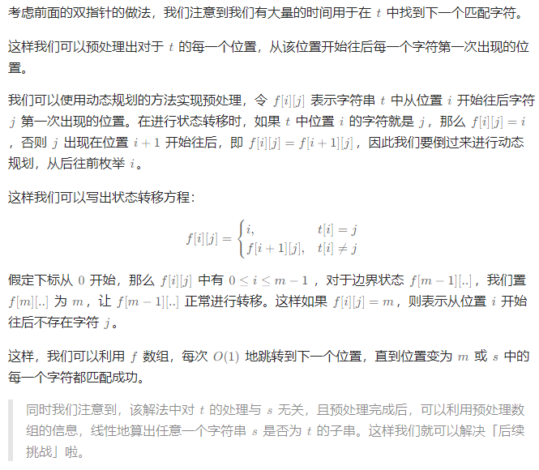

# 判断子序列

## [392. 判断子序列](https://leetcode.cn/problems/is-subsequence/)

> - ***Question***
>   - 给定字符串 `s` 和 `t` ，判断 `s` 是否为 `t` 的子序列。
>   - ***tips:***
>     - `0 <= s.length <= 100`
>     - `0 <= t.length <= 10^4`
>     - 两个字符串都只由小写字符组成

---

## *Java*

> - ***双指针***
>   - 我们初始化两个指针 `i` 和 `j` ，分别指向 `s` 和 `t` 的初始位置。每次贪心地匹配，匹配成功则 `i` 和 `j` 同时右移，匹配 `s` 的下一个位置，匹配失败则 `j` 右移， `i` 不变，尝试用 `t` 的下一个字符匹配 `s` 。最终如果 `i` 移动到 `s` 的末尾，就说明 `s` 是 `t` 的子序列。

```java
class Solution {

    public boolean isSubsequence(String s, String t) {
        int n = s.length(), m = t.length();
        int i = 0, j = 0;
        while (i < n && j < m) {
            if (s.charAt(i) == t.charAt(j)) {
                i++;
            }
            j++;
        }
        return i == n;
    }

}
```

> - ***动态规划***
>   - 

```java
class Solution {

    public boolean isSubsequence(String s, String t) {
        int n = s.length(), m = t.length();

        int[][] f = new int[m + 1][26];
        for (int i = 0; i < 26; i++) {
            f[m][i] = m;
        }

        for (int i = m - 1; i >= 0; i--) {
            for (int j = 0; j < 26; j++) {
                if (t.charAt(i) == j + 'a')
                    f[i][j] = i;
                else
                    f[i][j] = f[i + 1][j];
            }
        }
        int add = 0;
        for (int i = 0; i < n; i++) {
            if (f[add][s.charAt(i) - 'a'] == m) {
                return false;
            }
            add = f[add][s.charAt(i) - 'a'] + 1;
        }
        return true;
    }

}
```

---

> ***last change: 2024/3/28***

---
