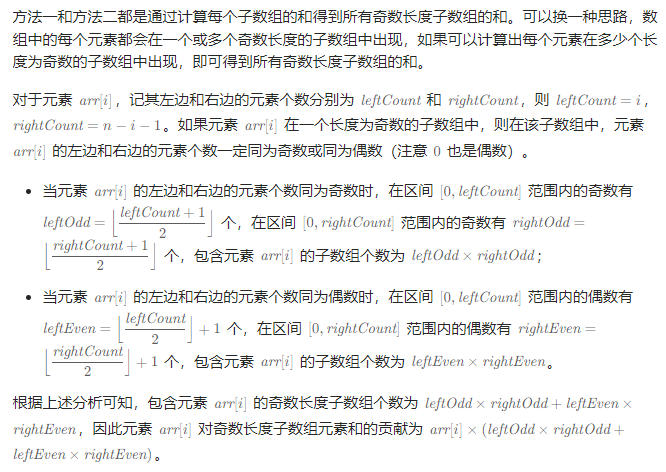

# 所有奇数长度子数组的和

## [1588. 所有奇数长度子数组的和](https://leetcode.cn/problems/sum-of-all-odd-length-subarrays/)

> - ***Question***
>   - 给你一个正整数数组 `arr` ，请你计算所有可能的奇数长度子数组的和。
>   - 子数组定义为原数组中的一个连续子序列。
>   - 请你返回 `arr` 中 所有奇数长度子数组的和。
>   - ***tips:***
>     - `1 <= arr.length <= 100`
>     - `1 <= arr[i] <= 1000`

---

## *Java*

> - ***数学***
>   - 

```java
class Solution {

    public int sumOddLengthSubarrays(int[] arr) {
        int sum = 0;
        int n = arr.length;
        for (int i = 0; i < n; i++) {
            int leftCount = i, rightCount = n - i - 1;
            int leftOdd = (leftCount + 1) / 2;
            int rightOdd = (rightCount + 1) / 2;
            int leftEven = leftCount / 2 + 1;
            int rightEven = rightCount / 2 + 1;
            sum += arr[i] * (leftOdd * rightOdd + leftEven * rightEven);
        }
        return sum;
    }

}
```
