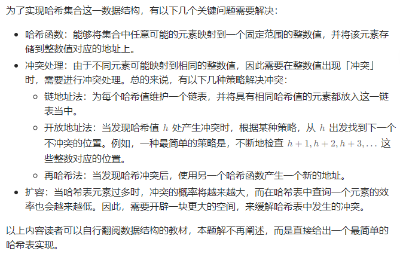
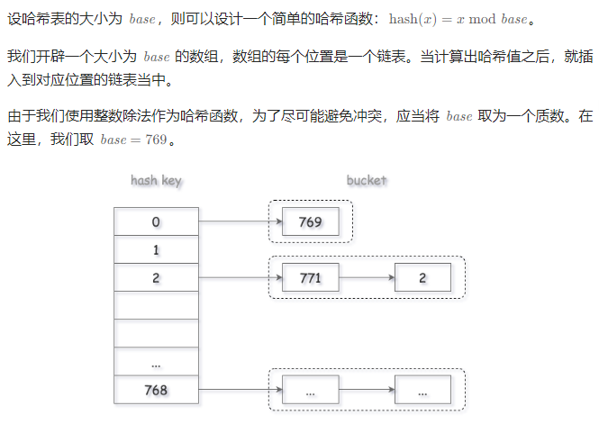

# 设计哈希集合与哈希映射

## [705. 设计哈希集合](https://leetcode.cn/problems/design-hashset/)

> - ***Question 1***
>   - 不使用任何内建的哈希表库设计一个哈希集合 `HashSet` 。
>   - 实现 `MyHashSet` 类：
>     - `void add(key)` 向哈希集合中插入值 `key` 。
>     - `bool contains(key)` 返回哈希集合中是否存在这个值 `key` 。
>     - `void remove(key)` 将给定值 `key` 从哈希集合中删除。如果哈希集合中没有这个值，什么也不做。
>   - ***tips:***
>     - `0 <= key <= 10^6`
>     - 最多调用 `10^4` 次 `add, remove, contains`

## [706. 设计哈希映射](https://leetcode.cn/problems/design-hashmap/)

> - ***Question 2***
>   - 不使用任何内建的哈希表库设计一个哈希映射 `HashMap` 。
>   - 实现 `MyHashMap` 类：
>     - `MyHashMap()` 用空映射初始化对象
>     - `void put(int key, int value)` 向 `HashMap` 插入一个键值对 `(key, value)` 。如果 `key` 已经存在于映射中，则更新其对应的值 `value` 。
>     - `int get(int key)` 返回特定的 `key` 所映射的 `value` ；如果映射中不包含 `key` 的映射，返回 `-1` 。
>     - `void remove(key)` 如果映射中存在 `key` 的映射，则移除 `key` 和它所对应的 `value` 。
>   - ***tips:***
>     - `0 <= key <= 10^6`
>     - 最多调用 `10^4` 次 `add, remove, contains`

---

## *Java*

> - ***Question 1: 链地址法***
>   - 
>   - 

```java
import java.util.*;

class MyHashSet {

    private static final int BASE = 769;
    private final LinkedList[] data;

    /**
     * Initialize your data structure here.
     */
    public MyHashSet() {
        data = new LinkedList[BASE];
        for (int i = 0; i < BASE; ++i) {
            data[i] = new LinkedList<Integer>();
        }
    }

    public void add(int key) {
        int h = hash(key);
        for (Object o : data[h]) {
            Integer element = (Integer) o;
            if (element == key) {
                return;
            }
        }
        data[h].offerLast(key);
    }

    public void remove(int key) {
        int h = hash(key);
        for (Object o : data[h]) {
            Integer element = (Integer) o;
            if (element == key) {
                data[h].remove(element);
                return;
            }
        }
    }

    /**
     * Returns true if this set contains the specified element
     */
    public boolean contains(int key) {
        int h = hash(key);
        for (Object o : data[h]) {
            Integer element = (Integer) o;
            if (element == key) {
                return true;
            }
        }
        return false;
    }

    private static int hash(int key) {
        return key % BASE;
    }

}

/**
 * Your MyHashSet object will be instantiated and called as such:
 * MyHashSet obj = new MyHashSet();
 * obj.add(key);
 * obj.remove(key);
 * boolean param_3 = obj.contains(key);
 */
```

> - ***Question 2: 链地址法***
>   - 设计哈希映射与设计哈希集合解法接近，唯一的区别在于我们存储的不是 `key` 本身，而是 `(key, value)`对。除此之外，代码基本是类似的。

```java
import java.util.*;

class MyHashMap {

    private static class Pair {

        private final int key;
        private int value;

        public Pair(int key, int value) {
            this.key = key;
            this.value = value;
        }

        public int getKey() {
            return key;
        }

        public int getValue() {
            return value;
        }

        public void setValue(int value) {
            this.value = value;
        }

    }

    private static final int BASE = 769;
    private final LinkedList[] data;

    /**
     * Initialize your data structure here.
     */
    public MyHashMap() {
        data = new LinkedList[BASE];
        for (int i = 0; i < BASE; ++i) {
            data[i] = new LinkedList<Pair>();
        }
    }

    /**
     * value will always be non-negative.
     */
    public void put(int key, int value) {
        int h = hash(key);
        for (Object o : data[h]) {
            Pair pair = (Pair) o;
            if (pair.getKey() == key) {
                pair.setValue(value);
                return;
            }
        }
        data[h].offerLast(new Pair(key, value));
    }

    /**
     * Returns the value to which the specified key is mapped, or -1 if this map contains no mapping for the key
     */
    public int get(int key) {
        int h = hash(key);
        for (Object o : data[h]) {
            Pair pair = (Pair) o;
            if (pair.getKey() == key) {
                return pair.value;
            }
        }
        return -1;
    }

    /**
     * Removes the mapping of the specified value key if this map contains a mapping for the key
     */
    public void remove(int key) {
        int h = hash(key);
        for (Object o : data[h]) {
            Pair pair = (Pair) o;
            if (pair.key == key) {
                data[h].remove(pair);
                return;
            }
        }
    }

    private static int hash(int key) {
        return key % BASE;
    }

}

/**
 * Your MyHashMap object will be instantiated and called as such:
 * MyHashMap obj = new MyHashMap();
 * obj.put(key,value);
 * int param_2 = obj.get(key);
 * obj.remove(key);
 */
```
